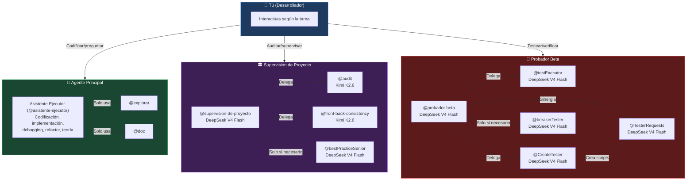
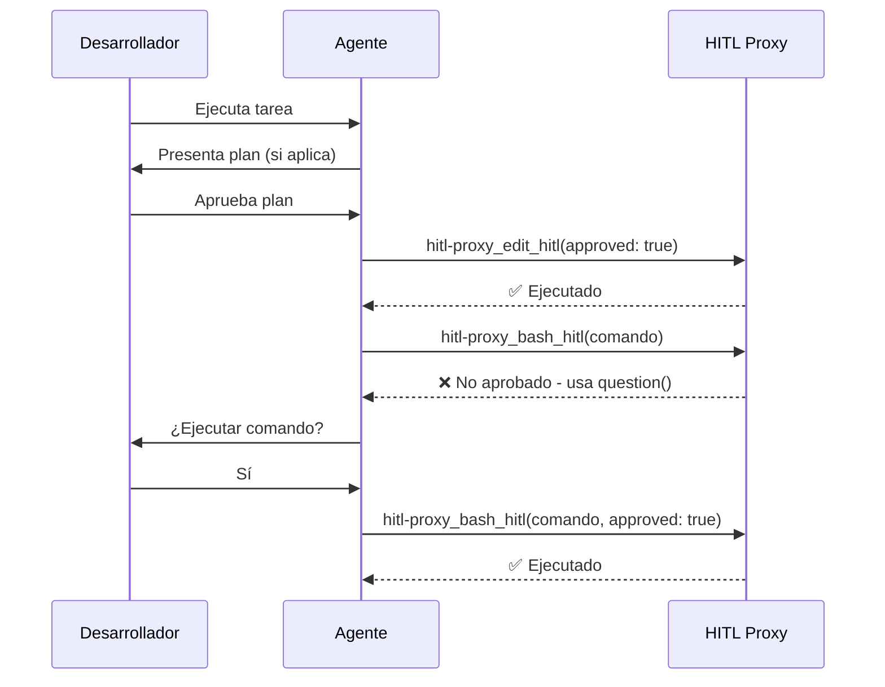
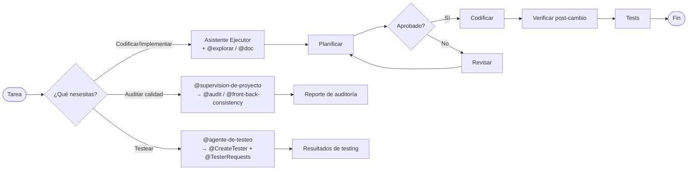

# Multi-Agent Architecture with HITL Policy Enforcement — v2 (Oficinas)

> Sistema de gobernanza de IA para Vyntra, organizado en oficinas especializadas con agentes orquestadores y subagentes.
> Cada oficina gestiona un dominio específico: supervisión de calidad o testing.

---

## 1. VISIÓN GENERAL

El sistema se organiza en 3 oficinas + 1 agente principal, cada una con un agente orquestador que gestiona subagentes especializados. El humano (tú) llama a la oficina que necesita según la tarea.

| Oficina | Agente Orquestador | Subagentes |
|---------|-------------------|------------|
| **Asistente Ejecutor** (agente principal) | `@asistente-ejecutor` | `@explorar`, `@doc` (solo huérfanos) |
| **Supervisión de Proyecto** | `@supervision-de-proyecto` | `@audit`, `@front-back-consistency`, `@bestPracticeSenior` |
| **Agente de Testeo** | `@agente-de-testeo` | `@testExecutor`, `@CreateTester`, `@TesterRequests`, `@breakerTester` |

### Regla fundamental
- **Asistente Ejecutor** solo usa huérfanos (`@explorar`, `@doc`). **NUNCA llama a otras oficinas.**
- **Tú llamas directamente** a `@supervision-de-proyecto` o `@agente-de-testeo` cuando necesitas auditoría o testing.

---

## 2. DIAGRAMA DE ARQUITECTURA

---

## 3. HITL POLICY ENFORCEMENT

### 3.1 ¿Qué es HITL?

**Human-in-the-Loop (HITL)** significa que el humano mantiene el control sobre decisiones críticas. La IA **no ejecuta acciones de riesgo sin aprobación explícita**.

### 3.2 Permisos por agente

| Agente | edit | bash | webfetch |
|--------|------|------|----------|
| AgentExecutor | allow (vía HITL proxy) | ask (allow-list para read) | ask |
| Supervisión de Proyecto | deny | deny | ask |
| @audit | deny | deny (solo git) | deny |
| @front-back-consistency | deny | deny | deny |
| @bestPracticeSenior | deny | deny | **allow** |
| Agente de Testeo | deny | ask | deny |
| @testExecutor | deny | ask | deny |
| @CreateTester | deny | deny | deny |
| @TesterRequests | deny | ask | deny |
| @breakerTester | deny | ask | deny |

### 3.3 Flujo de aprobación

---

## 4. OFICINAS EN DETALLE

### 4.1 Asistente Ejecutor (`@asistente-ejecutor`)

**Rol:** Asistente, planificador y ejecutor principal de tareas de codificación.

- Es el agente por defecto al iniciar sesión
- Asiste con preguntas, teoría, conceptos y explicaciones de código
- **Debe planificar** antes de tocar código si la tarea es ≥ moderada
- **No ejecuta código sin permiso del usuario**
- Usa exclusivamente `@explorar` (explorar código) y `@doc` (documentación)
- **Prohibido llamar a Supervisión de Proyecto o Agente de Testeo**

### 4.2 Supervisión de Proyecto (`@supervision-de-proyecto`)

**Rol:** Supervisar calidad del proyecto contra reglas establecidas.

**Modelo:** DeepSeek V4 Flash

**Subagentes:**

| Subagente | Modelo | Función |
|-----------|--------|---------|
| `@audit` | Kimi K2.6 | Auditoría de código puro. Requiere instrucción explícita. Audita en cascada. |
| `@front-back-consistency` | Kimi K2.6 | Verifica consistencia FE↔BE. Más autónomo. |
| `@bestPracticeSenior` | DeepSeek V4 Flash | Analiza buenas prácticas vía webfetch. Solo cuando hay dudas. |

**Flujo de trabajo:**
1. Recibe solicitud de supervisión
2. Decide qué subagente(s) usar
3. Delega con instrucciones claras
4. Si @audit encuentra issues → puede llamar a @bestPracticeSenior para validar
5. Compila reporte y lo devuelve al usuario

### 4.3 Agente de Testeo (`@agente-de-testeo`)

**Rol:** Gestionar todo el testing del proyecto.

**Modelo:** DeepSeek V4 Flash

**Subagentes:**

| Subagente | Modelo | Función |
|-----------|--------|---------|
| `@testExecutor` | DeepSeek V4 Flash | Ejecuta tests simples/scripts. |
| `@CreateTester` | DeepSeek V4 Flash | Crea tests y planes de testeo. Sinergia con @TesterRequests. |
| `@TesterRequests` | DeepSeek V4 Flash | Ejecuta tests HTTP/WSS. Requiere script de @CreateTester. |
| `@breakerTester` | DeepSeek V4 Flash | Intenta romper el código. Usar con precaución. |

**Sinergia clave:** @CreateTester + @TesterRequests son un equipo. @CreateTester diseña el test, @TesterRequests lo ejecuta. Sin @CreateTester, @TesterRequests no puede crear tests complejos.

**Flujo de trabajo:**
1. Recibe solicitud de testing
2. Analiza qué tipo de testeo necesita
3. Delegar al subagente(s) adecuado(s)
4. Si hay fallo: analiza causa raíz y propone solución
5. Reporta al usuario: qué se testéo, resultado, por qué falló, solución

---

## 5. MODELOS ASIGNADOS

| Agente | Modelo | Costo | Razón |
|--------|--------|-------|-------|
| Asistente Ejecutor | El que elijas vía TUI | Variable | El usuario decide |
| Supervisión de Proyecto | DeepSeek V4 Flash | $0.14/$0.28 | Volumen, respuestas rápidas |
| @audit | Kimi K2.6 | $0.95/$4.00 | Baja alucinación, precisión factual |
| @front-back-consistency | Kimi K2.6 | $0.95/$4.00 | Baja alucinación, retrieval |
| @bestPracticeSenior | DeepSeek V4 Flash | $0.14/$0.28 | Volumen para webfetch |
| Agente de Testeo | DeepSeek V4 Flash | $0.14/$0.28 | Volumen para testing |
| @testExecutor | DeepSeek V4 Flash | $0.14/$0.28 | Volumen |
| @CreateTester | DeepSeek V4 Flash | $0.14/$0.28 | Volumen |
| @TesterRequests | DeepSeek V4 Flash | $0.14/$0.28 | Volumen |
| @breakerTester | DeepSeek V4 Flash | $0.14/$0.28 | Volumen |
| @explorar | MiMo-V2.5 | Gratis | Velocidad > potencia |
| @doc | DeepSeek V4 Flash | $0.14/$0.28 | Texto largo |

---

## 6. FLUJO DE TRABAJO TÍPICO

---

## 7. REGLAS DE ORO

1. **Asistente Ejecutor** no llama a otras oficinas — solo usa `@explorar` y `@doc`
2. Cada oficina sabe gestionar sus subagentes: qué pedir, cómo, cuándo
3. Si un subagente no entrega lo esperado → el orquestador lo hace o reporta
4. `@bestPracticeSenior` y `@breakerTester` se usan con precaución y solo cuando es necesario
5. HITL proxy siempre activo: toda edición/escritura/bash pasa por `question()`
6. `@browser` está deshabilitado

---

## 8. ¿POR QUÉ ESTA ARQUITECTURA?

1. **Separación de dominios**: Cada oficina se especializa en un área (codificación, auditoría, testing)
2. **Control humano**: Tú decides qué oficina llamar según la tarea
3. **Modelos optimizados**: Kimi K2.6 para precisión, DeepSeek V4 Flash para volumen, MiMo-V2.5 para velocidad
4. **Jerarquía clara**: Agente orquestador → subagentes, cada uno con contexto aislado y permisos restrictivos
5. **Sin acoplamiento**: AgentExecutor nunca depende de las oficinas; son llamadas independientes del usuario
6. **Sinergia controlada**: @CreateTester + @TesterRequests funcionan en equipo, pero solo cuando los necesitas
