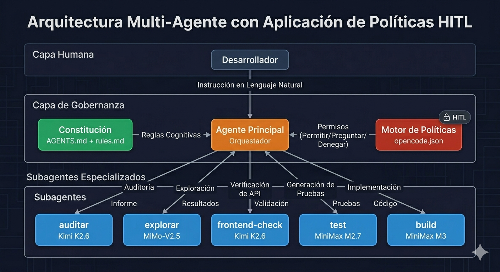
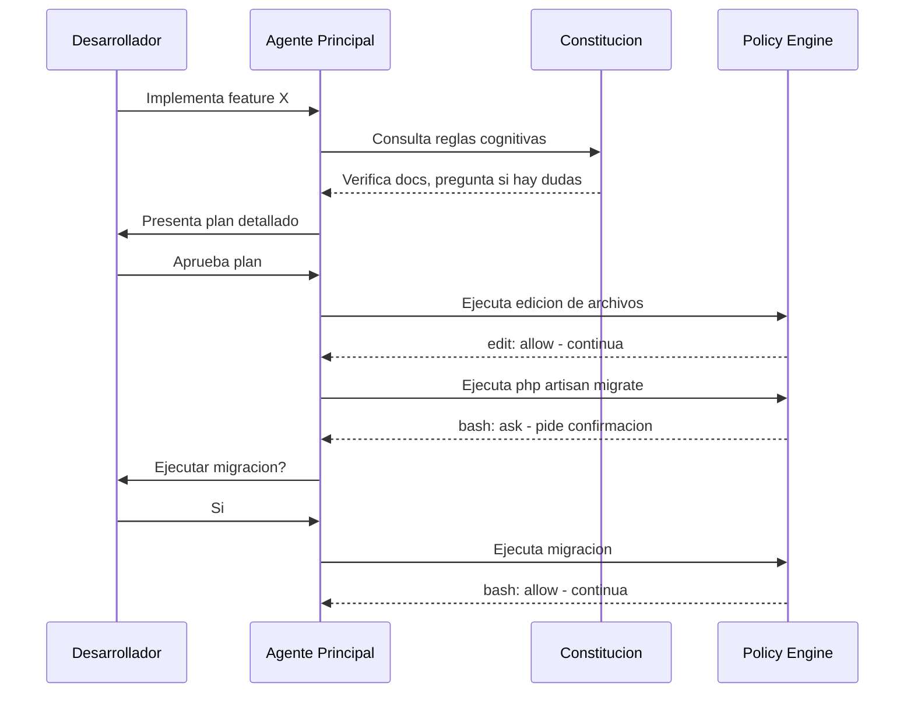
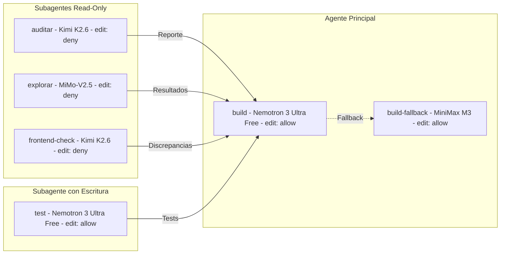
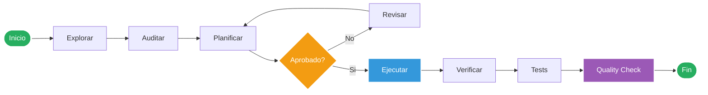

# Multi-Agent Architecture with HITL Policy Enforcement

> Sistema de gobernanza de IA implementado en el backend de Vyntra.
> Diseñado para eliminar alucinaciones, forzar verificación humana y escalar el desarrollo con agentes especializados.

***

## 1. VISIÓN GENERAL

En lugar de usar un modelo de IA genérico con acceso libre al código, este proyecto implementa una **capa de gobernanza** que controla **qué puede hacer la IA**, **cómo debe hacerlo** y **cuándo necesita permiso humano**.

El sistema se compone de cuatro pilares:

| Pilar | Función | Archivo(s) |
|---|---|---|
| **Constitución** | Reglas cognitivas obligatorias (verificar antes de asumir, preguntar si hay dudas) + HITL Continuo | `AGENTS.md` |
| **Convenciones del proyecto** | Reglas específicas del stack y estilo de código | `rules.md` |
| **Patrones Obligatorios** | Checklist ejecutable de patrones arquitectónicos por capa (idempotencia, SRP, N+1, paginación, etc.) | `docs/architecture/mandatory_patterns.md` |
| **Policy Enforcement** | Permisos técnicos a nivel de herramienta (edit, bash, webfetch) | `opencode.json` |
| **Multi-Agent System** | Subagentes especializados con modelos dedicados y permisos restrictivos | `.opencode/agents/*.md` |

***

## 2. DIAGRAMA DE ARQUITECTURA



*Diagrama de la arquitectura completa: Capa Humana → Capa de Gobernanza → Subagentes Especializados.*

***

## 3. HITL POLICY ENFORCEMENT

### 3.1 ¿Qué es HITL?

**Human-in-the-Loop (HITL)** significa que el humano mantiene el control sobre decisiones críticas. La IA **no ejecuta acciones de riesgo sin aprobación explícita**.

### 3.2 Cómo funciona en este proyecto

El archivo `opencode.json` define los permisos a nivel de herramienta:

```json
{
  "permission": {
    "edit": "allow",
    "webfetch": "ask",
    "bash": {
      "*": "ask",
      "git status": "allow",
      "php artisan route:list*": "allow",
      "rg *": "allow"
    }
  }
}
```

| Herramienta | Política | Racional |
|---|---|---|
| `edit` | `allow` | Tras aprobación del plan, la IA ejecuta sin fricción |
| `bash` | `ask` por defecto | Todo comando nuevo requiere confirmación |
| `bash` (allow-list) | `allow` | Comandos de inspección seguros se ejecutan libremente |
| `webfetch` | `ask` | No se hacen peticiones externas sin permiso |

### 3.3 Mejora continua: Protocolo de Clarificación Continua

La sección 3 de `AGENTS.md` fue reforzada con un **Protocolo de Clarificación Continua** que obliga a la IA a preguntar **durante** la ejecución, no solo al planificar:

- **Mientras investiga**: si algo no se entiende al 100% → STOP y pregunta
- **Mientras debuggea**: si no está 100% segura de la causa raíz → presenta hallazgos y pide dirección
- **Mientras refactoriza**: antes de cambiar lógica que no entiende → pregunta si el comportamiento colateral debe mantenerse
- **Regla de la duda inmediata**: si en CUALQUIER momento siente que está adivinando → DETENERSE y usar `question`

Esto es un refuerzo **constitucional** (no mecánico). opencode no tiene un sensor de incertidumbre, pero las instrucciones son explícitas y de cumplimiento obligatorio.

### 3.4 Flujo de aprobacion



***

## 4. CONSTITUCIÓN DEL AGENTE

### 4.1 `AGENTS.md` — Protocolo Cognitivo

Define **cómo debe pensar** la IA antes de actuar:

| Regla | Descripción |
|---|---|
| **Cero Suposiciones** | Prohibido inventar rutas, nombres, firmas o lógica |
| **Clarificación Obligatoria (HITL Continuo)** | Si hay ≥1% de ambigüedad → usar `question` y detenerse. INCLUSO durante debugging/refactor/implementación. Protocolo de duda inmediata: si sientes que estás adivinando → STOP → pregunta. |
| **Checklist Pre-Edición** | Leer archivo completo, imports, vecinos y docs antes de editar |
| **Manejo de Ignorancia** | Declarar "no lo sé" y preguntar; jamás inferir |
| **Aprobación de Planes** | Para tareas ≥3 archivos: plan → aprobación → ejecución |
| **Verificación Post-Cambio** | Tests + Pint + route:list obligatorios tras cada edición |

### 4.2 `rules.md` — Convenciones del Proyecto

Define **qué patrones debe seguir** el código:

- Controllers: validación vía FormRequest, respuesta vía API Resource
- Models: `$fillable` declarado, relaciones tipadas, scopes con prefijo `scope`
- Resources: solo campos definidos en `docs/api_contract.md`
- Tests: `RefreshDatabase`, `actingAs($user, 'sanctum')`, factories
- Migrations: una por cambio atómico, foreign keys con `constrained()`

### 4.3 `mandatory_patterns.md` — Checklist de Patrones Obligatorios

Define **qué verificar antes de escribir código**, organizado por capa y contexto:

- 17 secciones modulares con etiquetas `[BACKEND]` / `[FRONTEND]` / `[BOTH]`
- Mapa rápido de contexto para que la IA sepa qué secciones aplicar según lo que está haciendo
- Formato checklist ejecutable (no prosa) para que la IA marque mentalmente cada regla
- Cubre: idempotencia, SRP, N+1, paginación, modelos, migraciones, form requests, policies, resources, Octane, React Query, mutaciones, deduplicación, WebSockets, servicios, componentes, naming

Se carga como instrucción en `opencode.json` para que la IA lo lea al inicio de cada sesión, junto a `AGENTS.md` y `rules.md`.

***

## 5. SISTEMA MULTI-AGENTE

### 5.1 Arquitectura de Subagentes

Cada subagente opera con **contexto aislado**, **modelo dedicado** y **permisos restrictivos**:



### 5.2 Tabla de Subagentes

| Subagente | Modelo | Permisos | Función |
|---|---|---|---|
| `@auditar` | Kimi K2.6 | `edit: deny`, `bash: deny` | Auditoría completa del backend contra `@docs` |
| `@explorar` | MiMo-V2.5 | `edit: deny`, `bash: allow-list` | Exploración rápida de código (búsquedas, patrones) |
| `@frontend-check` | Kimi K2.6 | `edit: deny` | Verificación de consistencia frontend-backend |
| `@test` | **Nemotron 3 Ultra Free** | `edit: allow` | Generación de tests Feature/Unit para Laravel. **Gratis**, antes era MiniMax M2.7 ($0.30/$1.20). |
| **Agente principal (`build`)** | **Nemotron 3 Ultra Free** | `edit: allow` | **Implementación, debugging, refactor.** Gratis, 550B/55B, 1M ctx, 300+ tok/s. |
| **Fallback (`build-fallback`)** | MiniMax M3 | `edit: allow` | **Plan B si el periodo gratuito de Ultra termina.** |

### 5.3 Por qué modelos diferentes

| Modelo | Fortaleza | Uso en este sistema |
|---|---|---|
| **Nemotron 3 Ultra Free** | **550B/55B MoE, 1M ctx, 300+ tok/s, gratis.** Optimizado para agentic coding multi-paso. | **Agente principal** `build` + **`@test`** (cubre todo el coding). Antes se pagaba M3 y M2.7 por separado. |
| **Kimi K2.6** | Baja alucinación, retrieval factual | `@auditar`, `@frontend-check` (precisión > velocidad) |
| **MiMo-V2.5** | Extremadamente rápido, 150K req/mes | `@explorar` (velocidad > potencia) |
| ~~MiniMax M2.7~~ | ~~Bueno para tareas repetitivas~~ | **Reemplazado por Ultra** (gratis, sin sobreingeniería) |
| **MiniMax M3** | 1M contexto, coding SOTA, producer+verifier loop | **Fallback** del agente principal si el periodo gratuito de Ultra termina. |

***

## 6. FLUJO DE TRABAJO TIPICO



***

## 7. DIFERENCIAS VS USO TRADICIONAL DE IA

| Aspecto | Uso tradicional | Esta arquitectura |
|---|---|---|
| **Control** | La IA hace lo que quiere | HITL: humano aprueba planes y comandos |
| **Seguridad** | Confianza ciega en la IA | Constitución + Policy Enforcement |
| **Modelos** | Uno genérico para todo | Especializados por tarea |
| **Contexto** | Todo en un chat | Subagentes con contexto aislado |
| **Verificación** | Manual, post-facto | Automática: tests + lint + contract check + **mandatory patterns checklist** |
| **Patrones** | Confiar en que la IA recuerde | Checklist obligatorio por capa: 17 secciones, leído al inicio de cada sesión |
| **Escalabilidad** | Degrada con proyectos grandes | Mejora: cada subagente escala independientemente |

***

## 8. ¿POR QUÉ IMPORTÓ ESTA ARQUITECTURA?

Se queria lograr que la IA pudiese tener:

1. **Pensamiento sistémico**: No solo se "Uso IA y ya", sino que diseñé un sistema controlado, verificable y escalable.
2. **Seguridad proactiva**: La IA no puede ejecutar comandos destructivos ni editar archivos sin supervisión.
3. **Optimización de costos**: Modelos baratos para tareas simples, potentes para complejas.
4. **Calidad garantizada**: Verificación automática post-cambio (tests + lint + contract check).
5. **Escalabilidad**: Nuevos subagentes se añaden sin modificar el sistema central.
6. **Verificación de patrones**: Checklist obligatorio por capa (17 secciones) leído al inicio de cada sesión, con el fin de que nunca olvide los patrones de arquitectura/diseño/codigo obligatorios.
7. **Control Total Como Arquitecto De Software**: el HITL fue clave para no tener que lidiar con los problemas de alucinaciónes Fallos de escalabilidad o Arquitectura. Ademas de poder tener el control total de las decisiones y Saber exactamente lo que esta haciendo bajo mi supervicion siendo este el punto mas importante, ya que una IA plana no se puede tener un tal control asi como asi sin tener graves consecuencias. 


**Stack de IA implementado en Vyntra**: opencode (Go + Zen), **Nemotron 3 Ultra Free** (agente principal + tests), Kimi K2.6 (auditoría), MiniMax M3 (fallback), MiMo-V2.5 (exploración), Qwen3.7 Max (teoría), GLM-5.1 (documentación), DeepSeek V4 Flash/Pro (volumen).  
*Nota: MiniMax M2.7 removido — reemplazado por Nemotron 3 Ultra Free (más calidad, mismo costo: $0).*
