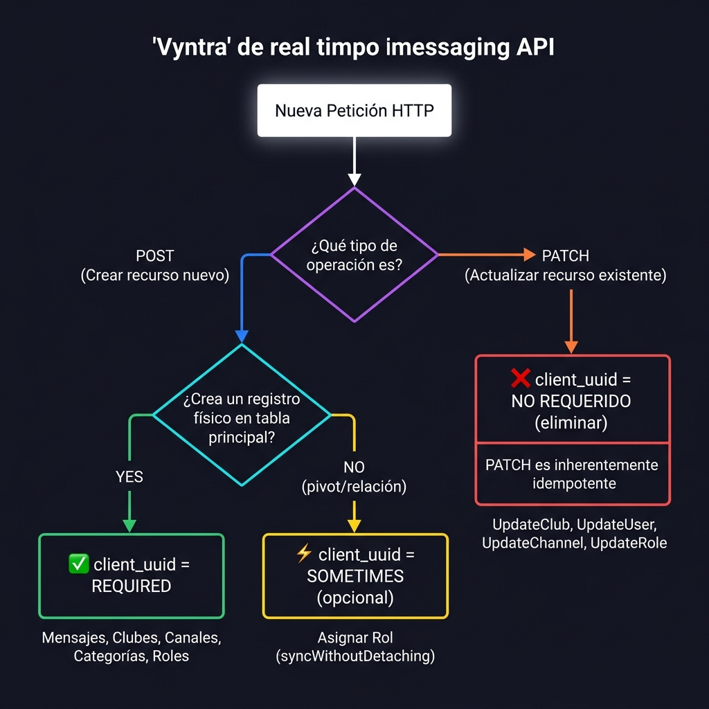
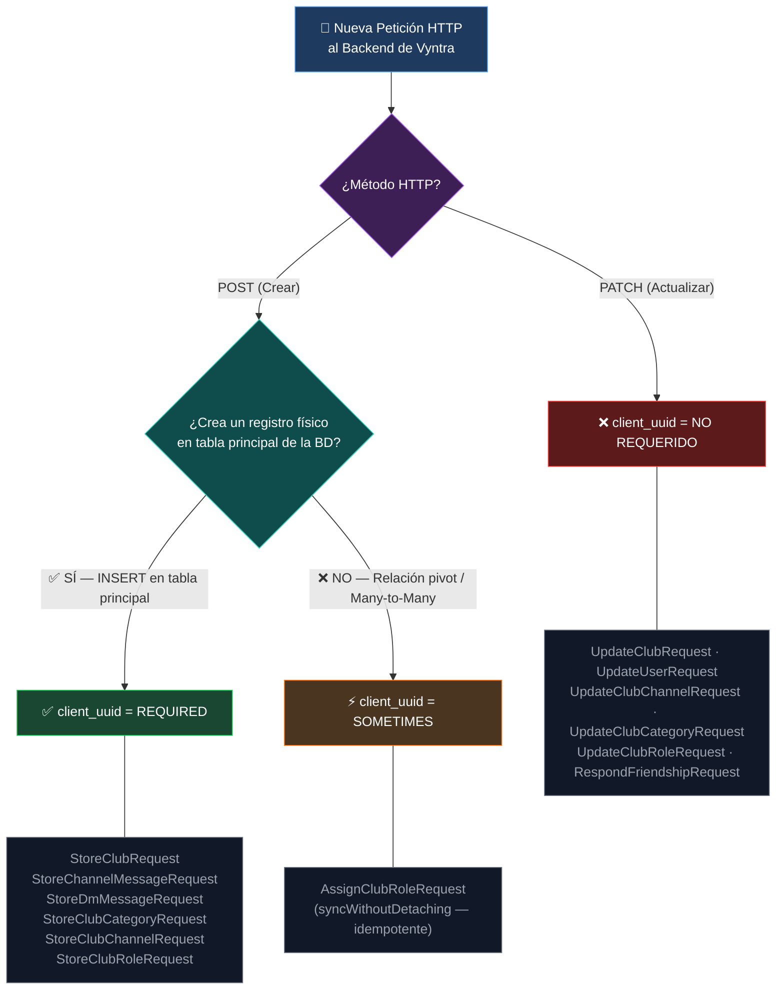
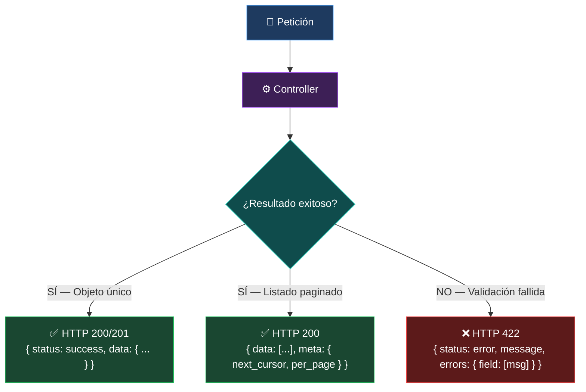
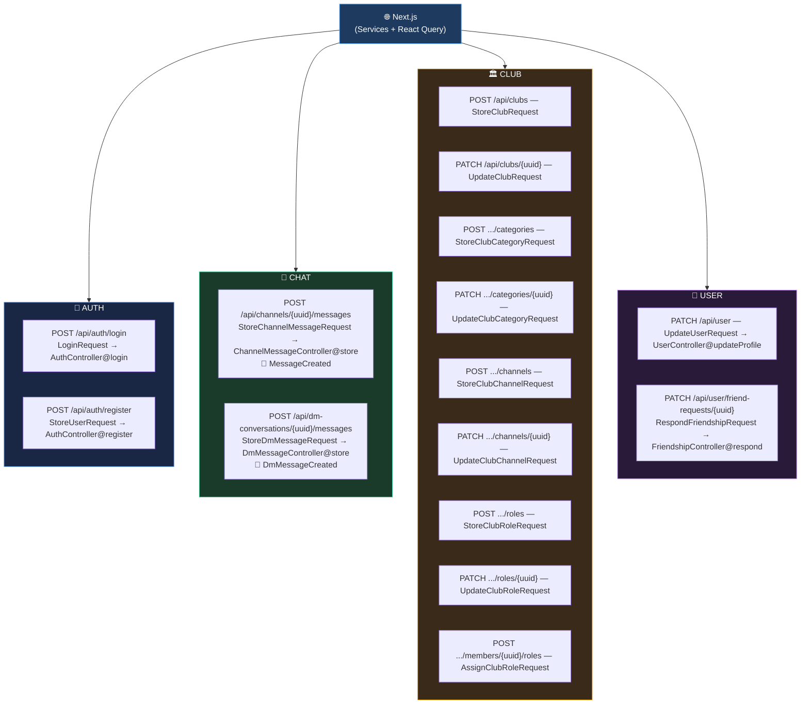

# 📑 Contrato de Interfaz API — Proyecto Vyntra (Vyne)

Contrato de comunicación entre el Frontend (Next.js / React Query) y el Backend (Laravel 11). Fuente de verdad única para la sincronización de payloads, validadores y respuestas.

---

## 1. Reglas Globales

| Regla | Especificación |
| :--- | :--- |
| **Formato** | `application/json` en todos los cuerpos de petición y respuesta. |
| **Naming Convention** | `snake_case` en todos los atributos del payload JSON. |
| **Identificadores** | UUID v4 (string). Nunca IDs numéricos auto-incrementales expuestos. |
| **Fechas** | ISO 8601 — `YYYY-MM-DDTHH:mm:ss.sssZ`. |
| **Idempotencia (POST)** | Las peticiones de creación física de recursos requieren un `client_uuid` (UUID v4 generado en el cliente) para deduplicación en tiempo real. |
| **Idempotencia (PATCH / Pivot)** | Las peticiones de actualización parcial (`PATCH`) y las operaciones sobre tablas pivot son idempotentes por naturaleza — `client_uuid` no requerido (`sometimes` como máximo). |
| **Autenticación** | Bearer Token en el header `Authorization` — gestionado con Laravel Sanctum. |

### Árbol de Decisión — `client_uuid`

Lógica de inclusión de `client_uuid` en `FormRequest` del backend y payloads del frontend.





---

## 2. Esquema de Entidades

### Usuario (`User`)

```json
{
  "uuid": "string",
  "username": "string",
  "user_tag": "string",
  "first_name": "string",
  "last_name": "string",
  "email": "string",
  "avatar_url": "string|null",
  "banner_url": "string|null",
  "bio": "string|null",
  "location": "string|null",
  "is_online": "boolean",
  "created_at": "string",
  "updated_at": "string"
}
```

### Mensaje de Chat (`ChatMessage`)

Estructura compartida para mensajes de canal de club y mensajes directos (DM).

```json
{
  "uuid": "string",
  "client_uuid": "string",
  "content": "string",
  "status": "sent|sending|error",
  "parent_message_uuid": "string|null",
  "sender_uuid": "string",
  "channel_uuid": "string|null",
  "dm_conversation_uuid": "string|null",
  "created_at": "string",
  "updated_at": "string",
  "user": {
    "uuid": "string",
    "username": "string",
    "avatar_url": "string|null"
  }
}
```

### Club y Estructura Organizativa

- **Club:** `{ uuid, name, description|null, avatar_url|null, banner_url|null, owner_uuid, category_tag, created_at, updated_at }`
- **Category:** `{ uuid, club_uuid, name, sort_order, is_private, created_at, updated_at }`
- **Channel:** `{ uuid, category_uuid, name, description|null, type: "text|voice", sort_order, is_private, created_at, updated_at }`
- **ClubRole:** `{ uuid, club_uuid, name, color: "#HEXHEX", permissions: { manage_channels, manage_roles, manage_members, send_messages, manage_club }, created_at, updated_at }`

---

## 3. Standard Envelopes

### Respuesta Exitosa — Objeto Único

```json
{
  "status": "success",
  "data": { ... }
}
```

### Respuesta Exitosa — Paginación por Cursor

```json
{
  "data": [ ... ],
  "meta": {
    "next_cursor": "string|null",
    "per_page": "number"
  }
}
```

### Error de Validación — HTTP 422

```json
{
  "status": "error",
  "message": "The given data was invalid.",
  "errors": {
    "field_name": ["Mensaje descriptivo del error."]
  }
}
```

### Flujo de Envelopes por Resultado



---

## 4. Mapeo de Endpoints

Correspondencia técnica entre servicios del frontend, rutas, validadores (`FormRequest`) y controladores del backend.

| Módulo | Servicio Frontend | Método | Ruta | FormRequest | Controller@Método | Broadcast |
| :--- | :--- | :---: | :--- | :--- | :--- | :--- |
| **Auth** | `AuthService.login` | `POST` | `/api/auth/login` | `LoginRequest` | `AuthController@login` | — |
| | `AuthService.register` | `POST` | `/api/auth/register` | `StoreUserRequest` | `AuthController@register` | — |
| **Chat** | `ChatService.sendMessage` | `POST` | `/api/channels/{c_uuid}/messages` | `StoreChannelMessageRequest` | `ChannelMessageController@store` | `MessageCreated` vía Reverb |
| | `ChatService.sendDmMessage` | `POST` | `/api/dm-conversations/{dm_uuid}/messages` | `StoreDmMessageRequest` | `DmMessageController@store` | `DmMessageCreated` vía Reverb |
| **Club** | `ClubService.createClub` | `POST` | `/api/clubs` | `StoreClubRequest` | `ClubController@store` | `ClubCreated` |
| | `ClubService.updateClub` | `PATCH` | `/api/clubs/{club_uuid}` | `UpdateClubRequest` | `ClubController@update` | `ClubUpdated` |
| | `ClubService.createCategory` | `POST` | `/api/clubs/{club_uuid}/categories` | `StoreClubCategoryRequest` | `ClubCategoryController@store` | `CategoryCreated` |
| | `ClubService.updateCategory` | `PATCH` | `/api/clubs/{club_uuid}/categories/{cat_uuid}` | `UpdateClubCategoryRequest` | `ClubCategoryController@update` | `CategoryUpdated` |
| | `ClubService.createChannel` | `POST` | `/api/clubs/{club_uuid}/channels` | `StoreClubChannelRequest` | `ClubChannelController@store` | `ChannelCreated` |
| | `ClubService.updateChannel` | `PATCH` | `/api/clubs/{club_uuid}/channels/{chan_uuid}` | `UpdateClubChannelRequest` | `ClubChannelController@update` | `ChannelUpdated` |
| | `ClubService.createRole` | `POST` | `/api/clubs/{club_uuid}/roles` | `StoreClubRoleRequest` | `ClubRoleController@store` | `RoleCreated` |
| | `ClubService.updateRole` | `PATCH` | `/api/clubs/{club_uuid}/roles/{role_uuid}` | `UpdateClubRoleRequest` | `ClubRoleController@update` | `RoleUpdated` |
| | `ClubService.assignRole` | `POST` | `/api/clubs/{club_uuid}/members/{member_uuid}/roles` | `AssignClubRoleRequest` | `ClubMemberController@assignRole` | `MemberRoleUpdated` |
| **User** | `UserService.updateUser` | `PATCH` | `/api/user` | `UpdateUserRequest` | `UserController@updateProfile` | `UserProfileUpdated` |
| | `NotificationService.respondToFriendRequest` | `PATCH` | `/api/user/friend-requests/{request_uuid}` | `RespondFriendshipRequest` | `FriendshipController@respond` | `FriendRequestStatusChanged` |

### Mapa de Endpoints por Módulo


