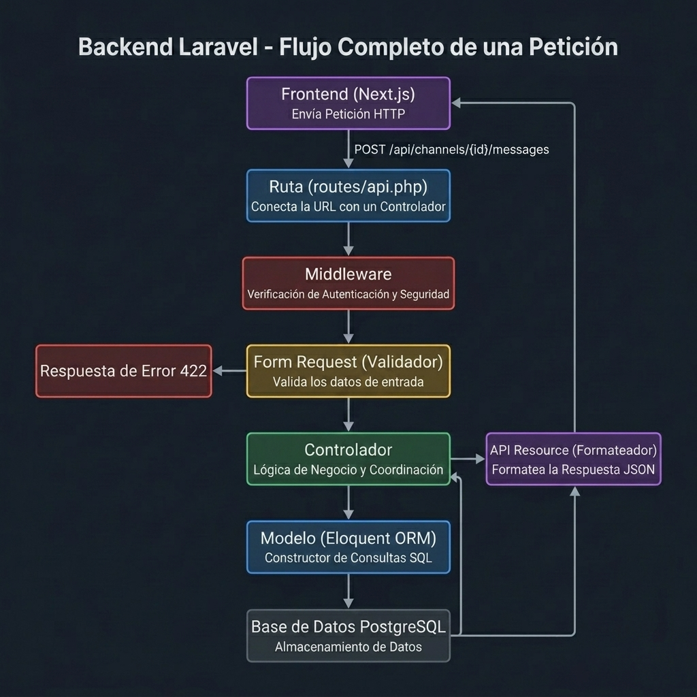
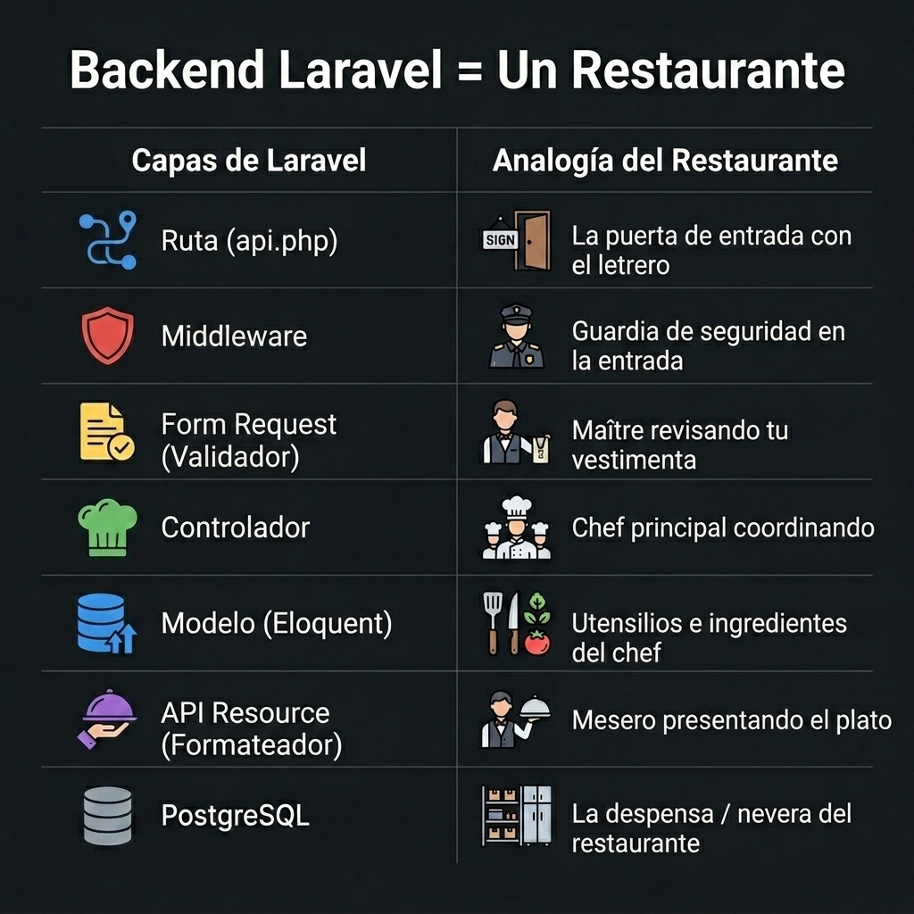
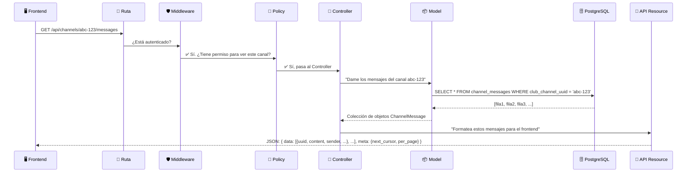
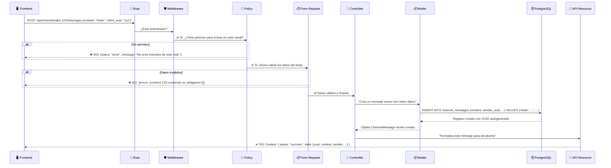
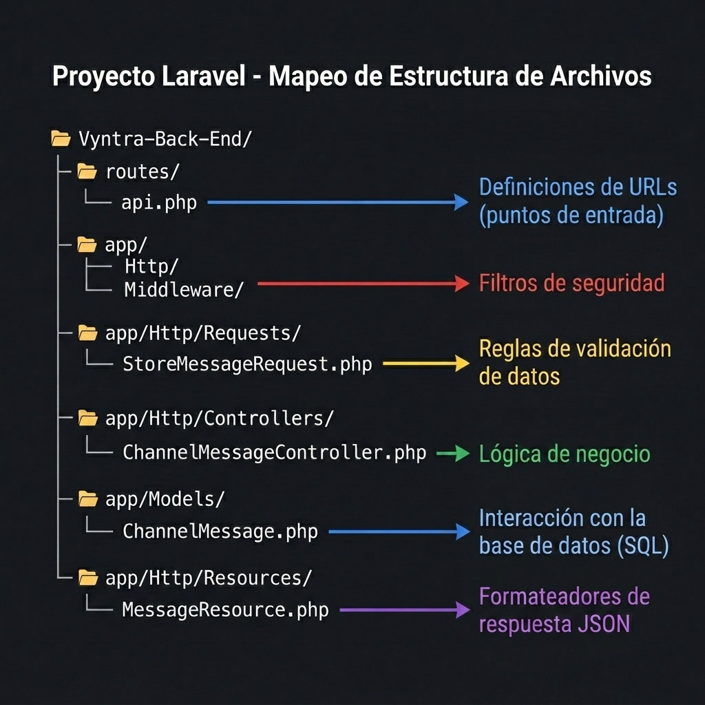

# 🔄 Flujo de Datos del Backend de Vyntra (Laravel)

Este documento explica visualmente cómo viaja una petición desde que el frontend (Next.js) la envía hasta que recibe una respuesta JSON del backend (Laravel).

---

## 1. El Viaje Completo de una Petición (Vista General)

Imagina que un usuario en el frontend presiona el botón **"Enviar Mensaje"** en un canal de chat. Esto es lo que ocurre por detrás:

---

## 2. Analogía del Restaurante 🍽️

Para que nunca olvides el propósito de cada capa, piensa en tu backend como un **restaurante de lujo**:

---

## 3. Los Dos Caminos: Lectura vs. Escritura

### 📖 Camino de LECTURA (GET) — "Quiero ver los mensajes del canal"

> [!NOTE]
> En una lectura (GET), el **Form Request NO participa** porque no hay datos del usuario que validar. Solo se consulta información existente. Sin embargo, la **Policy SÍ participa** porque incluso para leer datos necesitas verificar que el usuario tenga permiso para ver ese recurso.

---

### ✏️ Camino de ESCRITURA (POST) — "Quiero enviar un mensaje nuevo"

> [!IMPORTANT]
> En una escritura (POST, PUT, DELETE), tanto la **Policy** como el **Form Request** participan, en ese orden. Primero la **Policy** verifica permisos (¿puede este usuario hacer esto?). Luego el **Form Request** valida los datos (¿los campos son correctos?). El Controller nunca recibe una petición que no haya pasado ambas capas.

---

## 4. Mapeo de Archivos en tu Proyecto

Cada capa del diagrama corresponde a una carpeta específica dentro de tu proyecto Laravel:

---

## 5. Resumen de Responsabilidades (Regla de Oro)

> [!CAUTION]
> **Cada capa hace UNA SOLA COSA.** Si te encuentras validando datos dentro del Controller, estás rompiendo la arquitectura. Si estás formateando JSON dentro del Model, estás rompiendo la arquitectura. Cada pieza tiene su lugar.

| Capa | ✅ SÍ hace | ❌ NO hace |
|---|---|---|
| **Ruta** | Conectar una URL con un Controller | Validar datos, consultar la BD |
| **Middleware** | Verificar autenticación, limitar peticiones | Lógica de negocio, formatear JSON |
| **Policy** | Verificar permisos del usuario sobre un recurso específico | Validar datos, guardar en BD |
| **Form Request** | Validar y sanitizar los datos entrantes | Guardar en BD, devolver respuestas |
| **Controller** | Coordinar el flujo: recibir, procesar, responder | Escribir SQL directo, formatear JSON a mano |
| **Model** | Definir relaciones, reglas de datos, consultas SQL | Validar datos del frontend, devolver respuestas HTTP |
| **API Resource** | Transformar modelos PHP en JSON limpio | Consultar la BD, validar datos |

