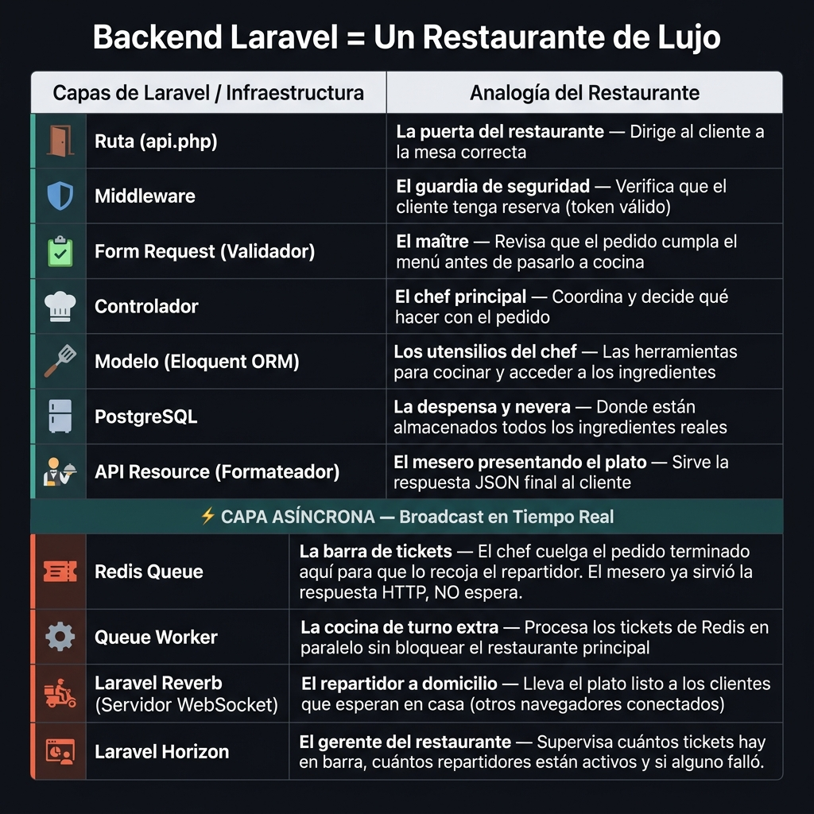
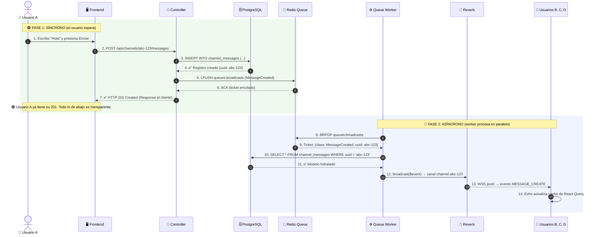
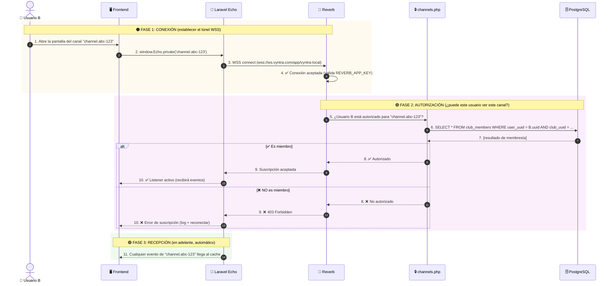

# ⚡ Flujo de Datos en Tiempo Real de Vyntra (WebSockets)

Este documento explica visualmente cómo viaja un evento desde que el Frontend (Next.js) lo dispara hasta que los demás clientes conectados al canal lo reciben en tiempo real.

---

## 1. El Viaje Completo de un Evento (Vista General)

Imagina que un usuario en el frontend publica un mensaje en un canal de chat. Mientras Laravel le devuelve el HTTP 201 al instante, **en paralelo** otro sistema lleva ese mismo mensaje a los demás usuarios conectados al canal. Esto es lo que ocurre por detrás:

> [!IMPORTANT]
> **La BD no desaparece — PostgreSQL es la casa de los datos.** Redis es **solo el sistema de tickets**: guarda una referencia al modelo (`{class: 'ChannelMessage', uuid: 'abc-123'}`), no la data completa. Cuando el worker procesa el ticket, hace `Model::find($uuid)` contra PostgreSQL para rehidratar el modelo fresco. Sin PostgreSQL, el broadcast no tiene qué mandar.

> [!IMPORTANT]
> **Redis NO es un buffer de escritura a la BD.** El INSERT a PostgreSQL se hace DIRECTO en el Controller (paso 3 del Mermaid de Emisión). Redis solo es el buffer del **broadcast** (la notificación a los demás clientes), no de la escritura. Cada request HTTP hace 1 INSERT a Postgres. Si llegan 10K requests/segundo, el cuello de botella se mitiga con **connection pooling + réplicas de lectura + particionamiento**, no metiendo Redis entre el Controller y la BD. Redis entra **DESPUÉS** del INSERT, solo para la notificación.

> [!NOTE]
> **Lo obvio:** El HTTP y el WebSocket son dos canales independientes. El usuario que publica no espera al WebSocket para recibir su respuesta — recibe el 201 al instante, y el broadcast les llega a los demás usuarios **después** (sub-segundo).
>
> **Lo no tan obvio:** El Controller no llama a Reverb directamente. Mete el evento en una cola de Redis y retorna. Un proceso aparte (`queue:work`) saca el evento de la cola, **consulta PostgreSQL para rehidratar el modelo**, y se lo pasa a Reverb. Esto desacopla la respuesta HTTP del envío WebSocket.

---

## 2. Analogía del Restaurante + Capa Asíncrona 🍽️⚡

Para no olvidarte nunca del propósito de cada capa, el backend de Vyntra se divide en dos mundos: el mundo **síncrono** (HTTP, lo que el usuario espera) y el mundo **asíncrono** (lo que pasa en paralelo sin que el usuario lo sepa).

> [!NOTE]
> **Lo obvio:** La primera mitad (Ruta, Middleware, Form Request, Controller, Modelo, PostgreSQL, API Resource) es el "restaurante" — sirve al cliente HTTP y devuelve la respuesta JSON.
>
> **Lo no tan obvio:** La segunda mitad (**Redis Queue, Queue Worker, Laravel Reverb, Laravel Horizon**) es la "cocina de turno extra" — procesa pedidos (eventos) en paralelo sin bloquear el restaurante principal. El cliente HTTP nunca tiene que esperar a esta segunda mitad.

---

## 3. Los Dos Caminos: Emisión vs Recepción

> El flujo se divide en 2 caminos:
> - **EMISIÓN** (cómo el backend avisa a los demás)
> - **RECEPCIÓN** (cómo el cliente se conecta y recibe)
>
> En los Mermaid, las flechas con `->>` son **síncronas** (esperan respuesta) y las flechas con `-->>` son **respuestas**. PostgreSQL aparece como actor independiente porque SIEMPRE participa (INSERT al inicio, SELECT al final del worker).

### 📤 Camino de EMISIÓN (Backend) — "Alguien hizo algo, notifico a los demás"

> Lee de **arriba hacia abajo**. La línea punteada horizontal divide las dos fases: arriba es **síncrono** (el usuario espera), abajo es **asíncrono** (el worker procesa en paralelo).

> [!NOTE]
> **Lo obvio:** El usuario A recibe su HTTP 201 en el paso 7, **antes** de que el broadcast salga (paso 8+). El orden importa: primero la fuente de verdad (BD), después la notificación.
>
> **Lo no tan obvio:** El worker hace un SELECT a la BD en el paso 10 para rehidratar el modelo. Sin ese SELECT, no hay payload para mandar.

> [!CAUTION]
> **¿Por qué no se mete Redis entre el Controller y la BD?** Algunos sistemas usan Redis como write-through cache para evitar golpear Postgres directamente. **Vyntra no lo hace** porque rompería la atomicidad del INSERT: si Redis se cae entre el cache y la BD, perdés datos. El patrón correcto para escalar escrituras es **connection pooling (PgBouncer) + réplicas de lectura + particionamiento de tablas**, no buffering de escrituras. Redis solo se usa para lo que es bueno: **buffer de notificaciones asíncronas** (el broadcast).

> [!IMPORTANT]
> **Resiliencia:** Si el Worker está caído, los tickets se acumulan en Redis (paso 5 sigue funcionando). Cuando el Worker vuelva, los procesa todos en orden. **No se pierden** (a menos que `--tries=3` se agoten y vayan a `queue:failed`).

> [!CAUTION]
> **Caso de error:** Si el evento falla al procesarse (paso 10 → modelo borrado, paso 12 → Reverb caído), el Worker reintenta hasta `--tries=3` y luego lo manda a `queue:failed`. Ver `php artisan queue:failed` para revisar y `php artisan queue:retry` para reintentar manualmente.

### 📥 Camino de RECEPCIÓN (Cliente) — "Quiero recibir eventos del canal"

> Lee de **arriba hacia abajo**. La autenticación del canal se hace UNA sola vez al suscribirse (pasos 1-5), después es automática.

> [!NOTE]
> **Lo obvio:** La autenticación se hace UNA VEZ al suscribirse. Después, el cliente solo recibe eventos sin re-autorización.
>
> **Lo no tan obvio:** El paso 6 hace una query SQL por cada nueva suscripción. Si un usuario se suscribe a 10 canales, son 10 queries — **N+1 potencial**. Se puede mitigar con `Cache::remember()` en `channels.php` si la membresía cambia poco.

> [!CAUTION]
> **Caso de error:** Si el `REVERB_APP_KEY` no coincide (paso 4) o el usuario no es miembro (paso 8), el frontend debe loguear el error y reintentar la conexión con backoff exponencial. **Nunca** debe quedar en estado "suscripción pendiente" sin un listener de error.

---

## 4. Mapeo de Archivos en tu Proyecto

Cada capa del flujo corresponde a un archivo o carpeta específica dentro del proyecto Laravel:

> [!NOTE]
> **Lo obvio:** Los eventos broadcast viven en `app/Events/` y se organizan por dominio (`Chat/`, `Dm/`, `Club/`, `User/`). Cada evento es una clase PHP independiente que define qué canal usar y qué datos enviar.
>
> **Lo no tan obvio:** Hay **3 archivos de configuración** trabajando juntos para que el pipeline funcione:
>
> | Archivo | ¿Qué define? |
> |---|---|
> | `config/queue.php` | La conexión Redis y la cola `broadcasts` |
> | `config/broadcasting.php` | El driver (`reverb`) y las credenciales de la app Reverb |
> | `config/reverb.php` | Las credenciales de la app (app_id, key, secret) |
>
> Si falta uno de los tres, el pipeline completo se rompe. El evento se encola pero nunca llega a Reverb, o Reverb rechaza la conexión porque las credenciales no coinciden.

---

## 5. Resumen de Responsabilidades (Regla de Oro)

> [!CAUTION]
> **Cada capa hace UNA SOLA COSA.** Si te encuentras ejecutando lógica de broadcast en el Controller directamente, estás rompiendo la arquitectura. Si estás encolando eventos manualmente en Reverb, estás rompiendo la arquitectura. Si el Worker está decidiendo a qué canal va un evento, estás rompiendo la arquitectura. Cada pieza tiene su lugar.

| Capa | ✅ SÍ hace | ❌ NO hace |
|---|---|---|
| **Controller** | Validar, autorizar, escribir en BD, despachar eventos (`Event::dispatch()`) | Llamar a Reverb directamente, encolar manualmente en Redis, formatear payloads de broadcast |
| **Event (clase)** | Definir el payload (`broadcastWith`), el canal (`broadcastOn`), y la cola (`broadcastQueue`) | Ejecutar lógica de negocio, consultar la BD, formatear respuestas HTTP |
| **Redis Queue** | Almacenar eventos encolados (LPUSH/BRPOP) de forma durable | Procesar eventos, transformar payloads, decidir canales |
| **Queue Worker** | Sacar el evento de Redis, instanciar la clase, llamar a Reverb (`ShouldBroadcast`) | Decidir a qué canal va el evento, transformar el payload del evento |
| **Laravel Reverb** | Aceptar conexiones WSS, autorizar canales delegando a `routes/channels.php`, distribuir eventos a suscriptores | Almacenar eventos, persistir mensajes, ejecutar lógica de negocio |
| **`routes/channels.php`** | Verificar membresía y permisos de suscripción para cada canal privado | Definir qué eventos se mandan, transformar payloads, ejecutar lógica de negocio |
| **Frontend (Next.js + Echo)** | Suscribirse a canales con Echo, recibir eventos, modificar la cache de React Query | Procesar la lógica de negocio del evento, hacer fetch HTTP desde el listener |

---

## 6. ¿Y la API REST?

La API REST y el WebSocket son **complementarios**, no excluyentes. Cada uno tiene su rol en la arquitectura:

| Canal | Se usa para | No se usa para |
|---|---|---|
| **HTTP (REST)** | Escrituras (POST/PUT/DELETE), lecturas de datos completos, autenticación, sincronización inicial | Notificaciones en tiempo real, chat en vivo, actualizaciones de estado sub-segundo |
| **WebSocket (Reverb)** | Notificaciones en tiempo real, presencia, chat, actualizaciones estructurales, deduplicación de escrituras | Escrituras (el frontend nunca escribe por WebSocket), autenticación inicial, carga de datos pesados |

> [!NOTE]
> **Lo obvio:** El Controller es el punto único donde se cruzan las dos vías. Despacha el evento broadcast DESPUÉS de escribir en la BD. El HTTP lleva la escritura, el WebSocket lleva la notificación.
>
> **Lo no tan obvio:** El Frontend **NUNCA debe confiar en el WebSocket como única fuente de verdad**. Si el WebSocket se cae (reconexión en progreso, servidor Reverb caído, cliente en background), el Frontend debe poder refetchear vía HTTP. El WebSocket es **optimización**, no requisito de correctness. Si pierdes WebSocket, pierdes tiempo real, pero no datos.

> Ver el flujo HTTP completo en [`../../http_request_lifecycle.md`](../../http_request_lifecycle.md).

---

## 6.5. Prompts para Generar las Imágenes (Nano Banana Pro)

> Las dos imágenes referenciadas en este documento están pendientes de creación. Aquí están los prompts listos para pegar en Nano Banana Pro. **El texto de las imágenes debe estar en español.**

### Imagen 1 — Viaje Completo de un Evento (`./assets/viaje_evento_broadcast.png`)

> **English prompt for Nano Banana Pro:**
>
> Create a clean, dark-mode infographic for a Vyntra WebSocket realtime data flow. Reference style: minimalist diagram with dark navy background, monospaced font, colored boxes connected by arrows. Title in Spanish: **"Viaje de un Evento Broadcast en Vyntra"**. Below the title, draw a horizontal flow diagram with 7 elements connected by arrows. The flow has TWO LAYERS:
>
> **Top layer (sequential horizontal flow):**
> 1. **Frontend (Next.js)** — arrow →
> 2. **HTTP Request → Laravel Controller** — arrow →
> 3. **Redis Queue (cola "broadcasts")** — labeled with caption "buffer temporal — no retiene data" →
> 4. **Queue Worker (php artisan queue:work)** — labeled with caption "rehidrata modelo desde BD" →
> 5. **Laravel Reverb (WebSocket Server)** — arrow →
> 6. **Clientes WebSocket suscritos**
>
> **Bottom layer (persistent data source — MUST be clearly visible as the foundation of the entire flow):**
> 7. **PostgreSQL — Base de datos** — shown as a wide bar/database icon spanning the bottom of the entire diagram, labeled "casa de los datos — vive aquí permanentemente". Use a downward arrow from the Controller to PostgreSQL (label: "INSERT al crear el mensaje") and another downward arrow from Queue Worker to PostgreSQL (label: "SELECT para rehidratar el modelo").
>
> The visual hierarchy MUST make clear: Redis is a thin temporary buffer, PostgreSQL is the thick persistent foundation. Below each top-layer box, write a short description in Spanish (max 10 words each). Use the same dark background and monospaced font style. The diagram should look technical and easy to follow. No emojis. All text in Spanish.

### Imagen 2 — Mapeo de Carpetas de Eventos (`./assets/mapeo_carpetas_eventos.png`)

> **English prompt for Nano Banana Pro:**
>
> Create a clean, dark-mode infographic diagram for a Vyntra WebSocket events architecture. Reference image attached: a folder tree style diagram with colored arrows pointing to descriptions. Title at the top in Spanish: **"Eventos WebSocket de Vyntra"**. Do NOT include any subtitle like "Proyecto Laravel" or reference to "HTTP" or "request lifecycle".
>
> Below the title, show a single `Vyntra-Back-End/` folder tree with 4 groups of files, each connected by a colored arrow to a short description in Spanish. The 4 groups are:
>
> 1. `app/Events/` subfolder (with sub-subfolders `Chat/`, `Dm/`, `Club/`, `User/` visible) → arrow → "Definiciones de eventos broadcast (20 eventos)"
>
> 2. `routes/channels.php` → arrow → "Autorización de canales privados WebSocket"
>
> 3. `app/Providers/BroadcastServiceProvider.php` → arrow → "Registro del sistema de broadcasting en Laravel"
>
> 4. `config/queue.php` + `config/broadcasting.php` + `config/reverb.php` → single arrow → "Configuración de cola dedicada y driver Reverb"
>
> Use the same dark navy background, monospaced font for file paths, and the same arrow colors as the original (blue, red, yellow, green, purple, cyan). Keep it clean, technical, and easy to read. No emojis in the diagram. All text in Spanish.

---

## 7. ¿Qué tan potente es este flujo para Vyntra (monolito)?

Vyntra es una aplicación **monolítica** (un solo proceso Laravel + un solo servidor Reverb + un solo Redis). En este contexto, el flujo de eventos broadcast logra resultados sorprendentes para su simplicidad arquitectónica.

### Logros del monolito bien diseñado

| Característica | Detalle |
|---|---|
| **Latencia sub-segundo** | Entre un POST HTTP y la entrega WebSocket a otros clientes: < 200ms en condiciones normales |
| **Desacople total** | El que escribe (HTTP) no espera al que notifica (WebSocket). Son pipelines independientes |
| **Tolerancia a fallos** | Worker caído → no afecta el HTTP. Reverb caído → no afecta el HTTP. Redis caído → el HTTP sigue (sin cola) |
| **Escalabilidad horizontal** | Agregar más nodos Reverb con `REVERB_SCALING_ENABLED=true`. Agregar más Workers con `php artisan queue:work --queue=broadcasts` |
| **Costo operativo bajo** | Un solo binario PHP, un solo Redis, un solo servidor (o VPS). Sin orquestación de microservicios |

### Limitaciones honestas del monolito

| Limitación | Impacto real | Mitigación |
|---|---|---|
| **Single point of failure** | Si el servidor Reverb cae, ningún cliente recibe eventos hasta que reinicie | Supervisión con systemd/supervisor + heartbeat en frontend para reconexión automática |
| **Conexiones concurrentes por instancia** | ~10K-30K antes de necesitar scaling horizontal (probado en k6) | `REVERB_SCALING_ENABLED=true` + load balancer con sticky sessions |
| **Worker como cuello de botella** | Con un solo worker, eventos lentos (broadcasts grandes, muchas relaciones) atrasan la cola | Múltiples workers en parallero: `php artisan queue:work --queue=broadcasts --sleep=1` |
| **Redis centralizado** | Una sola instancia Redis para cache + cola + sesiones puede saturarse | Redis LRU para cache, separar instancia Redis para cola si es necesario |

> [!NOTE]
 El monolito escala MUCHO más de lo que la gente cree. Con Octane (Swoole), Redis bien tuneado y un solo servidor Reverb, Vyntra puede manejar 30K conexiones concurrentes. Migrar a microservicios **antes** de tener evidencia con métricas es sobreingeniería.
