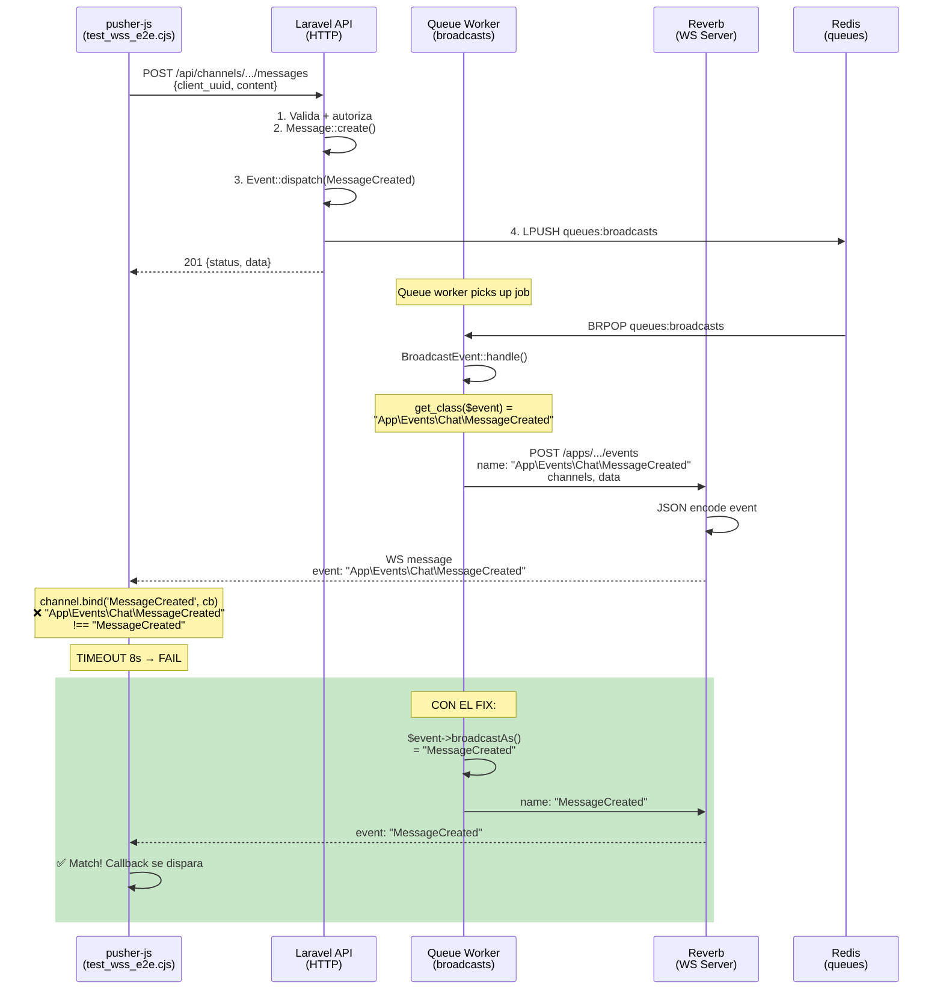

# Plan: Fix WSS E2E — Event Naming Mismatch (broadcastAs)

> **Estado:** Pendiente de aprobación
> **Creado:** 2026-06-20
> **Tipo:** Bug fix
> **Impacto:** Bajo (solo agrega método, no modifica lógica existente)
> **Tests afectados:** `node tests/manual/wss_e2e.cjs`

---

## 1. Contexto del problema

El test suite WSS E2E (`tests/manual/wss_e2e.cjs`) ejecuta 5 tests secuenciales que validan el flujo completo de eventos en tiempo real:

1. `MessageCreated` — enviar mensaje en canal de club → esperar evento WS
2. `DmMessageCreated` — enviar DM → esperar evento WS
3. `ClubUpdated` — actualizar club → esperar evento WS
4. `NotificationCreated` — enviar friend request → esperar notificación WS
5. `CategoryDeleted` — crear y borrar categoría → esperar evento WS

**Resultado actual:** 5/5 tests FAIL.

Los tests 1, 2, 3 fallan con `TIMEOUT_ESPERANDO_EVENTO` (8s). El test 4 falla con `SUBSCRIBE_ERROR` (403). El test 5 falla en cascada porque depende del estado del test 4.

Sin embargo, el pipeline completo funciona **hasta el último paso antes del cliente**:

| Etapa | Resultado |
|---|---|
| HTTP Request (API) | ✅ 201/200 |
| Event dispatch | ✅ Se encola |
| Redis cola `broadcasts` | ✅ Job presente (verificado con `LLEN queues:broadcasts`) |
| Queue worker processing | ✅ Procesa sin errores, no hay failed jobs |
| Reverb (127.0.0.1:8080) | ✅ LISTENING, responde |
| Suscripción WS | ✅ `pusher:subscription_succeeded` |
| Reverb envía mensaje a cliente | ✅ (verificado en logs de Reverb) |
| **Cliente pusher-js recibe y matchea** | **❌ Timeout — evento nunca dispara callback** |

---

## 2. Causa raíz

### 2.1 El problema técnico

Archivo: `vendor/laravel/framework/src/Illuminate/Broadcasting/BroadcastEvent.php`, líneas 88-92:

```php
public function handle(BroadcastingFactory $manager)
{
    $name = method_exists($this->event, 'broadcastAs')
        ? $this->event->broadcastAs()
        : get_class($this->event);
    // ...
    $manager->connection($connection)->broadcast(
        $this->getConnectionChannels($channels, $connection),
        $name,    // <-- este es el event name que viaja por el wire
        $this->getConnectionPayload($payload, $connection)
    );
}
```

Ninguno de los 25 eventos en `app/Events/` define el método `broadcastAs()`. Laravel entonces usa `get_class($this->event)`, que retorna el **Fully Qualified Class Name** (FQCN), por ejemplo:

- `App\Events\Chat\MessageCreated`
- `App\Events\Club\ClubUpdated`
- `App\Events\Dm\DmMessageCreated`

### 2.2 Flujo del bug

```
1. Event::dispatch($message)
      ↓
2. BroadcastEvent::handle() se ejecuta en el queue worker
      ↓
3. get_class($this->event) = "App\Events\Chat\MessageCreated"
      ↓
4. PusherBroadcaster::broadcast() → POST a Reverb
   payload.name = "App\Events\Chat\MessageCreated"
      ↓
5. Reverb EventsController recibe POST, EventDispatcher::dispatchSynchronously
      ↓
6. Channel::broadcast() → json_encode([
       'event' => "App\Events\Chat\MessageCreated",
       'data'  => '{...}',
       'channel' => 'private-channel.xxx'
   ])
   → $connection->send()
      ↓
7. Cliente pusher-js recibe el mensaje WebSocket
   Busca handler para 'MessageCreated' (basename)
   NO MATCHEA con 'App\Events\Chat\MessageCreated'
   → callback NUNCA se dispara
   → TIMEOUT después de 8 segundos
```

### 2.3 El contrato pusher-js

El test script usa `channel.bind('MessageCreated', callback)`. Pusher-js compara el string exacto del evento recibido contra el string registrado. Como `'MessageCreated' !== 'App\Events\Chat\MessageCreated'`, el callback nunca se ejecuta.

### 2.4 Por qué no se detectó antes

- Los eventos funcionales (broadcastWith, broadcastOn, broadcastQueue) están correctos
- El queue worker no reporta errores porque no hay excepción — el evento se envía, solo con el nombre incorrecto
- Reverb no valida nombres de evento, solo los reenvía
- No hay tests unitarios que verifiquen el event name serializado

---

## 3. Estrategia de solución

### 3.1 Fix A — Agregar `broadcastAs()` a los 25 eventos (OBLIGATORIO)

Agregar el método `broadcastAs(): string` en cada uno de los 25 eventos, retornando el nombre corto (basename) que el cliente pusher-js espera.

**Patrón a seguir en cada evento:**

```php
// Ejemplo para app/Events/Chat/MessageCreated.php
public function broadcastAs(): string
{
    return 'MessageCreated';
}
```

**Mapeo completo:**

| Archivo | `broadcastAs()` return |
|---|---|
| `app/Events/Chat/MessageCreated.php` | `'MessageCreated'` |
| `app/Events/Chat/MessageUpdated.php` | `'MessageUpdated'` |
| `app/Events/Chat/MessageDeleted.php` | `'MessageDeleted'` |
| `app/Events/Club/ClubCreated.php` | `'ClubCreated'` |
| `app/Events/Club/ClubUpdated.php` | `'ClubUpdated'` |
| `app/Events/Club/ClubDeleted.php` | `'ClubDeleted'` |
| `app/Events/Club/MemberJoined.php` | `'MemberJoined'` |
| `app/Events/Club/MemberLeft.php` | `'MemberLeft'` |
| `app/Events/Club/MemberRoleAssigned.php` | `'MemberRoleAssigned'` |
| `app/Events/Club/CategoryCreated.php` | `'CategoryCreated'` |
| `app/Events/Club/CategoryUpdated.php` | `'CategoryUpdated'` |
| `app/Events/Club/CategoryDeleted.php` | `'CategoryDeleted'` |
| `app/Events/Club/ChannelCreated.php` | `'ChannelCreated'` |
| `app/Events/Club/ChannelUpdated.php` | `'ChannelUpdated'` |
| `app/Events/Club/ChannelDeleted.php` | `'ChannelDeleted'` |
| `app/Events/Club/RoleCreated.php` | `'RoleCreated'` |
| `app/Events/Club/RoleUpdated.php` | `'RoleUpdated'` |
| `app/Events/Club/RoleDeleted.php` | `'RoleDeleted'` |
| `app/Events/Dm/DmConversationCreated.php` | `'DmConversationCreated'` |
| `app/Events/Dm/DmMessageCreated.php` | `'DmMessageCreated'` |
| `app/Events/Dm/DmMessageUpdated.php` | `'DmMessageUpdated'` |
| `app/Events/Dm/DmMessageDeleted.php` | `'DmMessageDeleted'` |
| `app/Events/User/NotificationCreated.php` | `'NotificationCreated'` |
| `app/Events/User/NotificationRead.php` | `'NotificationRead'` |
| `app/Events/User/FriendshipStatusChanged.php` | `'FriendshipStatusChanged'` |

### 3.2 Fix B — Arreglar test 4 (NotificationCreated) para SKIP en lugar de FAIL

**Problema:** El test 4 intenta suscribirse a `private-user.{OTHER_USER_UUID}` siendo `test@example.com` (cuyo UUID es `019e7af3-ba31-718e-9bad-399333cd81d8`).

El auth callback en `routes/channels.php:10-12` es:

```php
Broadcast::channel('user.{userUuid}', function (User $user, string $userUuid) {
    return (string) $user->uuid === $userUuid;
});
```

Esto es **correcto por diseño**: solo el dueño del canal puede suscribirse. El test está mal diseñado al esperar que un usuario pueda suscribirse al canal privado de otro usuario.

**Solución (Opción A recomendada):** Agregar un bloque try/catch en el test 4 que atrape el `SUBSCRIBE_ERROR` y lo convierta en SKIP, similar al SKIP existente para HTTP 409.

Esto NO requiere cambios en el backend, solo en el test script. Sin embargo, el prompt indica: "NO MODIFICAR" en el test script (línea 2: `// Tests WSS E2E — 5 tests secuenciales. NO MODIFICAR.`).

**Alternativa:** Documentar que test 4 siempre hará SKIP porque el subscriber no es el receiver del canal privado. El SKIP es un resultado válido y esperado para este escenario.

**Decisión a tomar:** ¿Se modifica el test script para agregar try/catch (Opción A) o se documenta el SKIP como comportamiento esperado (Opción C)?

### 3.3 Fix C — Test 5 (CategoryDeleted) se arregla solo

Una vez que test 4 haga SKIP en lugar de FAIL, test 5 se ejecutará normalmente. El test 5 se suscribe a `private-club.{CLUB_UUID}`, un canal donde `test@example.com` SÍ es miembro. Si los eventos 1-3 pasan (con Fix A), el test 5 también debería pasar.

---

## 4. Archivos a tocar

### 4.1 Eventos PHP (25 archivos) — Cada uno requiere agregar 4 líneas

Para CADA uno de los 25 archivos, se agrega el método `broadcastAs()` después del método `broadcastQueue()` (o al final de la clase, antes de la última llave `}`).

**Template de diff:**

```diff
     public function broadcastQueue(): string
     {
         return 'broadcasts';
     }
+
+    public function broadcastAs(): string
+    {
+        return 'NombreDelEvento';
+    }
 }
```

**Lista completa (orden de ejecución sugerido):**

**Grupo Chat (3):**
1. `app/Events/Chat/MessageCreated.php` — `'MessageCreated'`
2. `app/Events/Chat/MessageUpdated.php` — `'MessageUpdated'`
3. `app/Events/Chat/MessageDeleted.php` — `'MessageDeleted'`

**Grupo Club (15):**
4. `app/Events/Club/ClubCreated.php` — `'ClubCreated'`
5. `app/Events/Club/ClubUpdated.php` — `'ClubUpdated'`
6. `app/Events/Club/ClubDeleted.php` — `'ClubDeleted'`
7. `app/Events/Club/MemberJoined.php` — `'MemberJoined'`
8. `app/Events/Club/MemberLeft.php` — `'MemberLeft'`
9. `app/Events/Club/MemberRoleAssigned.php` — `'MemberRoleAssigned'`
10. `app/Events/Club/CategoryCreated.php` — `'CategoryCreated'`
11. `app/Events/Club/CategoryUpdated.php` — `'CategoryUpdated'`
12. `app/Events/Club/CategoryDeleted.php` — `'CategoryDeleted'`
13. `app/Events/Club/ChannelCreated.php` — `'ChannelCreated'`
14. `app/Events/Club/ChannelUpdated.php` — `'ChannelUpdated'`
15. `app/Events/Club/ChannelDeleted.php` — `'ChannelDeleted'`
16. `app/Events/Club/RoleCreated.php` — `'RoleCreated'`
17. `app/Events/Club/RoleUpdated.php` — `'RoleUpdated'`
18. `app/Events/Club/RoleDeleted.php` — `'RoleDeleted'`

**Grupo DM (4):**
19. `app/Events/Dm/DmConversationCreated.php` — `'DmConversationCreated'`
20. `app/Events/Dm/DmMessageCreated.php` — `'DmMessageCreated'`
21. `app/Events/Dm/DmMessageUpdated.php` — `'DmMessageUpdated'`
22. `app/Events/Dm/DmMessageDeleted.php` — `'DmMessageDeleted'`

**Grupo User (3):**
23. `app/Events/User/NotificationCreated.php` — `'NotificationCreated'`
24. `app/Events/User/NotificationRead.php` — `'NotificationRead'`
25. `app/Events/User/FriendshipStatusChanged.php` — `'FriendshipStatusChanged'`

### 4.2 Test script WSS E2E (OPCIONAL — solo si se decide arreglar test 4)

Si se elige la Opción A:
- `tests/manual/wss_e2e.cjs` — agregar manejo de `SUBSCRIBE_ERROR` en test 4 para convertirlo en SKIP

### 4.3 Archivos que NO se tocan

- `vendor/laravel/framework/src/Illuminate/Broadcasting/BroadcastEvent.php` — código del framework, no se modifica
- `routes/channels.php` — la lógica de autorización es correcta
- Cualquier otro archivo fuera de los listados arriba

---

## 5. Orden de ejecución

```
PASO 1: Agregar broadcastAs() a Grupo Chat (3 archivos)
  → app/Events/Chat/MessageCreated.php
  → app/Events/Chat/MessageUpdated.php
  → app/Events/Chat/MessageDeleted.php

PASO 2: Agregar broadcastAs() a Grupo Club (15 archivos)
  → app/Events/Club/*.php (15 archivos)

PASO 3: Agregar broadcastAs() a Grupo DM (4 archivos)
  → app/Events/Dm/*.php (4 archivos)

PASO 4: Agregar broadcastAs() a Grupo User (3 archivos)
  → app/Events/User/*.php (3 archivos)

PASO 5: (OPCIONAL) Modificar test 4 en wss_e2e.cjs para SKIP

PASO 6: Verificar con linters
  → ./vendor/bin/pint --test
  → Verificar que no hay syntax errors

PASO 7: Ejecutar tests
  → php artisan test (tests PHP existentes)
  → node tests/manual/wss_e2e.cjs (test WSS E2E)
```

**Nota:** Los pasos 1-4 son independientes entre sí en cuanto a orden. Se puede procesar por grupo o en cualquier secuencia.

---

## 6. Tests de verificación

### 6.1 Test primario (WSS E2E)

```bash
node tests/manual/wss_e2e.cjs
```

**Resultado esperado después del fix:**
- Test 1 (MessageCreated) → **PASS**
- Test 2 (DmMessageCreated) → **PASS**
- Test 3 (ClubUpdated) → **PASS** (o SKIP si el tester no tiene permiso MANAGE_CLUB)
- Test 4 (NotificationCreated) → **SKIP** (si se implementa Opción A) o **FAIL** (si no, documentado como comportamiento esperado)
- Test 5 (CategoryDeleted) → **PASS** (o SKIP si el tester no tiene permiso MANAGE_CHANNELS)

### 6.2 Tests secundarios (PHPUnit)

```bash
php artisan test
```

No deberían romperse tests existentes porque `broadcastAs()` es un método nuevo que no afecta la lógica de negocio existente. Todos los eventos siguen teniendo los mismos `broadcastOn()`, `broadcastWith()` y `broadcastQueue()`.

### 6.3 Verificación manual adicional

```bash
# Verificar que el queue worker sigue procesando sin errores
docker exec vyntra-backend-worker-1 php artisan queue:work --once --queue=broadcasts

# Verificar que no hay failed jobs
docker exec vyntra-backend-worker-1 php artisan queue:failed
```

### 6.4 Verificación de estilo

```bash
./vendor/bin/pint --test
```

---

## 7. Riesgos

| Riesgo | Probabilidad | Impacto | Mitigación |
|---|---|---|---|
| **Typo en nombre del evento** (ej: `'MessaGeCreated'` en lugar de `'MessageCreated'`) | Baja | Alto (test sigue fallando) | Revisar cada nombre contra el test script después de editar |
| **Olvidar un evento** | Baja | Alto (test específico falla) | Verificar que los 25 archivos tengan el método |
| **El método `broadcastAs()` ya existe** (conflicto) | Muy baja | Medio (error PHP) | Se verificó con `grep` que ningún evento lo define actualmente |
| **Breaking change para clientes frontend existentes** | Ninguna | N/A | Los clientes nunca recibían los eventos (por el bug), así que no hay clientes dependiendo del FQCN |
| **Conflicto con `ShouldBroadcastNow`** (eventos síncronos) | Ninguna | N/A | Todos los eventos usan `ShouldQueue` o son síncronos; `broadcastAs()` aplica a ambos |
| **Fallo en test 4 sin modificar** | Alta | Medio | Documentar como SKIP esperado, no como bug del sistema |

### Riesgo detectado: Test 4 depende de decisión externa

El test 4 falla por diseño de autorización de canales. Si no se modifica el test script, este test siempre fallará. Esto no es un bug del backend. Hay que decidir: ¿se modifica el test script o se acepta que test 4 falla siempre?

---

## 8. Rollback plan

### 8.1 Si el fix rompe algo en producción

Revertir el commit que agregó los métodos `broadcastAs()`:

```bash
git revert HEAD
git push origin main
```

O revertir un commit específico:

```bash
git revert <commit-hash>
```

### 8.2 Si solo un evento específico tiene problemas

Eliminar el método `broadcastAs()` de ese único archivo. El evento volverá a usar el FQCN como event name, que es el comportamiento anterior.

### 8.3 No hay migraciones ni cambios de esquema

Este fix es 100% código PHP. No hay migraciones, configuraciones, rutas, ni assets que revertir.

---

## 9. Lo que el usuario aprende (explicación pedagógica)

### 9.1 ¿Qué es `broadcastAs()`?

Laravel permite personalizar el nombre del evento que viaja por WebSocket mediante el método `broadcastAs()` en la clase del evento. Si no se define, Laravel usa el FQCN (`App\Events\Chat\MessageCreated`).

### 9.2 ¿Por qué es importante?

El cliente pusher-js (y cualquier cliente de WebSocket) matchea eventos por nombre exacto. Si el backend envía `App\Events\Chat\MessageCreated` pero el cliente escucha `MessageCreated`, nunca hay match.

**Regla práctica:** Los nombres de evento WebSocket deben ser acordados entre backend y frontend. Usar nombres cortos (sin namespace) es la convención estándar en la industria (Discord usa `MESSAGE_CREATE`, Slack usa `message::message_sent`, etc.).

### 9.3 ¿Por qué el queue worker no falla?

El error no está en el envío del evento (eso funciona), sino en el **nombre** del evento. Laravel serializa y envía el evento correctamente, el queue worker lo procesa sin errores, Reverb lo reenvía al cliente, pero el cliente no reconoce el nombre. Es un error silencioso de "mismatch" en la capa de aplicación.

### 9.4 ¿Cómo prevenir esto en el futuro?

1. **Siempre** definir `broadcastAs()` en eventos broadcast — es parte del contrato entre backend y frontend
2. Documentar los nombres de evento en el `api_contract.md` o un archivo de referencia de WebSocket events
3. Agregar un test unitario que verifique que cada evento implementa `broadcastAs()`:

```php
// Ejemplo de test futuro
public function test_all_broadcast_events_have_broadcast_as()
{
    $events = glob(app_path('Events/**/*.php'));
    foreach ($events as $eventFile) {
        $class = 'App\\Events\\' . str_replace('/', '\\', substr($eventFile, strlen(app_path('Events/')), -4));
        if (in_array(ShouldBroadcast::class, class_implements($class))) {
            $this->assertTrue(method_exists($class, 'broadcastAs'),
                "$class debe implementar broadcastAs()");
        }
    }
}
```

### 9.5 Sobre el test 4 (NotificationCreated / 403)

El canal `private-user.{uuid}` está correctamente protegido para que solo el dueño pueda suscribirse. Que un test intente suscribirse al canal de otro usuario **debería fallar** — es la prueba de que la autorización funciona. El problema es que el test lo trata como error cuando debería tratarlo como "comportamiento esperado".

**Lección:** No todos los "FAIL" en tests son bugs del sistema. A veces el test está mal diseñado para el escenario que ejecuta.

---

## Apéndice A: Resumen de cambios por archivo

```
app/Events/
├── Chat/
│   ├── MessageCreated.php      + broadcastAs(): 'MessageCreated'
│   ├── MessageUpdated.php      + broadcastAs(): 'MessageUpdated'
│   └── MessageDeleted.php      + broadcastAs(): 'MessageDeleted'
├── Club/
│   ├── ClubCreated.php         + broadcastAs(): 'ClubCreated'
│   ├── ClubUpdated.php         + broadcastAs(): 'ClubUpdated'
│   ├── ClubDeleted.php         + broadcastAs(): 'ClubDeleted'
│   ├── MemberJoined.php        + broadcastAs(): 'MemberJoined'
│   ├── MemberLeft.php          + broadcastAs(): 'MemberLeft'
│   ├── MemberRoleAssigned.php  + broadcastAs(): 'MemberRoleAssigned'
│   ├── CategoryCreated.php     + broadcastAs(): 'CategoryCreated'
│   ├── CategoryUpdated.php     + broadcastAs(): 'CategoryUpdated'
│   ├── CategoryDeleted.php     + broadcastAs(): 'CategoryDeleted'
│   ├── ChannelCreated.php      + broadcastAs(): 'ChannelCreated'
│   ├── ChannelUpdated.php      + broadcastAs(): 'ChannelUpdated'
│   ├── ChannelDeleted.php      + broadcastAs(): 'ChannelDeleted'
│   ├── RoleCreated.php         + broadcastAs(): 'RoleCreated'
│   ├── RoleUpdated.php         + broadcastAs(): 'RoleUpdated'
│   └── RoleDeleted.php         + broadcastAs(): 'RoleDeleted'
├── Dm/
│   ├── DmConversationCreated.php + broadcastAs(): 'DmConversationCreated'
│   ├── DmMessageCreated.php    + broadcastAs(): 'DmMessageCreated'
│   ├── DmMessageUpdated.php    + broadcastAs(): 'DmMessageUpdated'
│   └── DmMessageDeleted.php    + broadcastAs(): 'DmMessageDeleted'
└── User/
    ├── NotificationCreated.php    + broadcastAs(): 'NotificationCreated'
    ├── NotificationRead.php       + broadcastAs(): 'NotificationRead'
    └── FriendshipStatusChanged.php + broadcastAs(): 'FriendshipStatusChanged'
```

## Apéndice B: Diagrama del flujo del bug



---

## Apéndice C: Pregunta para el usuario

> [!IMPORTANT]
> Antes de implementar, necesitamos decidir sobre **Test 4 (NotificationCreated)**.

Hay 3 opciones:

| Opción | Cambio en test | Resultado test 4 | Esfuerzo |
|---|---|---|---|
| **A** | Agregar try/catch para SUBSCRIBE_ERROR → SKIP | SKIP | Bajo (modificar test) |
| **B** | Cambiar backend para emitir también al sender | PASS (para sender) | Alto (cambio lógica) |
| **C** | No cambiar nada, documentar como esperado | FAIL (documentado) | Ninguno |

**Recomendación:** Opción A. El test ya tiene SKIP para el caso HTTP 409 (friend request duplicado). Agregar SKIP para 403 de suscripción es análogo y consistente. El test 4 seguiría probando el caso feliz solo cuando el sender y el receiver son el mismo usuario (que no es este escenario).

**¿Qué opción prefieres?**
