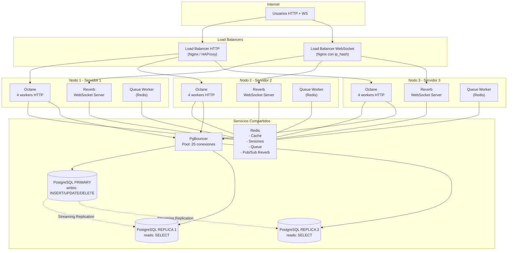

# 04 — Escalado Horizontal del Monolito

> **Qué vamos a hacer**: Pasar de 1 servidor Laravel a N servidores idénticos. Más copias del mismo monolito, NO microservicios.
> **Tiempo estimado**: 40 minutos.
> **Prerrequisitos**: PgBouncer (paso 01), read replica (paso 02), config Laravel read/write (paso 03).

---

## 🔍 ¿Qué es escalar horizontal?

### La analogía de las cajas registradoras (recargada)

Tienes un supermercado. Al principio **1 cajera** atiende toda la fila. La fila crece. Puedes:

| Estrategia | Qué haces | Problema |
|---|---|---|
| **Vertical** | Le pagas más a la cajera para que sea más rápida | Límite humano. No puede ser 2x más rápida. |
| **Horizontal** | Ponés 4 cajeras. Cada una atiende su propia fila. | Necesitas sincronizarlas (turno compartido, descansos, etc.) |

**En Vyntra:** El "supermercado" es tu servidor Laravel. La "cajera" es el proceso que atiende requests (Octane worker o Reverb worker). Escalar horizontal = más procesos, más máquinas.

### ¿Qué significa exactamente?

```
Antes:
[Una máquina] → Laravel Octane (8 workers) + Reverb (1 nodo) + PostgreSQL

Después:
                    ┌──► [Nodo 1] Octane + Reverb
Load Balancer ──────┼──► [Nodo 2] Octane + Reverb
                    └──► [Nodo 3] Octane + Reverb
                           │
                           ▼
                    Redis (compartido entre todos)
                           │
                           ▼
                    PgBouncer → Primary + Replica(s)
```

Cada nodo es **idéntico**. Mismo código, misma configuración. La única diferencia es la IP.

---

## 📋 ¿Qué componentes escalan horizontalmente en Vyntra?

| Componente | ¿Escala? | Cómo |
|---|---|---|
| **Octane (HTTP)** | ✅ Sí | N procesos por máquina + N máquinas = muchísimos workers |
| **Reverb (WebSocket)** | ✅ Sí | Múltiples nodos conectados via Redis Pub/Sub |
| **Postgres (reads)** | ✅ Sí | Múltiples replicas de lectura |
| **Postgres (writes)** | ❌ No (por ahora) | Solo 1 primary |
| **Redis** | ⚠️ Sí (si hace falta) | Redis Cluster con sharding |
| **Cola de jobs** | ✅ Sí | Redis Queue + N workers |
| **Sesiones** | ✅ Sí | Almacenadas en Redis (compartido) |
| **Cache** | ✅ Sí | Redis compartido (invalidate funciona entre nodos) |

---

## ✅ Paso 1: Escalar Octane horizontal

Octane ya está diseñado para esto. Cada proceso Octane (worker) maneja requests HTTP independientemente.

### 1a. Configuración actual (1 nodo, 4 workers)

```env
# .env
APP_URL=http://localhost:8000
```

```bash
# Inicias Octane con 4 workers
php artisan octane:start --workers=4 --task-workers=2
```

### 1b. Múltiples nodos con Supervisor

Para escalar a 3 nodos, necesitas:

1. **3 máquinas** (o 3 contenedores Docker) con el mismo código
2. **Supervisor** en cada máquina para mantener los workers vivos
3. **Un load balancer** adelante (Nginx, Caddy, HAProxy, o un Docker service mesh)

#### Supervisor config para Octane (en cada nodo)

```ini
; /etc/supervisor/conf.d/octane.conf
; Este archivo va en CADA nodo. Mismo contenido en todos.

[program:octane]
process_name=%(program_name)s_%(process_num)02d
command=php /var/www/html/artisan octane:start --workers=4 --task-workers=2 --max-requests=500
directory=/var/www/html
autostart=true
autorestart=true
user=www-data
numprocs=1
redirect_stderr=true
stdout_logfile=/var/log/supervisor/octane.log
stopwaitsecs=3600
```

**Explicación:**

| Directiva | Valor | ¿Por qué? |
|---|---|---|
| `command` | `octane:start --workers=4 --task-workers=2 --max-requests=500` | 4 workers HTTP, 2 workers de tareas, reinicia cada 500 requests (memory leak prevention) |
| `numprocs=1` | 1 | Octane ya maneja multi-worker internamente. Solo 1 proceso de Supervisor. |
| `stopwaitsecs=3600` | 3600s | Da tiempo a Octane para terminar requests en curso antes de matar. |

#### Load Balancer (Nginx)

```nginx
# /etc/nginx/conf.d/load-balancer.conf
# Este Nginx recibe requests y los distribuye entre los nodos Octane

upstream vyntra_backend {
    # Least connections: envía al nodo con menos conexiones activas
    least_conn;

    # Nodo 1
    server 192.168.1.10:8000 max_fails=3 fail_timeout=30s;
    # Nodo 2
    server 192.168.1.11:8000 max_fails=3 fail_timeout=30s;
    # Nodo 3
    server 192.168.1.12:8000 max_fails=3 fail_timeout=30s;
}

server {
    listen 80;
    server_name api.vyntra.app;

    location / {
        proxy_pass http://vyntra_backend;
        proxy_set_header Host $host;
        proxy_set_header X-Real-IP $remote_addr;
        proxy_set_header X-Forwarded-For $proxy_add_x_forwarded_for;
        proxy_set_header X-Forwarded-Proto $scheme;

        # Timeouts largos para WebSocket upgrades via Octane
        proxy_connect_timeout 75s;
        proxy_read_timeout 86400s;  # 24h para WS long-polling
    }
}
```

### 1c. Verificar que los nodos están vivos

```bash
# Desde cualquier nodo, verifica que responde
curl -I http://192.168.1.10:8000/health
curl -I http://192.168.1.11:8000/health
curl -I http://192.168.1.12:8000/health

# Todos deberían responder 200
```

---

## ✅ Paso 2: Escalar Reverb horizontal

Reverb usa Redis Pub/Sub para sincronizar mensajes entre nodos. Cuando un usuario envía un mensaje en el Nodo 1, Reverb en Nodo 2 y Nodo 3 también reciben el evento y lo reenvían a sus conexiones WebSocket.

### 2a. Configuración necesaria

```env
# .env en CADA nodo (misma configuración)

# Reverb - Configuración de servidor
REVERB_APP_ID=vyntra-app
REVERB_APP_KEY=vyntra-key
REVERB_APP_SECRET=vyntra-secret

# Host (puede ser 0.0.0.0 en cada nodo, el load balancer dirige)
REVERB_HOST=0.0.0.0
REVERB_PORT=8080

# ═══════════════════════════════════════════════════════
# CLAVE: Escalado horizontal de Reverb
# ═══════════════════════════════════════════════════════

# Habilitar modo escalado (usa Redis Pub/Sub entre nodos)
REVERB_SCALING_ENABLED=true

# Redis para Reverb (debería ser el mismo Redis para todos los nodos)
REVERB_SCALING_REDIS_HOST=redis  # nombre del servicio Redis
REVERB_SCALING_REDIS_PORT=6379
REVERB_SCALING_REDIS_PASSWORD=null
REVERB_SCALING_REDIS_DB=2  # DB 2 de Redis solo para Reverb Pub/Sub
```

### 2b. ¿Qué hace `REVERB_SCALING_ENABLED=true`?

Cuando activas esta opción:

1. **Reverb se suscribe a Redis Pub/Sub** — escucha un canal llamado `reverb:vyntra-app`
2. **Cuando un evento se dispara** en cualquier nodo, Reverb publica el mensaje en Redis
3. **Redis reenvía el mensaje** a TODOS los nodos suscritos
4. **Cada nodo Reverb reenvía** el mensaje a sus conexiones WebSocket locales

```
Nodo 1: Usuario A envía mensaje
  └──► Evento broadcast
        └──► Redis Pub/Sub
              ├──► Nodo 1: reenvía a sus conexiones WS
              ├──► Nodo 2: reenvía a sus conexiones WS
              └──► Nodo 3: reenvía a sus conexiones WS
```

### 2c. Configuración de channels.php

Esto no cambia con el escalado horizontal. `channels.php` ya funciona porque la autenticación de canales se hace vía Redis (sesión compartida):

```php
// routes/channels.php - No necesita cambios para escalado horizontal
// Redis maneja la sesión, cualquier nodo puede autenticar

Broadcast::channel('chat.{chatUuid}', function ($user, $chatUuid) {
    // Esto se ejecuta en el nodo que recibe el request
    // pero como la sesión está en Redis, funciona en cualquier nodo
    return $user->chats()->where('uuid', $chatUuid)->exists();
});
```

### 2d. Proxy Reverb con Nginx (sticky sessions)

Los WebSockets necesitan **sticky sessions**: una vez que un usuario se conecta a un nodo, debe seguir conectado al mismo nodo (porque la conexión WebSocket es stateful).

```nginx
# /etc/nginx/conf.d/reverb-upstream.conf

upstream vyntra_reverb {
    # IMPORTANTE: ip_hash mantiene la misma IP → mismo nodo
    # Esto es sticky sessions para WebSocket
    ip_hash;

    server 192.168.1.10:8080;
    server 192.168.1.11:8080;
    server 192.168.1.12:8080;
}

server {
    listen 443 ssl;
    server_name ws.vyntra.app;

    # SSL config...

    location /app {
        proxy_pass http://vyntra_reverb;

        # Headers necesarios para WebSocket
        proxy_http_version 1.1;
        proxy_set_header Upgrade $http_upgrade;
        proxy_set_header Connection "upgrade";
        proxy_set_header Host $host;
        proxy_set_header X-Real-IP $remote_addr;
        proxy_set_header X-Forwarded-For $proxy_add_x_forwarded_for;
        proxy_set_header X-Forwarded-Proto $scheme;

        # Timeouts largos (WebSocket = conexión permanente)
        proxy_read_timeout 86400s;
        proxy_send_timeout 86400s;
    }
}
```

> [!IMPORTANT]
> `ip_hash` en Nginx asegura que la misma IP de cliente siempre va al mismo nodo Reverb. Sin esto, el WebSocket se rompería porque Nginx redirigiría a otro nodo y la conexión se perdería.

---

## ✅ Paso 3: Agregar más read replicas

Ya tienes 1 primary + 1 replica. Si el tráfico de lectura crece, agregas más replicas.

### 3a. Agregar replica al docker-compose

```yaml
# docker-compose.yml
# Ahora con 2 replicas

services:
  postgres:
    image: postgres:17-alpine
    container_name: vyntra-postgres-primary
    # ... configuración existente ...

  postgres-replica-1:
    image: postgres:17-alpine
    container_name: vyntra-postgres-replica-1
    ports:
      - "5433:5432"
    # ... misma configuración que antes ...
    depends_on:
      - postgres

  postgres-replica-2:
    image: postgres:17-alpine
    container_name: vyntra-postgres-replica-2
    ports:
      - "5434:5432"   # Puerto diferente
    # ... misma configuración que replica-1 ...
    depends_on:
      - postgres
```

### 3b. Actualizar `config/database.php`

```php
// config/database.php

'read' => [
    'host' => [
        env('DB_READ_HOST_1', '127.0.0.1'),  // replica 1
        env('DB_READ_HOST_2', '127.0.0.1'),  // replica 2
    ],
    'port' => [
        env('DB_READ_PORT_1', '5433'),        // puerto replica 1
        env('DB_READ_PORT_2', '5434'),        // puerto replica 2
    ],
],
```

Laravel elegirá **aleatoriamente** entre replica 1 y replica 2 para cada SELECT. Esto distribuye la carga.

> [!TIP]
> Laravel no soporta nativamente diferentes puertos por host en el array `read`. Para esta configuración más avanzada, necesitarías usar un PgBouncer por replica o un balanceador como HAProxy entre Laravel y las replicas. En la práctica, para 2-3 replicas, un solo PgBouncer apuntando a las 3 replicas es más simple.

---

## ✅ Diagrama de arquitectura multi-nodo



---

## 📊 Tabla de capacidad estimada

| Escenario | HTTP req/s | WS conexiones | Workers Octane | Nodos Reverb | Read replicas |
|---|---|---|---|---|---|
| **1 nodo** (dev) | ~2,000 | ~3,000 | 4 | 1 | 0 |
| **1 nodo** (prod small) | ~5,000 | ~10,000 | 8 | 1 | 1 |
| **2 nodos** | ~12,000 | ~20,000 | 16 (8x2) | 2 | 2 |
| **4 nodos** | ~25,000 | ~35,000 | 32 (8x4) | 4 | 3 |
| **8 nodos** | ~50,000 | ~70,000 | 64 (8x8) | 8 | 4 |

**Suposiciones de esta tabla:**

- Cada worker Octane procesa ~300-500 req/s (depende de la complejidad)
- Cada nodo Reverb maneja ~8K-10K conexiones WebSocket
- Cada replica Postgres suma ~50K reads/s
- Redis single instance aguanta ~100K ops/s (cache + sesiones + queue + pub/sub)
- El cuello de botella suele ser el **primary de Postgres** (~5K writes/s)

> [!CAUTION]
> **No te obsesiones con estos números.** Son estimaciones teóricas. En producción real, factores como latencia de red, queries lentas, y contención de CPU/RAM pueden reducir el rendimiento 30-50%. **Mide antes de escalar.**

---

## 🚨 Cuándo NO escalar horizontal

Escalar horizontal NO es gratis. Cada nodo adicional agrega:

1. **Complejidad operativa** — más máquinas que monitorear, actualizar, asegurar
2. **Latencia de red** — llamadas entre nodos (Redis) son más lentas que locales
3. **Costo** — cada nodo cuesta dinero
4. **Debugging más difícil** — tienes que buscar logs en N servidores

### ¿Cuándo NO debes escalar?

| Situación | ¿Escalar? | Mejor solución |
|---|---|---|
| 1 nodo está al 30% de CPU | ❌ | No hagas nada |
| 1 nodo está al 70% de CPU | ⚠️ | Optimiza queries/código antes |
| 1 nodo está al 90% de CPU | ✅ | Escala |
| PgBouncer `cl_waiting` > 0 | ⚠️ | Aumenta `default_pool_size` primero |
| Primary Postgres al 80% CPU | ⚠️ | Optimiza writes, cachea más |
| Primary Postgres al 95% CPU | ✅ | Escala (probablemente necesites sharding) |

**La regla de oro:** Si puedes resolverlo con una configuración (más workers, más pool, mejor cache), haz eso primero. Solo escala horizontal cuando **hayas agotado las optimizaciones verticales**.

---

## 📚 ¿Qué aprendiste en este archivo?

1. **Escalar horizontal = más copias del mismo monolito**, no microservicios. Cada nodo corre el mismo Laravel.
2. **Octane escala horizontal** con un load balancer adelante. Cada nodo tiene N workers independientes.
3. **Reverb escala horizontal** con `REVERB_SCALING_ENABLED=true` y Redis Pub/Sub para sincronizar mensajes entre nodos.
4. **WebSockets necesitan sticky sessions** (`ip_hash` en Nginx). Un usuario siempre debe hablar con el mismo nodo Reverb.
5. **Las replicas de Postgres** pueden ser múltiples. Laravel elige una al azar para cada SELECT.
6. **El load balancer** es el punto de entrada único. Distribuye tráfico entre los nodos.
7. **No escales si no hace falta.** La optimización vertical (más workers, mejor cache, queries más rápidas) debe ir primero.

**En el próximo archivo (05_scaling_strategy.md)** vas a ver la estrategia completa: tabla de decisiones, anti-patrones, y la matemática final para 30K WS + 60K HTTP.
