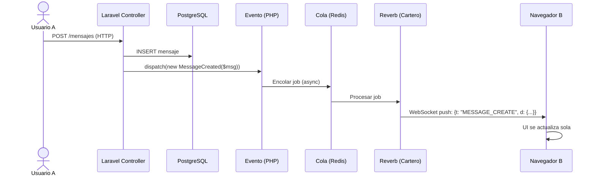
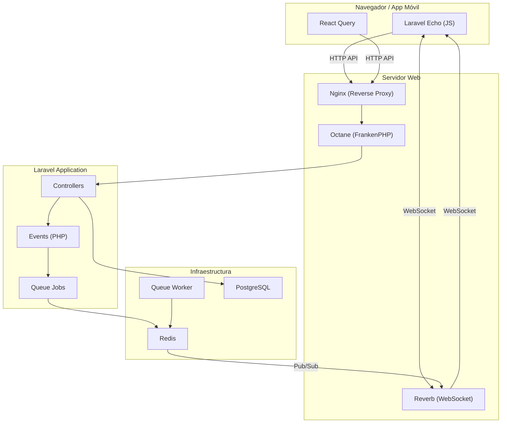

# 00 — Conceptos y Guía para Principiantes en Laravel Reverb, Octane y Redis

> **Profesor**: Tu mentor senior de software.  
> **Estudiante**: Tú. Primera vez con Laravel, Reverb, Octane y Redis.  
> **Misión**: Entender qué es todo esto, por qué existe, y cómo funciona sin morir en el intento.
> **Tiempo estimado**: 30 minutos de lectura.

---

## 📚 Lección 1: El Problema que Resolvemos (La Historia del Polling)

Imagina que tienes una app de chat. Sin WebSockets, ¿cómo sabe tu móvil que te llegó un mensaje?

### La forma tonta (Polling)

Tu móvil pregunta al servidor cada 5 segundos:

```
Móvil: ¿Hay mensajes nuevos?
Servidor: No.
Móvil: ¿Hay mensajes nuevos?
Servidor: No.
Móvil: ¿Hay mensajes nuevos?
Servidor: Sí, aquí tienes uno.
```

**Problemas**:
- **Latencia**: El mensaje llegó hace 4.9 segundos, pero tu móvil lo preguntó recién ahora.
- **Consumo de batería**: Tu móvil despierta la radio cada 5 segundos.
- **Escala**: Con 300,000 usuarios, son 60,000 requests/segundo al servidor solo para preguntar "¿hay algo nuevo?".

### La forma inteligente (WebSockets)

```
Móvil: Hola servidor, abro una conexión permanente.
Servidor: OK, conexión abierta.
        ... (silencio) ...
Servidor: ¡Te llegó un mensaje! (empuja el dato)
Móvil: ¡Gracias! Lo muestro al instante.
```

**Ventajas**:
- **Latencia**: < 200ms.
- **Batería**: La conexión duerme; el servidor despierta al móvil solo cuando hay datos.
- **Escala**: Una sola conexión por usuario, no 12 requests/minuto.

**WebSocket** = un "túnel" permanente entre tu navegador/móvil y el servidor. A través de ese túnel, el servidor puede empujar datos sin que el cliente pregunte.

---

## 📚 Lección 2: ¿Qué es Laravel Reverb?

### La analogía del cartero

Imagina que tu servidor es una oficina de correos. Laravel Reverb es el **cartero** que lleva las cartas (eventos) desde la oficina hasta las casas (usuarios conectados).

**Reverb no crea los eventos**. Reverb solo los **entrega**.

### ¿Quién crea los eventos?

Tu código Laravel. Cuando un usuario envía un mensaje:

1. El **Controller** recibe el mensaje HTTP.
2. El **Controller** guarda el mensaje en PostgreSQL.
3. El **Controller** dice: "¡Oye, alguien envió un mensaje!" (dispatchea un Evento).
4. El **Evento** dice: "Debo avisar a todos los que están en el canal #general".
5. **Reverb** recibe esa orden y lo empuja por el túnel WebSocket a todos los usuarios conectados.



### ¿Por qué usar Reverb y no otra cosa?

| Opción | ¿Qué es? | ¿Por qué no? |
|--------|---------|-------------|
| **Pusher** | Servicio pago de WebSockets | Cuesta dinero, vendor lock-in |
| **Socket.io** | Librería Node.js | Requiere un servidor Node.js separado |
| **Reverb** | WebSocket server de Laravel | Es gratis, está en PHP, integrado con todo Laravel |

**Reverb** es la forma oficial de Laravel de hacer WebSockets. Habla el mismo idioma que tu app (PHP + Laravel). No necesitas aprender Node.js.

---

## 📚 Lección 3: ¿Qué es Redis?

### La analogía del pizarrón de la oficina

Imagina que tu oficina tiene un **pizarrón gigante** en la pared donde todo el mundo puede escribir y leer cosas **muy rápido**.

- **PostgreSQL** = el archivo de la biblioteca (guarda cosas para siempre, pero lento de buscar).
- **Redis** = el pizarrón de la oficina (guarda cosas temporalmente, pero **instantáneo**).

### ¿Para qué usamos Redis en Vyntra?

**1. Colas de trabajos (Queues)**

Cuando un evento broadcast se crea, no se envía inmediatamente. Se encola en Redis:

```
Controller: "¡Evento listo!"
Redis (Queue): "OK, lo pongo en la fila."
Queue Worker: "Yo proceso la fila."
Reverb: "Yo entrego el mensaje."
```

¿Por qué encolar? Porque si 10,000 usuarios envían mensajes a la vez, el servidor se moriría si intentara enviar 10,000 WebSockets simultáneamente. La cola permite **procesar uno por uno** (o en paralelo con workers) sin matar el servidor.

**2. Cache**

Si un usuario pregunta "¿quién está en línea?", no hacemos `SELECT * FROM users` cada vez. Guardamos la lista en Redis por 30 segundos.

**3. Pub/Sub entre servidores Reverb**

Si tienes 3 servidores Reverb (escalado horizontal), ¿cómo se enteran uno del otro de que llegó un mensaje?

```
Reverb Server A: "¡Mensaje nuevo en el canal #general!"
Redis (Pub/Sub): "OK, se lo digo a todos los servidores."
Reverb Server B: "Gracias, lo envío a mis usuarios."
Reverb Server C: "Gracias, yo también."
```

**Redis** actúa como el "intercomunicador" entre los servidores.

---

## 📚 Lección 5: ¿Qué es Laravel Octane?

### La analogía del restaurante

**PHP-FPM tradicional** (sin Octane):

> Llega un cliente. El cocinero se pone el uniforme, lee el menú, prepara la cocina, cocina la hamburguesa, se quita el uniforme, se va.
> Llega otro cliente. El cocinero se pone el uniforme, lee el menú, prepara la cocina, cocina la hamburguesa, se quita el uniforme, se va.

**Cada request** = el servidor carga Laravel desde cero. Clases, config, rutas, providers. Tarda 50-100ms solo en "vestirse".

**Octane**:

> El cocinero ya está vestido, la cocina está lista, el menú lo sabe de memoria. Llega un cliente: cocina la hamburguesa al instante. Llega otro: cocina otra. Y otra. Sin perder tiempo en prepararse.

**Octane** = Laravel permanece en memoria entre requests. Bootstraps una vez, sirve miles de requests.

### ¿Cuánto más rápido?

| Métrica | PHP-FPM | Octane (FrankenPHP) | Mejora |
|---------|---------|---------------------|--------|
| Requests/segundo | ~500 | ~5,000 | 10x |
| Latencia p95 | 200ms | 20ms | 10x |
| Uso de CPU | Alto | Bajo | 50% menos |

### ¿Por qué es peligroso para principiantes?

Octane mantiene todo en memoria. Si tu código tiene un **memory leak** (fuga de memoria), la memoria crece hasta que el servidor explota.

**Ejemplo de memory leak**:

```php
// ❌ MAL: Esto mata a Octane
class MessageController {
    private static array $logs = [];

    public function store() {
        self::$logs[] = 'nuevo mensaje'; // ¡Nunca se limpia!
    }
}
```

Cada request añade algo al array. Después de 1000 requests, el array tiene 1000 elementos. Después de 1,000,000... 💥

**Regla**: Si tu código no funciona bien con PHP-FPM, **no uses Octane**. Octane es la última optimización, no la primera.

---

## 📚 Lección 6: ¿Cómo se Relacionan Todas las Piezas?



### Flujo completo: Usuario envía un mensaje

1. **Navegador** envía POST HTTP a `/api/messages`.
2. **Nginx** recibe el request y lo pasa a **Octane**.
3. **Octane** lo entrega al **Controller** de Laravel.
4. **Controller** guarda en **PostgreSQL**.
5. **Controller** despacha un **Event** (`MessageCreated`).
6. **Event** se encola en **Redis** (cola `broadcasts`).
7. **Queue Worker** (worker) saca el job de la cola y lo procesa.
8. El job le dice a **Reverb**: "Envía esto a todos los que están en `channel.#general`".
9. **Reverb** empuja el mensaje por WebSocket a todos los navegadores conectados.
10. **Laravel Echo** (en el navegador) recibe el mensaje y lo pasa a **React Query**.
11. **React Query** actualiza el cache y la UI se refresca sola.

---

## 📚 Lección 7: Conceptos Clave de WebSockets

### ¿Qué es un "Canal"?

Un canal es como una **sala de chat**. Los usuarios se "suscriben" a canales para recibir mensajes.

| Tipo de Canal | Analogía | Ejemplo en Vyntra |
|---------------|----------|-------------------|
| **Público** | Sala de chat abierta | `channel.#general` |
| **Privado** | Sala con portero | `user.{mi_uuid}` |
| **Presencia** | Sala con lista de asistentes | `presence.club.{uuid}` |

### ¿Qué es la Autenticación de Canales?

Cuando tu navegador quiere entrar a un canal privado, Reverb dice: "Espera, ¿quién eres?".

Tu navegador envía una petición HTTP a `/broadcasting/auth` con el token de Sanctum. El servidor verifica:

```php
// ¿Este usuario puede entrar a este canal?
Broadcast::channel('channel.{uuid}', function ($user, $uuid) {
    return $user->isMemberOfChannel($uuid);
});
```

Si el usuario tiene permiso, el servidor devuelve una firma. El navegador usa esa firma para decirle a Reverb: "El servidor me dejó pasar".

### ¿Qué es el Formato `{t, d}`?

Es la forma en que Discord envía eventos, y nosotros la copiamos porque es limpia:

```json
{
  "t": "MESSAGE_CREATE",
  "d": {
    "uuid": "abc-123",
    "content": "Hola mundo",
    "sender_uuid": "user-456"
  }
}
```

- `t` = tipo de evento (qué pasó).
- `d` = datos (los detalles).

Esto permite que el frontend haga un `switch(event.t)` y maneje cada tipo de evento de forma diferente.

---

## 📚 Lección 8: Checklist de Comprensión

Antes de pasar a los documentos técnicos, asegúrate de entender:

- [ ] **WebSocket** = túnel permanente entre navegador y servidor.
- [ ] **Reverb** = el servidor que entrega mensajes por ese túnel.
- [ ] **Redis** = el pizarrón rápido donde guardamos colas, cache y pub/sub.
- [ ] **Queue Worker** = `php artisan queue:work` procesa los trabajos en cola.
- [ ] **Octane** = el servidor que mantiene Laravel en memoria para ir más rápido.
- [ ] **Evento** = una "notificación interna" de que algo pasó (ej: "nuevo mensaje").
- [ ] **Cola** = una fila donde los eventos esperan para ser procesados.
- [ ] **Canal** = una sala de chat donde los usuarios reciben mensajes.
- [ ] **Autenticación de canal** = el portero que verifica si puedes entrar a una sala.
- [ ] **Broadcast** = el acto de enviar un mensaje a todos los que están en un canal.

---

## 📚 Lección 9: ¿Qué Hacer Ahora?

### Si eres totalmente nuevo en Laravel

1. **Lee este documento** de nuevo mañana. La primera vez siempre es confusa.
2. **Mira el video** "Laravel Reverb in 10 minutes" (busca en YouTube).
3. **Lee** `01_redis_reverb_setup.md` paso a paso. No saltes pasos.
4. **Instala Reverb** y haz que funcione. No te preocupes por Octane todavía.
5. **Prueba** un evento simple: crea un botón en el frontend que al hacer clic envíe un mensaje a todos los navegadores abiertos.

### Si ya entiendes Laravel pero no WebSockets

1. **Lee** `02_events_architecture.md` para entender la arquitectura de canales.
2. **Implementa** `routes/channels.php`.
3. **Crea** tu primer evento `MessageCreated`.
4. **Prueba** con `php artisan reverb:start` y dos pestañas del navegador.

### Si eres senior en otra stack (Node, Django, etc.)

1. **Lee** `02_events_architecture.md` y `01_redis_reverb_setup.md` en paralelo.
2. **Fíjate** en las diferencias: Laravel usa Jobs + Queues + Events en lugar de callbacks.
3. **Presta atención** a `mandatory_patterns.md` — las reglas de Laravel son estrictas.
4. **No intentes** hacer WebSockets "a tu manera". Laravel tiene un camino canónico.

---

## 📚 Lección 10: Glosario de Términos

| Término | Definición simple |
|---------|-------------------|
| **Broadcast** | Enviar un mensaje a todos los que están en un canal. |
| **Canal** | Una sala de chat (pública, privada o de presencia). |
| **Cartero** | Reverb. El que entrega mensajes por WebSocket. |
| **Cola** | Una fila de trabajos pendientes. |
| **Dispatch** | Decirle a Laravel: "Procesa este evento después" (no ahora). |
| **Echo** | Librería JavaScript que escucha eventos WebSocket. |
| **Evento** | Una clase PHP que representa "algo que pasó" en la app. |
| **Fábrica** | La cola de trabajos + el worker. |
| **Queue Worker** | Proceso que ejecuta `php artisan queue:work` para procesar colas. |
| **Job** | Una tarea que se ejecuta en segundo plano (ej: enviar un email). |
| **Memory leak** | Bug donde el programa usa más memoria sin liberarla. |
| **Octane** | Servidor que mantiene Laravel en memoria. |
| **Pizarrón** | Redis. Memoria rápida temporal. |
| **Polling** | Preguntar al servidor cada X segundos si hay novedades. |
| **Pub/Sub** | Publicar un mensaje para que todos los suscriptores lo reciban. |
| **Queue** | Cola (fila de trabajos). |
| **Reverb** | Servidor WebSocket oficial de Laravel. |
| **Redis** | Base de datos en memoria. |
| **Sharding** | Dividir carga entre múltiples servidores. |
| **ShouldBroadcast** | Interfaz que dice "este evento debe enviarse por WebSocket". |
| **ShouldQueue** | Interfaz que dice "este evento debe ir a la cola". |
| **WebSocket** | Conexión permanente entre navegador y servidor. |
| **Worker** | Proceso que saca trabajos de la cola y los ejecuta. |

---

## 📚 Referencias para Aprender Más

- [Laravel Reverb — Documentación oficial](https://laravel.com/docs/13.x/reverb)
- [Laravel Broadcasting — Conceptos básicos](https://laravel.com/docs/13.x/broadcasting)
- [Laravel Queues — Cómo funcionan las colas](https://laravel.com/docs/13.x/queues)
- [Laravel Queues — Documentación oficial](https://laravel.com/docs/13.x/queues)
- [Laravel Octane — Optimización](https://laravel.com/docs/13.x/octane)
- [Redis — Tutorial interactivo](https://try.redis.io)
- [Discord Gateway — Arquitectura de referencia](https://discord.com/developers/docs/topics/gateway)

---

> **Palabras del profesor**: No te preocupes si no entiendes todo de una vez. WebSockets es un tema que se entiende haciendo, no leyendo. Instala Reverb, crea un evento simple, ábrelo en dos pestañas del navegador, y mira cómo se comunican. Ese "momento mágico" es cuando todo empieza a tener sentido. Ahora, ve a `01_redis_reverb_setup.md` y empieza por el paso 1. ¡Tú puedes! 🚀
