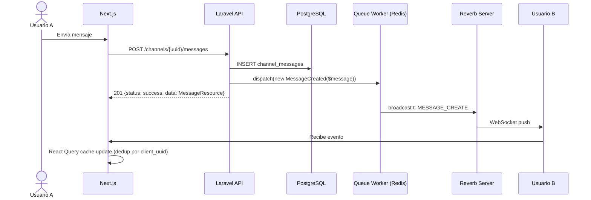

# 02 — Arquitectura de Eventos en Tiempo Real

> **Propósito**: Definir los canales de broadcast, el formato de eventos, la autenticación de canales y el flujo end-to-end de la capa de eventos en tiempo real de Vyntra.
> **Stack**: Laravel Reverb + Laravel Echo + Next.js + React Query + Zustand.
> **Audiencia**: Desarrolladores backend y frontend que implementarán los eventos broadcast.

---

## 0. Prerrequisitos y Orden de Implementación

> ⚠️ **NO empieces por este documento** si no tienes los prerrequisitos listos.

### 0.1 Prerrequisitos Faltantes en el Código (Backend)

| # | Prerrequisito | Archivo que debe existir | Estado Actual | Quién lo hace |
|---|---|---|---|---|
| 1 | `app/Events/` | Directorio de eventos broadcast | ✅ EXISTE | Backend |
| 2 | `routes/channels.php` | Autenticación de canales privados | ✅ EXISTE | Backend |
| 3 | `BroadcastServiceProvider` | Registrado en `bootstrap/providers.php` | ✅ REGISTRADO | Backend |
| 4 | `BROADCAST_CONNECTION` | Variable en `.env` | ✅ `reverb` | Backend |
| 5 | Cola `broadcasts` | Configurada en `config/queue.php` | ✅ CONFIGURADA | Backend |

### 0.2 Estado del Frontend

> ⚠️ **El frontend NO está listo para WebSockets.**
>
> Verificado en `vyntra-frontend`:
> - `package.json` NO tiene `laravel-echo`, `pusher-js`, ni librería WebSocket.
> - NO hay referencias a WebSocket, Echo, Pusher, ni Reverb en ningún archivo `.js`.
> - `chat.service.js` y `notification.service.js` usan **mock data** (datos falsos), no llaman al backend real.
> - `useChatMessages.js` tiene React Query bien configurado, pero **no escucha eventos** de WebSocket.
>
> **Conclusión:** El frontend necesita una **FASE FRONTEND** separada después de que el backend esté 100% funcionando.

### 0.3 Fases de Implementación

#### FASE 1: BACKEND (haz esto ahora)
1. **Paso 1**: Seguir `01_redis_reverb_setup.md` (instalar Redis, Reverb)
2. **Paso 2**: Crear `routes/channels.php` y registrar `BroadcastServiceProvider`
3. **Paso 3**: Configurar `.env` con `BROADCAST_CONNECTION=reverb`
4. **Paso 4**: Crear `app/Events/` y los eventos broadcast
5. **Paso 5**: Seguir este documento (`02_events_architecture.md`) para definir la arquitectura de canales
6. **Paso 6**: Seguir `03_notifications_system.md` (notificaciones)
7. **Paso 7**: Seguir `04_friendships_realtime.md` (amistades)
8. **Paso 8**: Seguir `06_octane_setup.md` (Octane)

#### FASE 2: VERIFICACIÓN (testea sin frontend)
- Usar `wscat`, Postman, o un script Node.js para verificar que el backend empuja eventos.
- Ver sección "8. Testing del Backend sin Frontend" de este documento.

#### FASE 3: FRONTEND (después de verificar backend)
- Instalar `laravel-echo` + `pusher-js` en `vyntra-frontend`.
- Crear provider global de WebSocket.
- Modificar hooks para que escuchen eventos y actualicen React Query cache.
- Migrar servicios de mock data a llamadas HTTP reales al backend.

### 0.4 Nota Importante

Este documento **asume** que ya tienes:
- Reverb instalado (`php artisan install:broadcasting`)
- `routes/channels.php` con la autenticación de canales
- `BroadcastServiceProvider` registrado en `bootstrap/providers.php`
- `BROADCAST_CONNECTION=reverb` en `.env`

Si no los tienes, **ve a `01_redis_reverb_setup.md` primero**.

**Los ejemplos de frontend en este documento son ilustrativos** (para que sepas qué esperar en la FASE FRONTEND). No los implementes ahora.

---

## 1. Problema que Resuelve

Vyntra es una plataforma de comunicación en tiempo real (similar a Discord/Slack). Sin WebSockets:
- Los mensajes de chat solo llegan tras un `refetch` manual o polling.
- Las notificaciones requieren refresh de página.
- Las actualizaciones de estructura (canales, roles, categorías) no se propagan a los miembros del club.
- Con 300,000 usuarios concurrentes, el polling masivo generaría millones de requests HTTP innecesarios y saturaría el backend.

**Objetivo**: Entregar eventos en tiempo real con latencia < 200ms, escalable horizontalmente y sin broadcast síncrono en los controllers.

---

## 2. Arquitectura de Canales

Vyntra utiliza **canales de tipo Pusher** (compatible con Reverb). Los canales se dividen en tres categorías:

### 2.1 Canales Públicos

Usados para eventos que cualquier miembro autorizado puede recibir.

| Canal | Descripción | Ejemplo de Eventos |
|-------|-------------|-------------------|
| `channel.{channel_uuid}` | Mensajes de un canal de club | `MESSAGE_CREATE`, `MESSAGE_UPDATE`, `MESSAGE_DELETE` |
| `club.{club_uuid}` | Estructura y miembros del club | `CHANNEL_CREATE`, `CATEGORY_UPDATE`, `ROLE_DELETE`, `MEMBER_ROLE_ASSIGNED` |

### 2.2 Canales Privados

Usados para eventos personales o conversaciones directas.

| Canal | Descripción | Ejemplo de Eventos |
|-------|-------------|-------------------|
| `user.{user_uuid}` | Eventos personales del usuario | `NOTIFICATION_CREATE`, `FRIENDSHIP_STATUS_CHANGED`, `CLUB_CREATED` (cuando es invitado) |
| `dm-conversation.{dm_uuid}` | Mensajes directos entre 2 usuarios | `DM_MESSAGE_CREATE`, `DM_MESSAGE_UPDATE` |

### 2.3 Canales de Presencia (Futuro, aun no implementado)

> **Recomendación de escalado futuro**: Implementar `presence.club.{club_uuid}` para rastrear quién está en línea en un club. Esto requiere un sistema de heartbeat que no está en el ciclo HTTP actual.
> Discord usa `GUILD_PRESENCES (1 << 8)` como intent privilegiado. En Vyntra, esto implicaría:
> - Un job periódico que actualice `users.is_online` con TTL en Redis.
> - Un canal de presencia que envíe `PRESENCE_UPDATE` con `user_uuid` + `status` (online, away, dnd, offline).
> - **Riesgo de escala**: 300K usuarios × heartbeat cada 30s = 10K heartbeats/segundo. Requiere Redis con pub/sub optimizado o un servicio de presencia independiente (ej. Erlang/Elixir o Go) antes de que el cluster Reverb colapse.

---

## 3. Autenticación de Canales

La autenticación se define en `routes/channels.php`. Reverb sigue el protocolo Pusher, por lo que el cliente debe solicitar autorización para canales privados y de presencia.

### 3.1 Canales Públicos

No requieren autorización explícita (solo autenticación del usuario vía Sanctum).

```php
// No se registra en routes/channels.php; el middleware auth:sanctum lo protege
```

### 3.2 Canales Privados

```php
// routes/channels.php
use Illuminate\Support\Facades\Broadcast;

// Canal personal del usuario
Broadcast::channel('user.{userUuid}', function (User $user, string $userUuid) {
    return (string) $user->uuid === $userUuid;
});

// Canal de conversación directa
Broadcast::channel('dm-conversation.{dmUuid}', function (User $user, string $dmUuid) {
    $conversation = DmConversation::find($dmUuid);

    if (! $conversation) {
        return false;
    }

    return in_array((string) $user->uuid, [
        (string) $conversation->user_one_uuid,
        (string) $conversation->user_two_uuid,
    ], true);
});

// Canal de mensajes de club
Broadcast::channel('channel.{channelUuid}', function (User $user, string $channelUuid) {
    $channel = ClubChannel::find($channelUuid);

    if (! $channel) {
        return false;
    }

    // Verificar membresía del usuario en el club
    return $channel->category->club->members()
        ->where('user_uuid', $user->uuid)
        ->exists();
});

// Canal de club (estructura y miembros)
Broadcast::channel('club.{clubUuid}', function (User $user, string $clubUuid) {
    $club = Club::find($clubUuid);

    if (! $club) {
        return false;
    }

    return $club->members()
        ->where('user_uuid', $user->uuid)
        ->exists();
});
```

### 3.3 Consideraciones de Seguridad

- [ ] **Nunca** exponer datos de otros usuarios en la autorización de canales.
- [ ] **Nunca** permitir acceso a canales privados basándose solo en que el usuario está autenticado (debe verificar membresía/relación).
- [ ] **Cachear** los resultados de autorización si un usuario se suscribe a múltiples canales simultáneamente (para evitar N+1 queries en la reconexión masiva).
- [ ] **Rate limiting** en el endpoint de autorización de canales (`/broadcasting/auth`) con `throttle:30,1`.

---

## 4. Formato de Payload

Todos los eventos broadcast siguen el formato `{t, d}` definido en `IMPORTANT_PRACTICES.md` (Regla 4). Esto emula la estructura de Discord Gateway (`t` = event type, `d` = data).

### 4.1 Estructura General

```json
{
  "t": "EVENT_NAME",
  "d": { ... }
}
```

### 4.2 Tabla de Eventos Planificados (20 eventos — ✅ 20 implementados)

| Evento (`t`) | Canal | Trigger (Controller) | Archivo (implementado) | Payload (`d`) | Tipo | Status |
|---|---|---|---|---|---|---|
| `MESSAGE_CREATE` | `channel.{uuid}` | `ChannelMessageController@store` | `app/Events/Chat/MessageCreated.php` | `MessageResource` completo | Chat | ✅ Implementado |
| `MESSAGE_UPDATE` | `channel.{uuid}` | `ChannelMessageController@update` | `app/Events/Chat/MessageUpdated.php` | `{uuid, content, is_edited, updated_at}` | Chat | ✅ Implementado |
| `MESSAGE_DELETE` | `channel.{uuid}` | `ChannelMessageController@destroy` | `app/Events/Chat/MessageDeleted.php` | `{uuid, action: 'delete'}` | Chat | ✅ Implementado |
| `DM_MESSAGE_CREATE` | `dm-conversation.{uuid}` | `DmMessageController@store` | `app/Events/Dm/DmMessageCreated.php` | `DmMessageResource` completo | DM | ✅ Implementado |
| `DM_MESSAGE_UPDATE` | `dm-conversation.{uuid}` | `DmMessageController@update` | `app/Events/Dm/DmMessageUpdated.php` | `{uuid, content, updated_at}` | DM | ✅ Implementado |
| `CLUB_CREATE` | `user.{uuid}` | `ClubController@store` | `app/Events/Club/ClubCreated.php` | `ClubResource` completo | Club | ✅ Implementado |
| `CLUB_UPDATE` | `club.{uuid}` | `ClubController@update` | `app/Events/Club/ClubUpdated.php` | `ClubResource` completo | Club | ✅ Implementado |
| `CATEGORY_CREATE` | `club.{uuid}` | `ClubCategoryController@store` | `app/Events/Club/CategoryCreated.php` | `ClubCategoryResource` completo | Estructura | ✅ Implementado |
| `CATEGORY_UPDATE` | `club.{uuid}` | `ClubCategoryController@update` | `app/Events/Club/CategoryUpdated.php` | `ClubCategoryResource` completo | Estructura | ✅ Implementado |
| `CATEGORY_DELETE` | `club.{uuid}` | `ClubCategoryController@destroy` | `app/Events/Club/CategoryDeleted.php` | `{uuid, action: 'delete'}` | Estructura | ✅ Implementado |
| `CHANNEL_CREATE` | `club.{uuid}` | `ClubChannelController@store` | `app/Events/Club/ChannelCreated.php` | `ClubChannelResource` completo | Estructura | ✅ Implementado |
| `CHANNEL_UPDATE` | `club.{uuid}` | `ClubChannelController@update` | `app/Events/Club/ChannelUpdated.php` | `ClubChannelResource` completo | Estructura | ✅ Implementado |
| `CHANNEL_DELETE` | `club.{uuid}` | `ClubChannelController@destroy` | `app/Events/Club/ChannelDeleted.php` | `{uuid, action: 'delete'}` | Estructura | ✅ Implementado |
| `ROLE_CREATE` | `club.{uuid}` | `ClubRoleController@store` | `app/Events/Club/RoleCreated.php` | `ClubRoleResource` completo | Estructura | ✅ Implementado |
| `ROLE_UPDATE` | `club.{uuid}` | `ClubRoleController@update` | `app/Events/Club/RoleUpdated.php` | `ClubRoleResource` completo | Estructura | ✅ Implementado |
| `ROLE_DELETE` | `club.{uuid}` | `ClubRoleController@destroy` | `app/Events/Club/RoleDeleted.php` | `{uuid, action: 'delete'}` | Estructura | ✅ Implementado |
| `MEMBER_ROLE_ASSIGNED` | `club.{uuid}` | `ClubMemberRoleController@store` | `app/Events/Club/MemberRoleAssigned.php` | `{club_uuid, user_uuid, role_uuid}` | Social | ✅ Implementado |
| `NOTIFICATION_CREATE` | `user.{uuid}` | `NotificationController@store` | `app/Events/User/NotificationCreated.php` | `NotificationResource` completo | Notificación | ✅ Implementado |
| `NOTIFICATION_READ` | `user.{uuid}` | `NotificationController@markAsRead` | `app/Events/User/NotificationRead.php` | `{uuid, is_read}` | Notificación | ✅ Implementado |
| `FRIENDSHIP_STATUS_CHANGED` | `user.{uuid}` | `FriendshipController@respond` | `app/Events/User/FriendshipStatusChanged.php` | `{uuid, sender_uuid, receiver_uuid, status, action}` | Social | ✅ Implementado |

> **Verificación:** Los 20 eventos se testearon con `php artisan tinker` (dispatch) + `php artisan queue:work redis --queue=broadcasts,default --once` (process). Resultado: 20/20 DONE, 0 fallos en `queue:failed`. Ver sección 7.4 para el protocolo completo de testing.

> **Distribución de archivos:**
> - `app/Events/Chat/` → 3 eventos
> - `app/Events/Dm/` → 2 eventos
> - `app/Events/Club/` → 12 eventos
> - `app/Events/User/` → 3 eventos

### 4.3 Ejemplo de Implementación Backend

```php
<?php

namespace App\Events\Chat;

use App\Http\Resources\MessageResource;
use App\Models\ChannelMessage;
use Illuminate\Broadcasting\PrivateChannel;
use Illuminate\Contracts\Broadcasting\ShouldBroadcast;
use Illuminate\Contracts\Queue\ShouldQueue;
use Illuminate\Foundation\Events\Dispatchable;
use Illuminate\Queue\SerializesModels;

class MessageCreated implements ShouldBroadcast, ShouldQueue
{
    use Dispatchable, SerializesModels;

    public function __construct(
        public readonly ChannelMessage $message
    ) {}

    public function broadcastOn(): array
    {
        return [
            new PrivateChannel('channel.' . $this->message->club_channel_uuid),
        ];
    }

    public function broadcastWith(): array
    {
        return [
            't' => 'MESSAGE_CREATE',
            'd' => (new MessageResource($this->message))->resolve(),
        ];
    }

    public function broadcastQueue(): string
    {
        return 'broadcasts';
    }
}
```

### 4.4 Reglas del Payload

- [ ] **Chat/mensajes**: payload completo del Resource (`MessageResource`, `DmMessageResource`). El frontend usa `client_uuid` para deduplicar.
- [ ] **Estructural (clubs, roles, categorías)**: payload mínimo `{uuid, action}` o campos modificados. El frontend invalida la query completa en lugar de intentar un patch optimista.
- [ ] **UUIDs**: `(string)` en todos los identificadores (`uuid`, `channel_uuid`, `sender_uuid`, `client_uuid`).
- [ ] **Fechas**: `toIso8601String()` en todos los timestamps.
- [ ] **Relaciones**: usar `whenLoaded()` en el Resource; cargar relaciones antes de construir el evento.

---

## 5. Flujo End-to-End



### 5.1 Reglas del Flujo

1. **Controller orquesta** (SRP §2):
   - Validar → FormRequest.
   - Autorizar → `Gate::authorize('create', $channel)`.
   - DB write → `ChannelMessage::firstOrCreate([...])`.
   - Dispatch event → `MessageCreated::dispatch($message)`.
   - Cargar relaciones → `$message->load(['sender'])`.
   - Responder → `response()->json(['status' => 'success', 'data' => new MessageResource($message)], 201)`.

2. **Evento broadcast**:
   - Implementa `ShouldBroadcast` + `ShouldQueue`.
   - NUNCA usar `broadcast()` síncrono en el controller.
   - Usa `broadcastQueue()` para enviar a una cola dedicada (`broadcasts`).

3. **Frontend** (React Query §14):
   - El listener de Echo modifica el cache de React Query.
   - Si `client_uuid` ya existe en el cache → actualizar `status: 'sent'`, NO duplicar.
   - Si el evento es estructural → `queryClient.invalidateQueries({ queryKey: ['club_categories', clubUuid] })`.

---

## 6. Escalabilidad y Patrones de Discord/Meta

Esta sección documenta patrones arquitectónicos que Vyntra **no implementará ahora**, pero que son críticos para escalar a 300K+ usuarios concurrentes.

### 6.1 Sharding de Eventos

> **Recomendación futura**: Cuando un club tenga > 2,500 miembros conectados simultáneamente, un único canal `club.{uuid}` puede saturar una instancia Reverb.
>
> **Patrón Discord**: `shard_id = (guild_id >> 22) % num_shards`
> - En Vyntra: `shard_id = hash(club_uuid) % num_shards`
> - El cliente se suscribe a `club.{club_uuid}.{shard_id}` según su `user_uuid`.
> - Esto distribuye la carga de broadcast entre múltiples instancias Reverb.

### 6.2 Backpressure

> **Recomendación futura**: Si un cliente no procesa eventos lo suficientemente rápido (ej. móvil con mala conexión), el buffer del servidor puede saturarse.
>
> **Patrón Meta**: Implementar un buffer circular con límite de tamaño por conexión. Si el buffer se llena:
> - Descartar eventos estructurales (pueden re-hidratar con HTTP).
> - Mantener eventos de chat críticos (MESSAGE_CREATE).
> - Enviar `SESSION_INVALID` para forzar una reconexión limpia.

### 6.3 Sliding Window Rate Limiting

> **Recomendación futura**: El throttle HTTP (`10,1`) no protege el WebSocket. Un usuario malicioso podría enviar 1000 mensajes/segundo vía WebSocket.
>
> **Patrón Discord**: 120 eventos/connection/60 segundos.
> - En Vyntra: implementar `RateLimiter` por `user_uuid` en Redis con ventana deslizante.
> - Si se excede: desconectar con close code `4008` (rate limited) y ban temporal de 5 minutos.

### 6.4 Reconexión Masiva (Thundering Herd)

> **Problema**: Si el servidor Reverb se reinicia, 300K clientes intentarán reconectar simultáneamente.
>
> **Mitigación**:
> - **Jitter en reconnection**: Esperar `random(0, 5000) ms` antes de intentar reconnect.
> - **Exponential backoff**: 1s, 2s, 4s, 8s, 16s, max 60s.
> - **Staggered reconnect**: Los clientes con `user_uuid` par reconectan en `t + 0`, los impares en `t + 2500ms`.
> - **Resume gateway URL**: Como Discord, mantener una URL separada para resumes que puede estar en un LB diferente.

### 6.5 Sequence Numbers y Sesiones

> **Recomendación futura**: Para garantizar que ningún evento se pierde durante una desconexión breve:
> - Asignar `seq` (sequence number) incremental a cada evento broadcast.
> - El cliente envía `last_seq` al reconectar.
> - El servidor re-encola eventos perdidos desde `last_seq` hasta el `seq` actual (dentro de una ventana de 5 minutos).
> - Si el gap es mayor a 5 minutos → invalidar todo el cache y re-hidratar con HTTP.

### 6.6 Payload Compression

> **Recomendación futura**: Con 300K usuarios, broadcastear un `MessageResource` completo a 10K usuarios en un canal consume ~10 MB × 10K = 100 MB de ancho de banda por mensaje.
>
> **Opciones**:
> - **zlib-stream**: Compresión de transporte continua (compartir contexto zlib por conexión).
> - **zstd-stream**: Más rápido que zlib, menor CPU.
> - **Payload minimalista**: Para eventos estructurales, enviar solo `{uuid, action}` y que el frontend haga un fetch HTTP para el detalle.

### 6.7 Consistent Hashing para Canales

> **Recomendación futura**: En múltiples instancias Reverb con Redis pub/sub, los mensajes se publican a TODAS las instancias. Con 10 instancias Reverb, cada mensaje se replica 10 veces.
>
> **Mejora**: Usar consistent hashing para asignar un canal a una instancia Reverb específica. Solo esa instancia maneja las suscripciones de ese canal.
> - Requiere un load balancer con sticky sessions basado en `channel_uuid`.
> - Si una instancia cae, solo los canales hasheados a esa instancia se reconectan (no todos).

---

## 7. Guía Práctica: Crear Eventos Paso a Paso (Backend)

> Esta sección reemplaza el checklist teórico. **Seguí estos pasos en orden.**
> Todos los eventos deben estar en `app/Events/` y usar los patrones documentados abajo.

---

### 7.1 Mapa rápido: ¿Qué patrón usa cada evento?

No existe un solo esqueleto. Hay **5 patrones distintos** según el tipo de datos que el frontend necesita. Esta tabla muestra los 20 eventos y a qué patrón pertenecen:

| Archivo | Carpeta | `t` | Canal | Patrón | Controller |
|---|---|---|---|---|---|
| `MessageCreated` | `Chat/` | `MESSAGE_CREATE` | `channel.{uuid}` | **A** (Payload completo) | `ChannelMessageController@store` |
| `MessageUpdated` | `Chat/` | `MESSAGE_UPDATE` | `channel.{uuid}` | **D** (Update parcial) | `ChannelMessageController@update` |
| `MessageDeleted` | `Chat/` | `MESSAGE_DELETE` | `channel.{uuid}` | **C** (Delete) | `ChannelMessageController@destroy` |
| `DmMessageCreated` | `Dm/` | `DM_MESSAGE_CREATE` | `dm-conversation.{uuid}` | **A** (Payload completo) | `DmMessageController@store` |
| `DmMessageUpdated` | `Dm/` | `DM_MESSAGE_UPDATE` | `dm-conversation.{uuid}` | **D** (Update parcial) | `DmMessageController@update` |
| `ClubCreated` | `Club/` | `CLUB_CREATE` | `user.{uuid}` | **B** (CRUD Estructural) | `ClubController@store` |
| `ClubUpdated` | `Club/` | `CLUB_UPDATE` | `club.{uuid}` | **B** (CRUD Estructural) | `ClubController@update` |
| `CategoryCreated` | `Club/` | `CATEGORY_CREATE` | `club.{uuid}` | **B** (CRUD Estructural) | `ClubCategoryController@store` |
| `CategoryUpdated` | `Club/` | `CATEGORY_UPDATE` | `club.{uuid}` | **B** (CRUD Estructural) | `ClubCategoryController@update` |
| `CategoryDeleted` | `Club/` | `CATEGORY_DELETE` | `club.{uuid}` | **C** (Delete) | `ClubCategoryController@destroy` |
| `ChannelCreated` | `Club/` | `CHANNEL_CREATE` | `club.{uuid}` | **B** (CRUD Estructural) | `ClubChannelController@store` |
| `ChannelUpdated` | `Club/` | `CHANNEL_UPDATE` | `club.{uuid}` | **B** (CRUD Estructural) | `ClubChannelController@update` |
| `ChannelDeleted` | `Club/` | `CHANNEL_DELETE` | `club.{uuid}` | **C** (Delete) | `ClubChannelController@destroy` |
| `RoleCreated` | `Club/` | `ROLE_CREATE` | `club.{uuid}` | **B** (CRUD Estructural) | `ClubRoleController@store` |
| `RoleUpdated` | `Club/` | `ROLE_UPDATE` | `club.{uuid}` | **B** (CRUD Estructural) | `ClubRoleController@update` |
| `RoleDeleted` | `Club/` | `ROLE_DELETE` | `club.{uuid}` | **C** (Delete) | `ClubRoleController@destroy` |
| `MemberRoleAssigned` | `Club/` | `MEMBER_ROLE_ASSIGNED` | `club.{uuid}` | **E** (Social) | `ClubMemberRoleController@store` |
| `NotificationCreated` | `User/` | `NOTIFICATION_CREATE` | `user.{uuid}` | **A** (Payload completo) | `NotificationController@store` |
| `NotificationRead` | `User/` | `NOTIFICATION_READ` | `user.{uuid}` | **D** (Update parcial) | `NotificationController@markAsRead` |
| `FriendshipStatusChanged` | `User/` | `FRIENDSHIP_STATUS_CHANGED` | `user.{uuid}` | **E** (Social) | `FriendshipController@respond` |

> **Orden recomendado:** primero los 3 del Patrón A (Chat/DM/Notif), luego los del Patrón B (estructura), después C, D, y por último E.

---

### 7.2 Los 5 Patrones de un Evento

Cada patrón responde a una necesidad distinta del frontend. Esta sección explica **cuándo** usar cada uno y **por qué** la sintaxis cambia.

> `broadcastQueue()` siempre retorna `'broadcasts'` — se menciona una vez aquí y no se repite en cada ejemplo:
> ```php
> public function broadcastQueue(): string
> {
>     return 'broadcasts';
> }
> ```

---

#### Patrón A — Payload completo con Resource (Chat, DM, Notificaciones)

**Cuándo:** El frontend necesita el objeto completo para mostrarlo sin hacer otra llamada HTTP. Se usa en mensajes de chat, mensajes directos y notificaciones, donde el contenido se renderiza inmediatamente.

```php
<?php

namespace App\Events\Chat;

use App\Models\ChannelMessage;
use Illuminate\Broadcasting\PrivateChannel;
use Illuminate\Contracts\Broadcasting\ShouldBroadcast;
use Illuminate\Contracts\Queue\ShouldQueue;
use Illuminate\Foundation\Events\Dispatchable;
use Illuminate\Queue\SerializesModels;

class MessageCreated implements ShouldBroadcast, ShouldQueue
{
    use Dispatchable, SerializesModels;

    public function __construct(
        public readonly ChannelMessage $message
    ) {}

    public function broadcastOn(): array
    {
        return [
            new PrivateChannel('channel.' . $this->message->club_channel_uuid),
        ];
    }

    public function broadcastWith(): array
    {
        return [
            't' => 'MESSAGE_CREATE',
            'd' => (new \App\Http\Resources\MessageResource($this->message))->resolve(),
        ];
    }
}
```

**Sintaxis clave:**
- `use Dispatchable, SerializesModels;` → `Dispatchable` permite llamar `::dispatch()`, `SerializesModels` serializa modelos Eloquent correctamente cuando pasa por la cola
- `public readonly ChannelMessage $message` → propiedad tipada de solo lectura. Laravel serializa automáticamente el modelo cuando encola el evento
- `new PrivateChannel('channel.' . $this->message->club_channel_uuid)` → el canal es privado (requiere autenticación en `routes/channels.php`). El nombre incluye el UUID del recurso para que el frontend se suscriba
- `(new MessageResource($this->message))->resolve()` → resuelve el Resource a un array. NO usar `->toArray()` directamente porque `resolve()` ejecuta toda la lógica de `whenLoaded()` y `whenHas()`
- El `'d'` (data) contiene el Resource completo para que el frontend no necesite hacer fetch

---

#### Patrón B — Payload mínimo CRUD (Club, Categoría, Canal, Rol)

**Cuándo:** El frontend invalida la cache de React Query cuando recibe el evento, y hace un refetch. Por eso no necesita el objeto completo, solo los campos que cambiaron para mostrar feedback inmediato.

```php
<?php

namespace App\Events\Club;

use App\Models\Club;
use Illuminate\Broadcasting\PrivateChannel;
use Illuminate\Contracts\Broadcasting\ShouldBroadcast;
use Illuminate\Contracts\Queue\ShouldQueue;
use Illuminate\Foundation\Events\Dispatchable;
use Illuminate\Queue\SerializesModels;

class ClubUpdated implements ShouldBroadcast, ShouldQueue
{
    use Dispatchable, SerializesModels;

    public function __construct(
        public readonly Club $club
    ) {}

    public function broadcastOn(): array
    {
        return [
            new PrivateChannel('club.' . $this->club->uuid),
        ];
    }

    public function broadcastWith(): array
    {
        return [
            't' => 'CLUB_UPDATE',
            'd' => [
                'uuid' => (string) $this->club->uuid,
                'name' => $this->club->name,
                'description' => $this->club->description,
                'avatar_url' => $this->club->avatar_url,
                'banner_url' => $this->club->banner_url,
            ],
        ];
    }
}
```

**Sintaxis clave:**
- `'club.' . $this->club->uuid` → el canal es `club.{uuid}`, que usa el propio UUID del club. Todos los miembros del club están suscritos a este canal
- `'d'` es un array plano, NO un Resource → el frontend solo necesita los campos modificados para mostrar feedback visual. Después hace `invalidateQueries()` para obtener los datos completos
- `(string)` en todos los UUIDs → garantiza que el JSON use strings, no objetos Buffer/Binary. Sin el cast, PHP podría serializar el UUID como un objeto
- Los campos del payload deben coincidir con el contrato de la sección 4.2

---

#### Patrón C — Delete (Categoría, Canal, Rol, Mensaje)

**Cuándo:** Se elimina un recurso y el frontend debe removerlo del cache local. El payload es mínimo: solo UUID y una acción `'delete'` para que el listener sepa exactamente qué hacer sin interpretar campos ausentes.

```php
<?php

namespace App\Events\Club;

use App\Models\ClubCategory;
use Illuminate\Broadcasting\PrivateChannel;
use Illuminate\Contracts\Broadcasting\ShouldBroadcast;
use Illuminate\Contracts\Queue\ShouldQueue;
use Illuminate\Foundation\Events\Dispatchable;
use Illuminate\Queue\SerializesModels;

class CategoryDeleted implements ShouldBroadcast, ShouldQueue
{
    use Dispatchable, SerializesModels;

    public function __construct(
        public readonly ClubCategory $category
    ) {}

    public function broadcastOn(): array
    {
        return [
            new PrivateChannel('club.' . $this->category->club_uuid),
        ];
    }

    public function broadcastWith(): array
    {
        return [
            't' => 'CATEGORY_DELETE',
            'd' => [
                'uuid' => (string) $this->category->uuid,
                'action' => 'delete',
            ],
        ];
    }
}
```

**Sintaxis clave:**
- `$this->category->club_uuid` → para eventos en `club.{uuid}`, se usa la FK directa al club (ClubCategory tiene `club_uuid`). Para ClubChannel, se usaría `$this->channel->category->club_uuid` (requiere cargar `category` antes)
- `'action' => 'delete'` → campo discriminante. El frontend recibe `{uuid, action}` y sabe que debe remover el item del cache. Sin este campo, el frontend tendría que inferir la acción comparando con el estado anterior
- Tipo de retorno `Response` (en el controller `destroy`) → 204 sin body. El evento se encarga de notificar a los demás clientes

---

#### Patrón D — Update parcial (editar mensaje, marcar como leído)

**Cuándo:** Solo uno o dos campos cambian en un recurso existente. Enviar el Resource completo sería wasteful. Se envía solo `{uuid, campo_modificado}` y el frontend aplica el cambio en el cache local.

```php
<?php

namespace App\Events\Chat;

use App\Models\ChannelMessage;
use Illuminate\Broadcasting\PrivateChannel;
use Illuminate\Contracts\Broadcasting\ShouldBroadcast;
use Illuminate\Contracts\Queue\ShouldQueue;
use Illuminate\Foundation\Events\Dispatchable;
use Illuminate\Queue\SerializesModels;

class MessageUpdated implements ShouldBroadcast, ShouldQueue
{
    use Dispatchable, SerializesModels;

    public function __construct(
        public readonly ChannelMessage $message
    ) {}

    public function broadcastOn(): array
    {
        return [
            new PrivateChannel('channel.' . $this->message->club_channel_uuid),
        ];
    }

    public function broadcastWith(): array
    {
        return [
            't' => 'MESSAGE_UPDATE',
            'd' => [
                'uuid' => (string) $this->message->uuid,
                'content' => $this->message->content,
                'updated_at' => $this->message->updated_at->toIso8601String(),
            ],
        ];
    }
}
```

**Sintaxis clave:**
- `'content'` y `'updated_at'` son los únicos campos que cambian en una edición de mensaje → el frontend actualiza el `content` en el cache y muestra la hora de edición
- `->updated_at->toIso8601String()` → todas las fechas en ISO 8601 (ej: `2026-06-17T15:30:00Z`). El frontend las parsea con `new Date()` sin configuración adicional
- Para `NotificationRead`, el payload sería `{uuid, is_read: true}` — solo cambia el flag booleano, no el contenido completo

---

#### Patrón E — Social (amistades, asignación de roles)

**Cuándo:** El evento involucra relaciones entre dos o más usuarios. El payload contiene los UUIDs de los actores involucrados más la acción realizada.

```php
<?php

namespace App\Events\Club;

use Illuminate\Broadcasting\PrivateChannel;
use Illuminate\Contracts\Broadcasting\ShouldBroadcast;
use Illuminate\Contracts\Queue\ShouldQueue;
use Illuminate\Foundation\Events\Dispatchable;
use Illuminate\Queue\SerializesModels;

class MemberRoleAssigned implements ShouldBroadcast, ShouldQueue
{
    use Dispatchable, SerializesModels;

    public function __construct(
        public readonly string $clubUuid,
        public readonly string $userUuid,
        public readonly string $roleUuid
    ) {}

    public function broadcastOn(): array
    {
        return [
            new PrivateChannel('club.' . $this->clubUuid),
        ];
    }

    public function broadcastWith(): array
    {
        return [
            't' => 'MEMBER_ROLE_ASSIGNED',
            'd' => [
                'user_uuid' => $this->userUuid,
                'role_uuid' => $this->roleUuid,
                'club_uuid' => $this->clubUuid,
            ],
        ];
    }
}
```

**Sintaxis clave:**
- `public readonly string $clubUuid` → NO recibe un modelo Eloquent, recibe strings directamente. El controller pasa los UUIDs después de crear la relación en la tabla pivote (`club_member_roles`)
- Sin `SerializesModels` necesario (no hay modelos que serializar) → se podría omitir el trait, pero mantenerlo no daña
- `'d'` contiene `{user_uuid, role_uuid, club_uuid}` → el frontend puede identificar qué miembro recibió qué rol en qué club
- Para `FriendshipStatusChanged`, el payload es `{uuid, sender_uuid, receiver_uuid, status, action}` — identifica a ambos usuarios de la relación y el nuevo estado

---

### 7.3 Valores para cada Evento

Cada evento requiere valores específicos. Esta tabla contiene **todos los 20 eventos** con sus namespaces, modelos, canales, columna UUID y valor de `'t'`:

| Patrón | Archivo | Namespace | Modelo | Canal | Columna UUID | `t` |
|---|---|---|---|---|---|---|
| **A** | `MessageCreated` | `App\Events\Chat` | `ChannelMessage` | `channel.` | `club_channel_uuid` | `MESSAGE_CREATE` |
| **D** | `MessageUpdated` | `App\Events\Chat` | `ChannelMessage` | `channel.` | `club_channel_uuid` | `MESSAGE_UPDATE` |
| **C** | `MessageDeleted` | `App\Events\Chat` | `ChannelMessage` | `channel.` | `club_channel_uuid` | `MESSAGE_DELETE` |
| **A** | `DmMessageCreated` | `App\Events\Dm` | `DmMessage` | `dm-conversation.` | `dm_conversation_uuid` | `DM_MESSAGE_CREATE` |
| **D** | `DmMessageUpdated` | `App\Events\Dm` | `DmMessage` | `dm-conversation.` | `dm_conversation_uuid` | `DM_MESSAGE_UPDATE` |
| **B** | `ClubCreated` | `App\Events\Club` | `Club` | `user.` | `owner_uuid` (ver nota) | `CLUB_CREATE` |
| **B** | `ClubUpdated` | `App\Events\Club` | `Club` | `club.` | `uuid` | `CLUB_UPDATE` |
| **B** | `CategoryCreated` | `App\Events\Club` | `ClubCategory` | `club.` | `club_uuid` | `CATEGORY_CREATE` |
| **B** | `CategoryUpdated` | `App\Events\Club` | `ClubCategory` | `club.` | `club_uuid` | `CATEGORY_UPDATE` |
| **C** | `CategoryDeleted` | `App\Events\Club` | `ClubCategory` | `club.` | `club_uuid` | `CATEGORY_DELETE` |
| **B** | `ChannelCreated` | `App\Events\Club` | `ClubChannel` | `club.` | `category.club_uuid` (ver nota) | `CHANNEL_CREATE` |
| **B** | `ChannelUpdated` | `App\Events\Club` | `ClubChannel` | `club.` | `category.club_uuid` (ver nota) | `CHANNEL_UPDATE` |
| **C** | `ChannelDeleted` | `App\Events\Club` | `ClubChannel` | `club.` | `category.club_uuid` (ver nota) | `CHANNEL_DELETE` |
| **B** | `RoleCreated` | `App\Events\Club` | `ClubRole` | `club.` | `club_uuid` | `ROLE_CREATE` |
| **B** | `RoleUpdated` | `App\Events\Club` | `ClubRole` | `club.` | `club_uuid` | `ROLE_UPDATE` |
| **C** | `RoleDeleted` | `App\Events\Club` | `ClubRole` | `club.` | `club_uuid` | `ROLE_DELETE` |
| **E** | `MemberRoleAssigned` | `App\Events\Club` | — (UUIDs sueltos) | `club.` | parámetro `$clubUuid` | `MEMBER_ROLE_ASSIGNED` |
| **A** | `NotificationCreated` | `App\Events\User` | `Notification` | `user.` | `user_uuid` | `NOTIFICATION_CREATE` |
| **D** | `NotificationRead` | `App\Events\User` | `Notification` | `user.` | `user_uuid` | `NOTIFICATION_READ` |
| **E** | `FriendshipStatusChanged` | `App\Events\User` | — (UUIDs sueltos) | `user.` | parámetro `$userUuid` | `FRIENDSHIP_STATUS_CHANGED` |

> **Notas importantes:**
> - **ClubCreated** usa `user.{owner_uuid}` como canal, no `club.{uuid}`. Se envía al dueño del club recién creado.
> - **ClubUpdated** usa `club.{uuid}` (el propio UUID del club) como canal, no una FK. Todos los miembros del club reciben la actualización.
> - **ChannelCreated/Updated/Deleted**: `ClubChannel` no tiene `club_uuid` directo. La columna es `category_uuid`, y la categoría pertenece a un club. En el constructor se debe pasar también `$clubUuid` o cargar `$this->channel->category` antes de acceder a `->club_uuid`.
> - **MemberRoleAssigned** y **FriendshipStatusChanged**: no tienen un modelo único. Usan UUIDs sueltos como parámetros del constructor (strings, no modelos Eloquent).

---

### 7.4 Verificar que Funciona

Después de crear cada evento, verificá que el pipeline completo funcione:

```bash
# 1. Verificar sintaxis PHP del archivo
php -l app/Events/Chat/MessageCreated.php

# 2. Disparar el evento desde Tinker (se encola, no se ejecuta sincrónicamente)
php artisan tinker
$mensaje = \App\Models\ChannelMessage::first();
\App\Events\Chat\MessageCreated::dispatch($mensaje);
exit

# 3. Verificar que llegó a la cola de broadcasts
docker exec redis redis-cli LLEN queues:broadcasts
# Debe mostrar un número > 0

# 4. Procesar la cola de broadcasts
php artisan queue:work redis --queue=broadcasts,default --once

# 5. Verificar que no hay fallos
php artisan queue:failed
# Debe mostrar: "No failed jobs found."

# 6. Verificar que la cola usa Redis
php artisan tinker
echo config('queue.default');
# Debe mostrar: "redis"
```

> El worker procesa el evento, lo envía a Reverb y este lo distribuye a los clientes WebSocket suscritos al canal.

---

### 7.5 Conectar el Evento al Controller

El controller orquesta el flujo completo. El evento se dispara **después** de la operación DB y **antes** de construir el Resource:

```php
// Ejemplo real: ChannelMessageController@store
public function store(StoreChannelMessageRequest $request, ClubChannel $channel): JsonResponse
{
    $validated = $request->validated();

    $message = ChannelMessage::firstOrCreate(
        ['club_channel_uuid' => $channel->uuid, 'client_uuid' => $validated['client_uuid']],
        ['sender_uuid' => $request->user()->uuid, 'content' => $validated['content']],
    );

    if ($message->wasRecentlyCreated) {
        $message->load('sender'); // cargar relaciones antes del evento y del Resource
        \App\Events\Chat\MessageCreated::dispatch($message);
    }

    $status = $message->wasRecentlyCreated ? 201 : 200;

    return response()->json([
        'status' => 'success',
        'data' => new MessageResource($message),
    ], $status);
}
```

**Reglas para conectar eventos al controller:**

- [ ] `::dispatch()` siempre después de DB write, antes de construir el Resource
- [ ] Cargar relaciones (`->load()`) ANTES de `::dispatch()` para que estén disponibles en el serializador
- [ ] El evento solo se dispara si `wasRecentlyCreated` es `true` (para eventos de creación)
- [ ] Para eventos de update/delete, NO condicionar con `wasRecentlyCreated` — se disparan siempre
- [ ] NUNCA usar `broadcast()` síncrono en el controller — delegar al Event + ShouldQueue
- [ ] Las relaciones necesarias para el `broadcastOn()` deben estar cargadas antes del dispatch

> **IMPORTANTE:** Para eventos estructurales (Patrón B y C) que necesitan `club_uuid` pero el modelo no lo tiene como FK directa (ej: `ClubChannel`), pasar el club UUID como segundo parámetro:
> ```php
> \App\Events\Club\ChannelCreated::dispatch($channel, $club->uuid);
> ```

### 7.6 Regla de Decisión: Resource vs Array Manual (YAGNI)

> **Principio base:** Solo enviar al cliente lo que va a usar para esa acción específica. Ver `mandatory_patterns.md` §18 (YAGNI) y `real_time_rules.md` §4 (Payloads Inteligentes).

Cada uno de los 5 patrones de evento definidos arriba responde a esta pregunta:

> **"¿Qué necesita el cliente para esta acción?"**

| Patrón | Pregunta respondida | ¿Por qué? |
|---|---|---|
| **A (Payload completo)** | ¿El cliente va a renderizar el objeto entero? | Sí → Resource completo, ahorra N requests HTTP |
| **B (CRUD estructural)** | ¿El cliente va a invalidar la cache y refetch? | Sí → Resource completo, después el frontend hace `invalidateQueries()` |
| **C (Delete)** | ¿El cliente solo necesita QUÉ borrar? | Sí → `{uuid, action}` minimalista |
| **D (Update parcial)** | ¿El cliente solo necesita QUÉ CAMBIÓ? | Sí → `{uuid, campo_modificado}` |
| **E (Social)** | ¿No hay modelo único (relación entre UUIDs)? | N/A → array manual con los UUIDs sueltos |

**Las 3 últimas (C, D, E) son mutuamente excluyentes** — solo una aplica por evento.

#### Decisión rápida

```
¿El cliente va a renderizar el objeto entero o invalidar+refetch?
├── SÍ → Patrón A o B → 'd' => (new XxxResource(...))->resolve()
└── NO → ¿Qué necesita saber?
    ├── QUÉ borrar → Patrón C → 'd' => ['uuid' => ..., 'action' => 'delete']
    ├── QUÉ CAMBIÓ → Patrón D → 'd' => ['uuid' => ..., campo => ...]
    └── QUÉ RELACIÓN → Patrón E → 'd' => ['user_uuid' => ..., 'role_uuid' => ...]
```

#### Anti-patrón a evitar

**NO usar Resource en eventos de Delete:**

```php
// ❌ El cliente solo necesita QUÉ borrar
class CategoryDeleted implements ShouldBroadcast, ShouldQueue
{
    public function broadcastWith(): array
    {
        return [
            't' => 'CATEGORY_DELETE',
            'd' => (new ClubCategoryResource($this->category))->resolve(),
        ];
    }
}
```

**SÍ array manual con action:**

```php
// ✅ El cliente recibe solo lo que necesita
class CategoryDeleted implements ShouldBroadcast, ShouldQueue
{
    public function broadcastWith(): array
    {
        return [
            't' => 'CATEGORY_DELETE',
            'd' => [
                'uuid' => (string) $this->category->uuid,
                'action' => 'delete',
            ],
        ];
    }
}
```

> **Discord hace lo mismo** — `MESSAGE_CREATE` con objeto completo, `MESSAGE_DELETE` con `{id, channel_id, guild_id}`. Aplicar YAGNI a payloads es la práctica estándar de la industria.

---

## 8. Referencias

- [Laravel Broadcasting](https://laravel.com/docs/13.x/broadcasting)
- [Laravel Reverb](https://laravel.com/docs/13.x/reverb)
- [Discord Gateway Docs](https://discord.com/developers/docs/topics/gateway)
- [Vyntra API Contract](../../api_contract.md)
- [Vyntra API Requests Manifest](../../api_requests_manifest.md)
- [Vyntra Mandatory Patterns](../../architecture/mandatory_patterns.md)
- [Vyntra Important Practices](../../architecture/IMPORTANT_PRACTICES.md)
