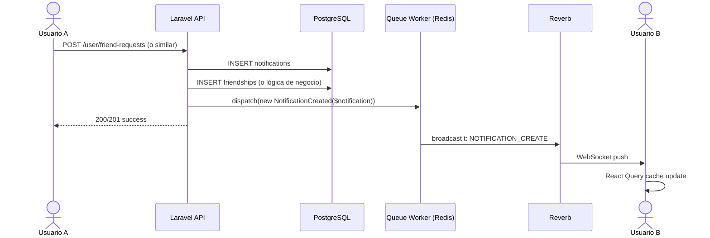
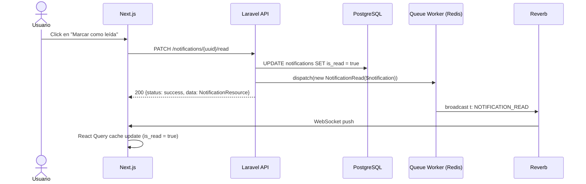

# 03 — Sistema de Notificaciones en Tiempo Real

> **Propósito**: Definir la arquitectura de notificaciones persistentes en base de datos + entrega en tiempo real vía WebSocket.
> **Stack**: Laravel 13 + Reverb + Redis + Next.js + React Query.
> **Audiencia**: Desarrolladores backend y frontend.

---

## 0. Prerrequisitos y Orden de Implementación

> ⚠️ **NO empieces por este documento** si no tienes los prerrequisitos listos.

### 0.1 Prerrequisitos Faltantes en el Código (Backend)

| # | Prerrequisito | Archivo que debe existir | Estado Actual | Quién lo hace |
|---|--------------|-------------------------|---------------|---------------|
| 1 | `App\Events\User\NotificationCreated.php` | Evento broadcast de notificaciones | ✅ EXISTE | Backend ✅ |
| 2 | `App\Events\User\NotificationRead.php` | Evento broadcast de lectura | ✅ EXISTE | Backend ✅ |
| 3 | `routes/channels.php` | Autenticación de canal `user.{uuid}` | ✅ EXISTE | Backend ✅ |
| 4 | `BroadcastServiceProvider` | Registrado en `bootstrap/providers.php` | ✅ REGISTRADO | Backend ✅ |
| 5 | `BROADCAST_CONNECTION=reverb` | Variable en `.env` | ✅ CONFIGURADA | Backend ✅ |

### 0.2 Estado del Frontend

> ⚠️ **El frontend NO está listo para WebSockets.**
>
> Verificado en `vyntra-frontend`:
> - `package.json` NO tiene `laravel-echo`, `pusher-js`, ni librería WebSocket.
> - `notification.service.js` usa **mock data** (`mockFriendRequests`), no llama al backend real.
> - No hay hooks que escuchen eventos WebSocket y actualicen React Query cache.
>
> **Conclusión:** El frontend necesita una **FASE FRONTEND** separada después de que el backend esté 100% funcionando.

### 0.3 Fases de Implementación

#### FASE 1: BACKEND (haz esto ahora)
1. **Paso 1**: Seguir `01_redis_reverb_setup.md` (instalar Redis, Reverb)
2. **Paso 2**: Crear `routes/channels.php` y registrar `BroadcastServiceProvider`
3. **Paso 3**: Configurar `.env` con `BROADCAST_CONNECTION=reverb`
4. **Paso 4**: Seguir `02_events_architecture.md` (arquitectura de canales y payload)
5. **Paso 5**: Crear `app/Events/NotificationCreated.php` y `app/Events/NotificationRead.php`
6. **Paso 6**: Seguir este documento (`03_notifications_system.md`) para implementar notificaciones en tiempo real
7. **Paso 7**: Seguir `04_friendships_realtime.md` (amistades)
8. **Paso 8**: Seguir `06_octane_setup.md` (Octane)

#### FASE 2: VERIFICACIÓN (testea sin frontend)
- Usar `wscat`, Postman, o un script Node.js para verificar que el backend empuja eventos.
- Verificar que `NotificationCreated` llega al canal `user.{uuid}`.

#### FASE 3: FRONTEND (después de verificar backend)
- Instalar `laravel-echo` + `pusher-js` en `vyntra-frontend`.
- Crear `useNotificationEvents(userUuid)` hook.
- Modificar `NotificationService` para usar HTTP real en lugar de mock data.
- Conectar el listener de WebSocket para que actualice React Query cache.

### 0.4 Nota Importante

Este documento **asume** que ya tienes:
- Reverb instalado y corriendo
- `routes/channels.php` con autenticación del canal `user.{uuid}`
- `BroadcastServiceProvider` registrado
- Eventos broadcast funcionando (ej: `MessageCreated` ya existe y se despacha correctamente)

Si no los tienes, **ve a `01_redis_reverb_setup.md` y `02_events_architecture.md` primero**.

**Los ejemplos de frontend en este documento son ilustrativos** (para que sepas qué esperar en la FASE FRONTEND). No los implementes ahora.

---

## 1. Problema que Resuelve

Vyntra requiere notificaciones para múltiples escenarios:
- Solicitud de amistad recibida.
- Invitación a un club.
- Mención en un mensaje (@user).
- Mensaje en un canal que el usuario sigue.

**Sin WebSockets**: El usuario solo ve notificaciones al hacer polling o al refrescar la página.
**Con WebSockets**: La notificación aparece al instante, pero también debe persistir para que el usuario la vea cuando esté offline.

**Problema de escala**: 300K usuarios × 10 notificaciones/día = 3M notificaciones/día. El sistema debe:
- Insertar en PostgreSQL sin bloquear el request.
- Broadcastear vía Reverb sin saturar el servidor.
- Permitir al usuario marcar como leída desde cualquier dispositivo.

---

## 2. Modelo de Datos

El modelo `Notification` ya existe en Vyntra:

```php
// app/Models/Notification.php
#[Fillable(['user_uuid', 'type', 'data', 'is_read', 'client_uuid'])]
class Notification extends Model
{
    protected $table = 'notifications';
    protected $primaryKey = 'uuid';
    use HasFactory, HasUuids, SoftDeletes;

    protected function casts(): array
    {
        return [
            'data' => 'array',
            'is_read' => 'boolean',
            'client_uuid' => 'string',
        ];
    }
}
```

### 2.1 Tipos de Notificación

| Tipo | Descripción | `data` (JSON) |
|------|-------------|---------------|
| `friend_request` | Alguien te envió solicitud de amistad | `{sender_uuid, sender_username, sender_avatar_url}` |
| `friend_request_accepted` | Alguien aceptó tu solicitud | `{friend_uuid, friend_username, friend_avatar_url}` |
| `club_invite` | Te invitaron a un club | `{club_uuid, club_name, inviter_uuid, inviter_username}` |
| `mention` | Te mencionaron en un mensaje | `{message_uuid, channel_uuid, club_uuid, sender_uuid, sender_username, content_snippet}` |
| `message_in_channel` | Mensaje en canal que sigues | `{message_uuid, channel_uuid, club_uuid, sender_uuid, sender_username, content_snippet}` |
| `role_assigned` | Te asignaron un rol en un club | `{club_uuid, club_name, role_uuid, role_name, role_color}` |

---

## 3. Flujo de Creación



### 3.1 Controller (Orquestación SRP §2)

```php
// Ejemplo: FriendshipController@store
public function store(StoreFriendshipRequest $request)
{
    $validated = $request->validated();

    Gate::authorize('create', Friendship::class);

    $friendship = Friendship::firstOrCreate(
        [
            'sender_uuid' => $request->user()->uuid,
            'receiver_uuid' => $validated['receiver_uuid'],
        ],
        [
            'client_uuid' => $validated['client_uuid'],
            'status' => 'pending',
        ]
    );

    if ($friendship->wasRecentlyCreated) {
        // Crear notificación para el receptor
        $notification = Notification::create([
            'user_uuid' => $validated['receiver_uuid'],
            'type' => 'friend_request',
            'data' => [
                'sender_uuid' => (string) $request->user()->uuid,
                'sender_username' => $request->user()->username,
                'sender_avatar_url' => $request->user()->avatar_url,
            ],
            'client_uuid' => $validated['client_uuid'],
        ]);

        // Dispatch evento broadcast
        NotificationCreated::dispatch($notification);
    }

    return response()->json([
        'status' => 'success',
        'data' => new FriendshipResource($friendship),
    ], $friendship->wasRecentlyCreated ? 201 : 200);
}
```

### 3.2 Evento Broadcast

```php
<?php

namespace App\Events\User;

use App\Http\Resources\NotificationResource;
use App\Models\Notification;
use Illuminate\Broadcasting\PrivateChannel;
use Illuminate\Contracts\Broadcasting\ShouldBroadcast;
use Illuminate\Contracts\Queue\ShouldQueue;
use Illuminate\Foundation\Events\Dispatchable;
use Illuminate\Queue\SerializesModels;

class NotificationCreated implements ShouldBroadcast, ShouldQueue
{
    use Dispatchable, SerializesModels;

    public function __construct(
        public readonly Notification $notification
    ) {}

    public function broadcastOn(): array
    {
        return [
            new PrivateChannel('user.' . $this->notification->user_uuid),
        ];
    }

    public function broadcastWith(): array
    {
        return [
            't' => 'NOTIFICATION_CREATE',
            'd' => (new NotificationResource($this->notification))->resolve(),
        ];
    }

    public function broadcastQueue(): string
    {
        return 'broadcasts';
    }
}
```

### 3.3 Reglas del Payload

- [ ] `uuid` como `(string)`.
- [ ] `user_uuid` como `(string)` (no expuesto al público; solo el receptor puede verlo).
- [ ] `data` como array/object serializado (no string JSON crudo).
- [ ] `is_read` como `(boolean)`.
- [ ] `created_at` como `toIso8601String()`.
- [ ] `client_uuid` como `(string)` para deduplicación frontend.

---

## 4. Flujo de Lectura (Mark as Read)



### 4.1 Controller

```php
// NotificationController@markAsRead
public function markAsRead(Notification $notification, Request $request)
{
    Gate::authorize('update', $notification);

    $notification->update(['is_read' => true]);

    NotificationRead::dispatch($notification);

    return response()->json([
        'status' => 'success',
        'data' => new NotificationResource($notification->load('notificationReceiver')),
    ]);
}
```

### 4.2 Evento

```php
<?php

namespace App\Events\User;

use App\Models\Notification;
use Illuminate\Broadcasting\PrivateChannel;
use Illuminate\Contracts\Broadcasting\ShouldBroadcast;
use Illuminate\Contracts\Queue\ShouldQueue;
use Illuminate\Foundation\Events\Dispatchable;
use Illuminate\Queue\SerializesModels;

class NotificationRead implements ShouldBroadcast, ShouldQueue
{
    use Dispatchable, SerializesModels;

    public function __construct(
        public readonly Notification $notification
    ) {}

    public function broadcastOn(): array
    {
        return [
            new PrivateChannel('user.' . $this->notification->user_uuid),
        ];
    }

    public function broadcastWith(): array
    {
        return [
            't' => 'NOTIFICATION_READ',
            'd' => [
                'uuid' => (string) $this->notification->uuid,
                'is_read' => (bool) $this->notification->is_read,
                'updated_at' => $this->notification->updated_at->toIso8601String(),
            ],
        ];
    }

    public function broadcastQueue(): string
    {
        return 'broadcasts';
    }
}
```

---

## 5. Frontend (React Query)

### 5.1 Hook de Notificaciones

```js
// src/features/notifications/hooks/useNotifications.js
import { useInfiniteQuery } from '@tanstack/react-query';
import { NotificationService } from '@/services/notification.service';

export const useNotifications = () => {
  return useInfiniteQuery({
    queryKey: ['notifications'],
    queryFn: async ({ pageParam }) => {
      const res = await NotificationService.getNotifications(pageParam);
      return res.data;
    },
    initialPageParam: null,
    getNextPageParam: (lastPage) => lastPage.meta?.next_cursor,
    staleTime: 1000 * 60 * 5,
    retry: 1,
    refetchOnWindowFocus: false,
  });
};
```

### 5.2 Listener de WebSocket

```js
// src/features/notifications/hooks/useNotificationEvents.js
import { useEffect } from 'react';
import { useQueryClient } from '@tanstack/react-query';
import Echo from 'laravel-echo';
import Pusher from 'pusher-js';

export const useNotificationEvents = (userUuid) => {
  const queryClient = useQueryClient();

  useEffect(() => {
    if (!userUuid) return;

    const echo = new Echo({
      broadcaster: 'pusher',
      key: process.env.NEXT_PUBLIC_REVERB_APP_KEY,
      wsHost: process.env.NEXT_PUBLIC_REVERB_HOST,
      wsPort: process.env.NEXT_PUBLIC_REVERB_PORT,
      wssPort: process.env.NEXT_PUBLIC_REVERB_PORT,
      forceTLS: true,
      enabledTransports: ['ws', 'wss'],
      authEndpoint: '/api/broadcasting/auth',
      auth: {
        headers: {
          Authorization: `Bearer ${localStorage.getItem('token')}`,
        },
      },
    });

    echo.private(`user.${userUuid}`)
      .listen('NotificationCreated', (event) => {
        const notification = event.d;

        queryClient.setQueryData(['notifications'], (old) => {
          if (!old) return old;

          // Deduplicación por client_uuid
          const exists = old.pages[0]?.data?.some(
            (n) => n.client_uuid === notification.client_uuid
          );
          if (exists) return old;

          // Insertar al inicio de la primera página
          const newPages = [...old.pages];
          newPages[0] = {
            ...newPages[0],
            data: [notification, ...newPages[0].data],
          };

          return { ...old, pages: newPages };
        });
      })
      .listen('NotificationRead', (event) => {
        const { uuid, is_read } = event.d;

        queryClient.setQueryData(['notifications'], (old) => {
          if (!old) return old;

          return {
            ...old,
            pages: old.pages.map((page) => ({
              ...page,
              data: page.data.map((n) =>
                n.uuid === uuid ? { ...n, is_read } : n
              ),
            })),
          };
        });
      });

    return () => {
      echo.disconnect();
    };
  }, [userUuid, queryClient]);
};
```

### 5.3 Reglas Frontend

- [ ] Listener modifica React Query cache, NUNCA la UI directamente.
- [ ] Deduplicación por `client_uuid` en `NOTIFICATION_CREATE`.
- [ ] En reconexión: `queryClient.invalidateQueries({ queryKey: ['notifications'] })`.
- [ ] `useNotificationEvents` se monta en un layout o provider global, no en cada componente.

---

## 6. Escalabilidad y Consideraciones

### 6.1 Índices de Base de Datos

```php
// Migration para índices de notificaciones
Schema::table('notifications', function (Blueprint $table) {
    $table->index(['user_uuid', 'is_read', 'created_at']); // Para listar no leídas
    $table->index(['user_uuid', 'created_at']); // Para listado paginado
    $table->index(['client_uuid']); // Para deduplicación
});
```

### 6.2 Limpieza de Notificaciones Viejas

> **Recomendación futura**: Con 3M notificaciones/día, la tabla `notifications` crecería infinitamente.
>
> **Solución**: Implementar un job diario (`PruneOldNotifications`) que:
> - Archiva notificaciones > 90 días a una tabla `notifications_archive` (o S3 en JSON).
> - Elimina notificaciones leídas > 30 días.
> - Mantiene notificaciones no leídas indefinidamente.

### 6.3 Notas sobre @everyone

> **No implementado en Vyntra.** La mención `@everyone` NO se incluye en el alcance del proyecto. Si en el futuro se agrega, la solución correcta es usar un flag `last_read_message_seq` por usuario (como hace Discord) en lugar de crear 10K notificaciones individuales. Ver `mandatory_patterns.md` §18 (YAGNI).

### 6.4 Rate Limiting

> **Recomendación futura**: Limitar notificaciones por usuario a 100/minuto para evitar spam.
> - Usar Redis con sliding window rate limiter.
> - Si se excede, acumular en una cola de "notificaciones pendientes" y entregar en batch.

### 6.5 Contador de Notificaciones No Leídas (Cache Redis)

> **Problema:** Si el frontend muestra un badge "10 notificaciones no leídas", hace un `SELECT COUNT(*) FROM notifications WHERE user_uuid = ? AND is_read = false`. Con millones de notificaciones, este COUNT se vuelve lento.

**Solución senior:** Mantener el contador en Redis en lugar de consultarlo a Postgres cada vez.

```php
// Al crear una notificación (después del INSERT):
Redis::incr("user:{$notification->user_uuid}:unread_count");

// Al marcar como leída (después del UPDATE):
Redis::decr("user:{$notification->user_uuid}:unread_count");

// El frontend pide el contador al backend, que lee de Redis:
$unreadCount = Redis::get("user:{$userUuid}:unread_count") ?? 0;
```

**Ventajas:**
- O(1) en Redis vs O(N) en Postgres con COUNT
- No toca la BD para algo que cambia constantemente
- Se puede invalidar cuando el usuario marca todas como leídas

**Regla de oro:** Los contadores que cambian frecuentemente y se leen más de lo que se escriben van en Redis, no en Postgres.

---

## 7. Checklist de Implementación

### Backend

- [ ] Crear evento `NotificationCreated` con `ShouldBroadcast + ShouldQueue`.
- [ ] Crear evento `NotificationRead` con `ShouldBroadcast + ShouldQueue`.
- [ ] Verificar que `NotificationResource` sigue el contrato API (`uuid`, `user_uuid`, `type`, `data`, `is_read`, `client_uuid`, `created_at`).
- [ ] Verificar que `NotificationPolicy@update` permite solo al receptor (`$user->uuid === $notification->user_uuid`).
- [ ] Agregar índices compuestos en `notifications` para `user_uuid + is_read + created_at`.
- [ ] Crear job `PruneOldNotifications` (para ejecutar con cron/scheduler).
- [ ] Asegurar que `client_uuid` es UNIQUE en la migración.
- [ ] Asegurar que todos los controllers que crean notificaciones usan `firstOrCreate` con `client_uuid`.
- [ ] Asegurar que `NotificationCreated` se despacha DENTRO de `if ($model->wasRecentlyCreated)`.

### Frontend

- [ ] Crear hook `useNotificationEvents(userUuid)` en `src/features/notifications/hooks/`.
- [ ] Crear `NotificationService` con `getNotifications(pageParam)` y `markAsRead(uuid)`.
- [ ] Implementar deduplicación por `client_uuid` en el listener.
- [ ] Implementar invalidación de cache en reconexión.
- [ ] UI: Badge de notificaciones no leídas suscrito a React Query.

### Testing

- [ ] Test: `NotificationCreated` se inserta en BD y se despacha.
- [ ] Test: `NotificationCreated` llega al receptor vía WebSocket.
- [ ] Test: `NotificationRead` actualiza `is_read` en BD y broadcast.
- [ ] Test: Usuario A no recibe notificaciones de Usuario B.
- [ ] Test: Deduplicación por `client_uuid` funciona.
- [ ] Test: Rate limiting en `/broadcasting/auth`.

---

## 8. Referencias

- [Vyntra API Contract](../../api_contract.md)
- [Vyntra API Requests Manifest](../../api_requests_manifest.md)
- [Vyntra Mandatory Patterns](../../architecture/mandatory_patterns.md)
- [Laravel Broadcasting](https://laravel.com/docs/13.x/broadcasting)
- [Laravel Reverb](https://laravel.com/docs/13.x/reverb)
