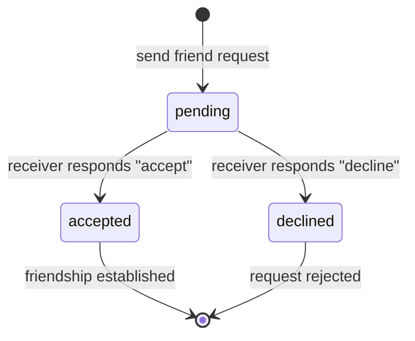
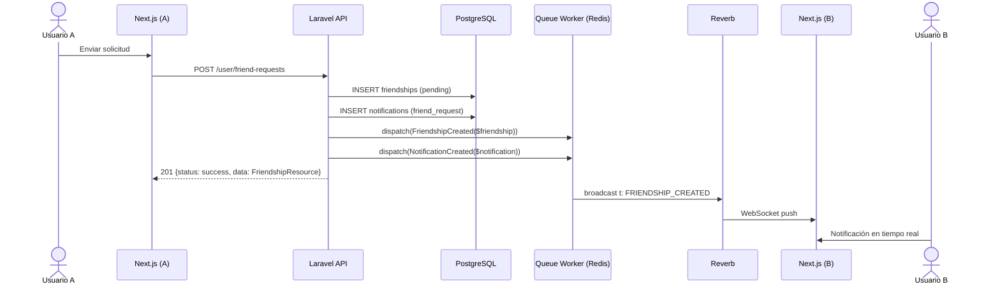
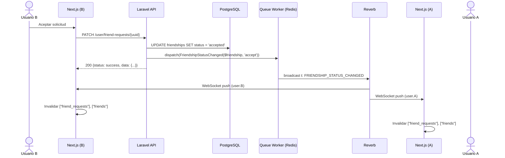

# 04 — Amistades en Tiempo Real

> **Propósito**: Definir el flujo end-to-end de solicitudes de amistad con actualización en tiempo real: cuando un usuario acepta/declina una solicitud, ambos usuarios ven el cambio al instante.
> **Stack**: Laravel 13 + Reverb + Next.js + React Query + Echo.
> **Audiencia**: Desarrolladores backend y frontend.

---

## 0. Prerrequisitos y Orden de Implementación

> ⚠️ **NO empieces por este documento** si no tienes los prerrequisitos listos.

### 0.1 Prerrequisitos Faltantes en el Código (Backend)

| # | Prerrequisito | Archivo que debe existir | Estado Actual | Quién lo hace |
|---|--------------|-------------------------|---------------|---------------|
| 1 | `app/Events/User/FriendshipStatusChanged.php` | Evento broadcast de cambio de estado | ✅ EXISTE | Backend ✅ |
| 2 | `routes/channels.php` | Autenticación de canal `user.{uuid}` | ✅ EXISTE | Backend ✅ |
| 3 | `BroadcastServiceProvider` | Registrado en `bootstrap/providers.php` | ✅ REGISTRADO | Backend ✅ |
| 4 | `BROADCAST_CONNECTION=reverb` | Variable en `.env` | ✅ CONFIGURADA | Backend ✅ |

> [!NOTE]
> `FriendshipCreated` NO se crea porque el evento de "solicitud nueva" se maneja vía `NotificationCreated` (con `type: 'friend_request'`). No es un evento separado.

### 0.2 Estado del Frontend

> ⚠️ **El frontend NO está listo para WebSockets.**
>
> Verificado en `vyntra-frontend`:
> - `package.json` NO tiene `laravel-echo`, `pusher-js`, ni librería WebSocket.
> - `useMutateFriendRequests.js` y hooks relacionados **no escuchan** eventos WebSocket.
> - No hay deduplicación por `client_uuid` en el frontend.
>
> **Conclusión:** El frontend necesita una **FASE FRONTEND** separada después de que el backend esté 100% funcionando.

### 0.3 Fases de Implementación

#### FASE 1: BACKEND (haz esto ahora)
1. **Paso 1**: Seguir `01_redis_reverb_setup.md` (instalar Redis, Reverb)
2. **Paso 2**: Crear `routes/channels.php` y registrar `BroadcastServiceProvider`
3. **Paso 3**: Configurar `.env` con `BROADCAST_CONNECTION=reverb`
4. **Paso 4**: Seguir `02_events_architecture.md` (arquitectura de canales y payload)
5. **Paso 5**: Seguir `03_notifications_system.md` (notificaciones — incluye `FriendshipCreated`)
6. **Paso 6**: Crear `app/Events/FriendshipStatusChanged.php`
7. **Paso 7**: Seguir este documento (`04_friendships_realtime.md`) para implementar amistades en tiempo real
8. **Paso 8**: Seguir `06_octane_setup.md` (Octane)

#### FASE 2: VERIFICACIÓN (testea sin frontend)
- Usar `wscat`, Postman, o un script Node.js para verificar que el backend empuja eventos.
- Verificar que `FriendshipStatusChanged` llega a `user.{sender_uuid}` y `user.{receiver_uuid}`.

#### FASE 3: FRONTEND (después de verificar backend)
- Instalar `laravel-echo` + `pusher-js` en `vyntra-frontend`.
- Crear `useFriendshipEvents(userUuid)` hook.
- Modificar `useMutateFriendRequests` para optimistic updates + deduplicación.
- Migrar `FriendshipService` de mock data a HTTP real.

### 0.4 Nota Importante

Este documento **asume** que ya tienes:
- Reverb instalado y corriendo
- `routes/channels.php` con autenticación del canal `user.{uuid}`
- `BroadcastServiceProvider` registrado
- Eventos broadcast funcionando (ej: `NotificationCreated` ya existe)

Si no los tienes, **ve a `01_redis_reverb_setup.md`, `02_events_architecture.md` y `03_notifications_system.md` primero**.

**Los ejemplos de frontend en este documento son ilustrativos** (para que sepas qué esperar en la FASE FRONTEND). No los implementes ahora.

---

## 1. Problema que Resuelve

El flujo de amistades en Vyntra tiene los siguientes estados:
- `pending`: Usuario A envió solicitud a Usuario B.
- `accepted`: Usuario B aceptó la solicitud.
- `declined`: Usuario B rechazó la solicitud.

**Sin WebSockets**:
- Usuario A envía solicitud → Usuario B no se entera hasta que hace polling.
- Usuario B acepta → Usuario A no ve el cambio en su lista de amigos hasta que refresca.
- Múltiples dispositivos: si Usuario A acepta desde el móvil, el desktop no se actualiza.

**Con WebSockets**: El cambio de estado se propaga al instante a ambos usuarios y a todos sus dispositivos.

---

## 2. Flujo de Estados



---

## 3. Flujo de Envío de Solicitud



### 3.1 Controller (Store)

```php
// FriendshipController@store
public function store(StoreFriendshipRequest $request)
{
    $validated = $request->validated();

    Gate::authorize('create', Friendship::class);

    // Prevenir auto-referencia
    if ($validated['receiver_uuid'] === (string) $request->user()->uuid) {
        return response()->json([
            'status' => 'error',
            'message' => 'Cannot send friend request to yourself.',
        ], 422);
    }

    // Prevenir spam: máximo 50 solicitudes pendientes por usuario
    $pendingCount = Friendship::where('sender_uuid', $request->user()->uuid)
        ->where('status', 'pending')
        ->count();

    if ($pendingCount >= 50) {
        return response()->json([
            'status' => 'error',
            'message' => 'Too many pending friend requests.',
        ], 429);
    }

    $friendship = Friendship::firstOrCreate(
        [
            'sender_uuid' => $request->user()->uuid,
            'receiver_uuid' => $validated['receiver_uuid'],
        ],
        [
            'client_uuid' => $validated['client_uuid'],
            'status' => 'pending',
        ]
    );

    if ($friendship->wasRecentlyCreated) {
        // Notificación para el receptor
        $notification = Notification::create([
            'user_uuid' => $validated['receiver_uuid'],
            'type' => 'friend_request',
            'data' => [
                'sender_uuid' => (string) $request->user()->uuid,
                'sender_username' => $request->user()->username,
                'sender_avatar_url' => $request->user()->avatar_url,
            ],
            'client_uuid' => $validated['client_uuid'],
        ]);

        NotificationCreated::dispatch($notification);
    }

    return response()->json([
        'status' => 'success',
        'data' => new FriendshipResource($friendship),
    ], $friendship->wasRecentlyCreated ? 201 : 200);
}
```

---

## 4. Flujo de Respuesta a Solicitud (Aceptar / Declinar)

Este es el flujo más crítico: el receptor responde y ambos usuarios deben ver el cambio.



### 4.1 Controller (Respond)

```php
// FriendshipController@respond
public function respond(RespondFriendshipRequest $request, string $friendshipUuid)
{
    $validated = $request->validated();

    $friendship = Friendship::findOrFail($friendshipUuid);

    Gate::authorize('update', $friendship);

    // Verificar que el usuario autenticado es el receptor
    if ((string) $request->user()->uuid !== (string) $friendship->receiver_uuid) {
        return response()->json([
            'status' => 'error',
            'message' => 'Only the receiver can respond to this request.',
        ], 403);
    }

    // Verificar que la solicitud está pendiente
    if ($friendship->status !== 'pending') {
        return response()->json([
            'status' => 'error',
            'message' => 'This request has already been responded to.',
        ], 409);
    }

    $action = $validated['action']; // 'accept' | 'decline'
    $friendship->update(['status' => $action === 'accept' ? 'accepted' : 'declined']);

    FriendshipStatusChanged::dispatch(
        (string) $friendship->uuid,
        (string) $friendship->sender_uuid,
        (string) $friendship->receiver_uuid,
        $friendship->status,
        $action
    );

    return response()->json([
        'status' => 'success',
        'data' => [
            'uuid' => (string) $friendship->uuid,
            'action' => $action,
            'status' => $friendship->status,
        ],
    ]);
}
```

### 4.2 Evento Broadcast

```php
<?php

namespace App\Events\User;

use Illuminate\Broadcasting\PrivateChannel;
use Illuminate\Contracts\Broadcasting\ShouldBroadcast;
use Illuminate\Contracts\Queue\ShouldQueue;
use Illuminate\Foundation\Events\Dispatchable;

class FriendshipStatusChanged implements ShouldBroadcast, ShouldQueue
{
    use Dispatchable;

    public function __construct(
        public readonly string $friendshipUuid,
        public readonly string $senderUuid,
        public readonly string $receiverUuid,
        public readonly string $status,
        public readonly string $action
    ) {}

    public function broadcastOn(): array
    {
        // Enviar a AMBOS usuarios: el sender debe saber que aceptaron su solicitud
        // y el receiver debe confirmar su propia acción
        return [
            new PrivateChannel('user.' . $this->senderUuid),
            new PrivateChannel('user.' . $this->receiverUuid),
        ];
    }

    public function broadcastWith(): array
    {
        return [
            't' => 'FRIENDSHIP_STATUS_CHANGED',
            'd' => [
                'uuid' => $this->friendshipUuid,
                'sender_uuid' => $this->senderUuid,
                'receiver_uuid' => $this->receiverUuid,
                'status' => $this->status,
                'action' => $this->action,
            ],
        ];
    }

    public function broadcastQueue(): string
    {
        return 'broadcasts';
    }
}
```

### 4.3 Consideraciones de Seguridad

- [ ] **Solo el receptor** puede responder (`receiver_uuid === $user->uuid`).
- [ ] **No permitir** que el sender modifique la solicitud.
- [ ] **Idempotencia**: Si ya está `accepted`/`declined`, retornar 409 (Conflict) o 200 con el estado actual.
- [ ] **Client UUID**: No es necesario en PATCH (idempotente por naturaleza), pero el frontend puede enviarlo para tracking.

---

## 5. Frontend (React Query)

### 5.1 Hook de Amistades

```js
// src/features/social/hooks/useFriendships.js
import { useInfiniteQuery } from '@tanstack/react-query';
import { FriendshipService } from '@/services/friendship.service';

export const useFriendships = (filter = 'all') => {
  return useInfiniteQuery({
    queryKey: ['friends', filter],
    queryFn: async ({ pageParam }) => {
      const res = await FriendshipService.getFriends(filter, pageParam);
      return res.data;
    },
    initialPageParam: null,
    getNextPageParam: (lastPage) => lastPage.meta?.next_cursor,
    staleTime: 1000 * 60 * 5,
    retry: 1,
    refetchOnWindowFocus: false,
  });
};

export const useFriendRequests = () => {
  return useInfiniteQuery({
    queryKey: ['friend_requests'],
    queryFn: async ({ pageParam }) => {
      const res = await FriendshipService.getFriendRequests(pageParam);
      return res.data;
    },
    initialPageParam: null,
    getNextPageParam: (lastPage) => lastPage.meta?.next_cursor,
    staleTime: 1000 * 60 * 5,
    retry: 1,
    refetchOnWindowFocus: false,
  });
};
```

### 5.2 Mutación (Optimistic Update)

```js
// src/features/social/hooks/useRespondFriendRequest.js
import { useMutation, useQueryClient } from '@tanstack/react-query';
import { toast } from 'sonner';
import { FriendshipService } from '@/services/friendship.service';

export const useRespondFriendRequest = () => {
  const queryClient = useQueryClient();

  return useMutation({
    mutationFn: async ({ requestUuid, action }) => {
      return FriendshipService.respondToFriendRequest(requestUuid, action);
    },
    onMutate: async ({ requestUuid, action }) => {
      // Cancelar refetches
      await queryClient.cancelQueries({ queryKey: ['friend_requests'] });
      await queryClient.cancelQueries({ queryKey: ['friends'] });

      // Backup cache
      const previousFriendRequests = queryClient.getQueryData(['friend_requests']);
      const previousFriends = queryClient.getQueryData(['friends']);

      // Optimistic update en friend_requests
      queryClient.setQueryData(['friend_requests'], (old) => {
        if (!old) return old;
        return {
          ...old,
          pages: old.pages.map((page) => ({
            ...page,
            data: page.data.filter((req) => req.uuid !== requestUuid),
          })),
        };
      });

      // Si es accept, invalidar friends para recargar
      if (action === 'accept') {
        queryClient.invalidateQueries({ queryKey: ['friends'] });
      }

      return { previousFriendRequests, previousFriends };
    },
    onError: (err, variables, context) => {
      // Rollback
      queryClient.setQueryData(['friend_requests'], context.previousFriendRequests);
      queryClient.setQueryData(['friends'], context.previousFriends);
      toast.error('Error', { description: err.message });
    },
    onSettled: () => {
      queryClient.invalidateQueries({ queryKey: ['friend_requests'] });
      queryClient.invalidateQueries({ queryKey: ['friends'] });
    },
  });
};
```

### 5.3 Listener de WebSocket

```js
// src/features/social/hooks/useFriendshipEvents.js
import { useEffect } from 'react';
import { useQueryClient } from '@tanstack/react-query';
import Echo from 'laravel-echo';

export const useFriendshipEvents = (userUuid) => {
  const queryClient = useQueryClient();

  useEffect(() => {
    if (!userUuid) return;

    const echo = new Echo({
      broadcaster: 'pusher',
      key: process.env.NEXT_PUBLIC_REVERB_APP_KEY,
      wsHost: process.env.NEXT_PUBLIC_REVERB_HOST,
      wsPort: process.env.NEXT_PUBLIC_REVERB_PORT,
      wssPort: process.env.NEXT_PUBLIC_REVERB_PORT,
      forceTLS: true,
      enabledTransports: ['ws', 'wss'],
      authEndpoint: '/api/broadcasting/auth',
      auth: {
        headers: {
          Authorization: `Bearer ${localStorage.getItem('token')}`,
        },
      },
    });

    echo.private(`user.${userUuid}`)
      .listen('FriendshipCreated', (event) => {
        // Nueva solicitud recibida
        queryClient.invalidateQueries({ queryKey: ['friend_requests'] });
      })
      .listen('FriendshipStatusChanged', (event) => {
        const { uuid, action, status } = event.d;

        // Si es el sender o receiver, actualizar ambas listas
        queryClient.invalidateQueries({ queryKey: ['friend_requests'] });
        queryClient.invalidateQueries({ queryKey: ['friends'] });

        // Si fue aceptada, toast de confirmación
        if (action === 'accept') {
          toast.success('Solicitud de amistad aceptada');
        }
      });

    return () => {
      echo.disconnect();
    };
  }, [userUuid, queryClient]);
};
```

> [!NOTE]
> **Estado del frontend:** El frontend ya tiene `useMutateFriendRequests` (en `features/notifications/hooks/`) que implementa optimistic update para responder solicitudes. Cuando se conecte a HTTP real, solo falta reemplazar el `mockRequest` por `fetch` al endpoint `PATCH /api/user/friend-requests/{uuid}`. El listener de WebSocket (`useFriendshipEvents`) NO existe todavía y debe crearse en la Fase Frontend.

---

## 6. Edge Cases y Escalabilidad

### 6.1 Múltiples Dispositivos

Un usuario puede tener sesiones en móvil, desktop y web. El evento `FRIENDSHIP_STATUS_CHANGED` se envía al canal `user.{uuid}`, por lo que **todos** los dispositivos suscritos reciben el evento.

**Problema**: Si el usuario aceptó desde el móvil, el desktop también recibe el evento y hace `invalidateQueries`. Esto es correcto (eventual consistency), pero genera una request HTTP extra por dispositivo.

**Optimización**: Si el evento contiene `client_uuid`, el frontend puede detectar si el evento fue originado por él mismo (por el mismo `client_uuid`) y evitar el `invalidateQueries`, ya que el optimistic update ya cubrió el cambio.

### 6.2 Reconexión Masiva

Si el usuario B estaba offline cuando A envió la solicitud, al reconectar B recibe el evento `FriendshipCreated` (si la sesión se resume) o debe hacer `invalidateQueries` al reconectar.

**Recomendación**: En la reconexión de Echo, siempre ejecutar:
```js
queryClient.invalidateQueries({ queryKey: ['friend_requests'] });
queryClient.invalidateQueries({ queryKey: ['friends'] });
```

### 6.3 Deduplicación

El evento `FriendshipCreated` puede llegar dos veces:
1. Vía HTTP response (optimistic update del frontend).
2. Vía WebSocket broadcast.

El frontend debe usar `client_uuid` para evitar duplicar la notificación en la UI.

### 6.4 Rate Limiting

**Riesgo**: Un usuario malicioso podría enviar 1000 solicitudes de amistad/segundo.
**Mitigación**: `throttle:10,1` en `POST /user/friend-requests` (ya implementado en `routes/api.php`). Además, limitar a 50 solicitudes pendientes por usuario.

---

## 7. Checklist de Implementación

### Backend

- [ ] Crear evento `FriendshipCreated` con `ShouldBroadcast + ShouldQueue`.
- [ ] Crear evento `FriendshipStatusChanged` con `ShouldBroadcast + ShouldQueue`.
- [ ] Verificar que `FriendshipController@respond` valida que solo el receptor puede responder.
- [ ] Verificar que `FriendshipPolicy@update` compara `receiver_uuid === user->uuid`.
- [ ] Verificar que `Friendship::firstOrCreate` usa `client_uuid` con UNIQUE.
- [ ] Verificar que `FriendshipStatusChanged` se despacha a `user.{sender_uuid}` y `user.{receiver_uuid}`.
- [ ] Asegurar que el payload usa formato `{t, d}` con `FRIENDSHIP_STATUS_CHANGED`.
- [ ] Asegurar que todos los UUIDs son `(string)`.
- [ ] Agregar `FriendshipResource` con `sender` y `receiver` cargados.

### Frontend

- [ ] Crear `useFriendshipEvents(userUuid)` hook.
- [ ] Implementar optimistic update en `useRespondFriendRequest`.
- [ ] Implementar deduplicación por `client_uuid`.
- [ ] Invalidar `['friend_requests']` y `['friends']` al recibir `FRIENDSHIP_STATUS_CHANGED`.
- [ ] En reconexión: invalidar ambas queries.
- [ ] Mostrar toast de éxito/error según corresponda.

### Testing

- [ ] Test: Usuario A envía solicitud → Usuario B recibe evento WebSocket.
- [ ] Test: Usuario B acepta → Usuario A recibe evento WebSocket.
- [ ] Test: Múltiples dispositivos de A reciben el evento.
- [ ] Test: Deduplicación por `client_uuid`.
- [ ] Test: Rate limiting en `POST /user/friend-requests`.
- [ ] Test: Usuario no autorizado no puede responder a solicitud ajena.

---

## 8. Referencias

- [Vyntra API Contract](../../api_contract.md)
- [Vyntra API Requests Manifest](../../api_requests_manifest.md)
- [Vyntra Mandatory Patterns](../../architecture/mandatory_patterns.md)
- [Laravel Broadcasting](https://laravel.com/docs/13.x/broadcasting)
- [Laravel Reverb](https://laravel.com/docs/13.x/reverb)
