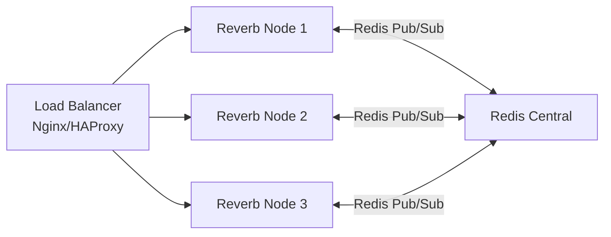

# Escalado Horizontal — Producción

> 🖥️ **PRODUCCIÓN SOLO**. Esta guía extiende [`01_redis_reverb_setup.md`](../01_redis_reverb_setup.md).
>
> Contenido original de las secciones **2.6** (Consideraciones de Escalabilidad — Redis) y **3.8** (Escalado Horizontal — Reverb).
> Solo aplica cuando se requiere alta disponibilidad y balanceo de carga entre múltiples nodos.

---

## 2.6 Consideraciones de Escalabilidad — Redis

> **Recomendación futura**: Con 300K usuarios, Redis puede saturarse si todo está en una sola instancia.

**Soluciones** (en orden de prioridad — aplicar de arriba hacia abajo):

1. **PgBouncer + Read Replica de PostgreSQL** (OBLIGATORIO antes de tocar Redis) — Ver [`../../bd_scaling/`](../../bd_scaling/README.md). Separa reads de writes en Postgres. Sin esto, Redis no es el cuello de botella — Postgres lo es.
2. **Separación de responsabilidades de Redis**: Usar Redis A para queues, Redis B para cache, Redis C para pub/sub de Reverb. Es la solución más simple y efectiva.
3. **Persistencia AOF**: Configurar AOF (Append Only File) para queues críticas (no perder broadcasts en caso de reinicio).
4. **Redis Sentinel** (Alta disponibilidad): Solo si Redis es crítico y no puede tener downtime. Failover automático.
5. **Redis Cluster** (Sharding): **ÚLTIMO recurso**. Solo si una sola instancia Redis no da abasto DESPUÉS de separar responsabilidades. El sharding agrega complejidad operacional significativa.

> [!CAUTION]
> **Anti-patrón:** No implementar Redis Cluster "por las dudas". Es sobreingeniería (viola YAGNI — `mandatory_patterns.md` §18). La separación de responsabilidades (punto 2) resuelve el 90% de los casos de saturación de Redis sin sharding.

## 3.8 Escalado Horizontal — Reverb

- Todos los nodos Reverb se suscriben al mismo canal Redis (`reverb`).
- Cuando un mensaje llega a R1, R1 publica en Redis y R2/R3 lo reciben.
- El cliente se conecta a cualquier nodo vía el Load Balancer.

**Requisitos para escalar**:
- [ ] `REVERB_SCALING_ENABLED=true`
- [ ] Redis central accesible por todos los nodos.
- [ ] Load Balancer con sticky sessions (ej: basado en IP) o round-robin.
- [ ] `ulimit` y `worker_connections` ajustados en cada nodo (ver [production_server_tuning.md](production_server_tuning.md)).

---

## Referencias

- [Guía principal: 01_redis_reverb_setup.md](../01_redis_reverb_setup.md)
- [Redis Cluster Specification](https://redis.io/docs/reference/cluster-spec/)
- [Redis Sentinel Docs](https://redis.io/docs/management/sentinel/)
- [Laravel Reverb — Scaling](https://laravel.com/docs/13.x/reverb#horizontal-scaling)
